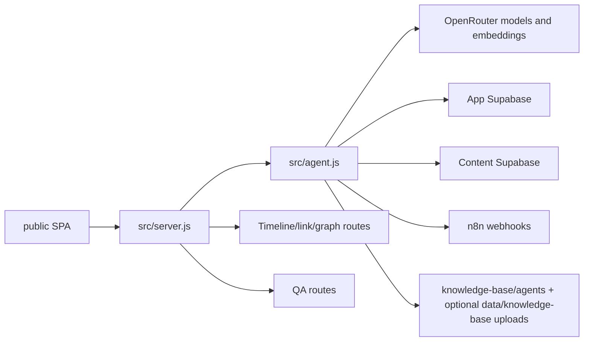

# BiDoc Main RAG Backend - Current System Documentation

Generated from direct source inspection on 2026-06-04.

This document describes the current live state of `main-rag-backend/bidoc-main-rag`. It is meant as a handoff map before feature work begins. It intentionally documents the code as it exists now, including places where older docs or memory notes disagree with the implementation.

## 1. Executive Summary

`bidoc-main-rag` is a Node.js >=20 ESM application that serves two roles:

1. A plain HTTP backend for a construction-project RAG assistant.
2. A plain HTML/CSS/JS single-page admin and chat UI from `public/`.

The project has no Express/Next/etc. framework. `src/server.js` uses `node:http` locally and exports a Vercel-compatible handler in serverless mode.

Core capabilities:

- Chat assistant for the JFrog construction project.
- OpenRouter chat completions, embeddings, reranking, model listing, QA reports.
- App Supabase for settings, chat history, QA reports, timeline links, timeline graph tables, and project graph tables.
- Optional separate Content Supabase for indexed project content, alerts, hybrid search RPC, timeline event reads, and alert retrieval.
- n8n webhook tools for project-domain adapters such as meetings, emails, safety, financial transactions, submittals, etc.
- Markdown-backed Knowledge Base for professional/methodology guidance, with optional uploaded local docs.
- Timeline UI with event links, link suggestions, smart link-agent review, and graph-aware suggestions.
- Project Graph UI backed by Supabase `graph_nodes` and `graph_edges`.
- Workflow logging with live SSE events and Cytoscape graph visualization.
- QA agent for disliked answers and run-quality reports.

High-level mental model:



## 2. Repo State

- Git root: `main-rag-backend/bidoc-main-rag`.
- Current branch: `main`.
- Remote: `https://github.com/avivgolan/bidoc-main-rag.git`.
- Working tree was clean before this documentation file was added.
- `node_modules/` is not present locally.
- `.env` / `.env.local` were not present in this inspected checkout.
- Built-in Knowledge agents live in `knowledge-base/agents/*.md`.
- `data/` does not exist in the inspected checkout, but `src/knowledge.js` will create `data/knowledge-base/...` at runtime when optional documents are uploaded.

Important tracked noise:

- `.venv/` and `.venv.zip` are tracked in git.
- `.npm-cache/` is tracked in git.
- `.claude/skills/ui-ux-pro-max/` and `.claude/worktrees/` are tracked in git.
- These are not app runtime code, but they are part of the current repository state.

## 3. Directory and File Inventory

### Root Files

| Path | Purpose |
|---|---|
| `package.json` | Node project metadata. Scripts: `dev`, `start`, `test`. Dependency: `graphology`. |
| `package-lock.json` | Lockfile for `graphology`, `events`, and `graphology-types`. |
| `vercel.json` | Routes all requests through `src/server.js` using `@vercel/node`. |
| `AGENTS.md` | Bedrock/project-memory onboarding instructions for AI agents. |
| `CLAUDE.md` | Older developer guide. Useful, but partly stale. See section 17. |
| `.gitignore` | Ignores env files, `data/settings.json`, `node_modules`, and some bedrock generated outputs. Does not ignore `data/knowledge-base/`. |
| `.agent-project.yaml` | Bedrock project metadata pointing at an older absolute path from the previous developer machine. |
| `.agentknowledgeignore` | Empty-ish bedrock ignore template. |
| `.venv.zip`, `.venv/` | Tracked Python virtualenv artifact, not used by the Node app. |

### `src/`

| File | Current responsibility |
|---|---|
| `server.js` | HTTP entrypoint, static file serving, all API routes, timeline/link-agent route logic, diagnostics, QA routes, restart helper. |
| `agent.js` | Main chat pipeline: sanitize, save, classify, memory, Lite Agent, Main RAG Agent, knowledge planner, hybrid search, graph search, reranking, tool calls, source quality, conflicts, answer synthesis, workflow log. |
| `config.js` | Environment loading, settings cache, Supabase-backed settings persistence, model/tool/retrieval defaults, secret masking/merging, content-source config. |
| `prompts.js` | Default prompt definitions for classifier, knowledge planner, lite, main, reranker, and QA agents. |
| `openrouter.js` | OpenRouter chat completions, embeddings, model listing, LLM reranker, JSON extraction helper. |
| `supabase.js` | App and Content Supabase REST helpers, chat history, QA reports, timeline event reads, timeline links, timeline graph persistence, project graph persistence/search. |
| `classifier.js` | Calls classifier model and normalizes classifier JSON. Parses hinted tools. |
| `heuristics.js` | Local classifier fallback rules for chat/RAG, urgency, hashtags, professional mode, and investigation mode. |
| `knowledge.js` | Markdown-backed Knowledge agent loader, optional uploaded-doc CRUD, and keyword/chunk search. |
| `memory.js` | In-memory local session memory and compact conversation summary. |
| `tools.js` | n8n webhook invocation, source-link extraction, tool ordering. |
| `sourceQuality.js` | Tool/source reliability scoring and simple conflict detection rules. |
| `runLog.js` | In-memory run event store, SSE subscriber handling, local run history. |
| `qaAgent.js` | QA agent and trend-analysis agent wrappers over OpenRouter. |
| `subagents/alert.js` | Local Alert subagent: embeds alert query, calls alert RPC, filters date range, summarizes through LLM. |
| `timelineLinks.js` | Timeline relation types, quote/approval detection, link suggestions, duration/approver helpers. |
| `timelineGraph.js` | Timeline entity extraction, graphology/SimpleGraph builder, graph scoring for timeline event pairs. |
| `projectGraph.js` | Extracts project graph nodes/edges from content/alert records and summarizes graph-search results. |
| `clock.js` | Builds timezone-adjusted ISO-like current datetime for prompts. |
| `sanitize.js` | Redacts prompt-injection patterns and truncates user input to 8000 chars. |
| `types.js` | Simple constants for chat type, complexity, urgency. Currently minimal and not central. |

### `public/`

| File | Current responsibility |
|---|---|
| `index.html` | Hebrew RTL SPA shell. Defines tabs and forms for chat, agents, settings, tools, knowledge, workflow, history, timeline, graph, link agent, QA, reset. Loads Cytoscape/Dagre from CDN and `/app.js`. |
| `app.js` | Large browser-side controller for all UI tabs and API calls. Owns routing, chat send flow, SSE run log, workflow graph, settings forms, knowledge uploads, timeline UI, project graph UI, QA UI. |
| `styles.css` | Full visual system for the SPA, including responsive panels, workflow graph, settings, timeline, project graph, QA. |

### `supabase/`

| File | Purpose |
|---|---|
| `project-graph.sql` | Creates `graph_nodes`, `graph_edges`, indexes, update triggers, and `graph_search` RPC. |
| `timeline-knowledge-graph.sql` | Creates `timeline_entities`, `timeline_event_entities`, `timeline_graph_edges`, indexes, and update triggers. |

### `test/`

| File | Purpose |
|---|---|
| `run-tests.js` | Node assert-based test runner. Tests sanitization, classification normalization, heuristics, knowledge search, config helpers, Supabase/content separation, timeline mapping, source quality, graph extraction, OpenRouter payload shaping, and more. |

### `bedrock/`

Project memory/history maintained by prior AI tooling. It is not app runtime code.

| Path | Purpose |
|---|---|
| `STATUS.md` | Bedrock project status. Says onboarding is complete. |
| `Memory/` | Curated memory branches for stack/chat/subagents/timeline. Some facts are stale. |
| `History/` | Lightweight project diary/backfills. |
| `Dashboards/`, `Evidence/`, `Outputs/`, `Templates/` | Bedrock support views and placeholders. |

### Tooling and Agent Support Dirs

| Path | Purpose |
|---|---|
| `.claude/` | Claude-specific rules, hooks, commands, launch config, local skills/worktrees. Paths refer to previous developer environment. |
| `.cursor/` | Cursor hooks/rules/commands for bedrock. Paths refer to previous developer environment. |
| `.kilo/` | Kilo config/session metadata. |
| `.specstory/` | SpecStory metadata/history. |
| `.vscode/settings.json` | Enables SpecStory cloud sync. |
| `.npm-cache/` | Tracked npm cache artifact. Not app logic. |
| `.venv/` | Tracked Python virtualenv artifact. Not app logic. |

## 4. Runtime and Deployment

### Local Runtime

Requirements:

- Node.js >=20.
- `npm install` if you want the declared `graphology` dependency installed. The code has a `SimpleGraph` fallback if `graphology` import fails in `timelineGraph.js`, but the package declares it.

Commands:

```bash
npm run dev
npm start
npm test
```

Equivalent direct commands:

```bash
node src/server.js
node test/run-tests.js
```

On Windows, if PowerShell blocks `npm.ps1`, run `node src/server.js` or `node test/run-tests.js` directly.

Default local URL:

```text
http://localhost:4000
```

### Vercel Runtime

`vercel.json` sends all routes to `src/server.js`:

```json
{
  "version": 2,
  "builds": [{ "src": "src/server.js", "use": "@vercel/node" }],
  "routes": [{ "src": "/(.*)", "dest": "/src/server.js" }]
}
```

`server.js` checks `process.env.VERCEL`:

- If unset, it starts a local `http.createServer(handler).listen(port)`.
- If set, it only exports the handler for Vercel.

Important Vercel caveat:

- Built-in Knowledge agents are repo Markdown files under `knowledge-base/agents`, so baseline Knowledge search is durable in deployment. Optional uploaded docs still write local files under `data/knowledge-base`, which is not durable in serverless deployments. Older docs claim Supabase-backed knowledge docs, but current code does not use Supabase for Knowledge Base storage.

## 5. Configuration Model

Configuration comes from three places, merged in this order:

1. Defaults in code.
2. Environment variables from `.env` and `.env.local`, loaded by `loadEnv()`.
3. Supabase `agent_settings` row, loaded into an in-memory cache.

`config.js` loads env files from the project root, not from the shell working directory.

### Settings Persistence

`initSettings()`:

- Reads App Supabase table `agent_settings`.
- Loads row `id = default`.
- Caches `data` in memory.
- Runs a one-time prompt migration flag `__prompts_clean_v2` to remove stale prompt overrides.

`refreshSettingsIfStale()`:

- Runs on every request.
- Refreshes settings from Supabase if cache age exceeds 30 seconds.

`writeLocalSettings()`:

- Normalizes incoming settings.
- Stores only prompt overrides that differ from current defaults.
- Upserts `agent_settings` with `Prefer: resolution=merge-duplicates`.

### Secrets

Secrets can be stored in `agent_settings.data.secrets`, but env vars are also supported.

Masked values such as `sk-o...abcd` and `********` are not treated as real secrets. The code falls back to env vars in that case.

Supabase header behavior:

- New `sb_secret_...` keys are sent as `apikey` only.
- Legacy JWT keys starting with `eyJ` also get `Authorization: Bearer ...`.

Security note: `/api/settings/export` returns full resolved secrets. There is no auth layer in `server.js`.

### Environment Variables

| Variable | Used for |
|---|---|
| `PORT` | Local server port. Default `4000`. |
| `VERCEL` | Detect serverless mode. |
| `OPENROUTER_API_KEY` | OpenRouter chat, embeddings, reranker, QA, alert agent. |
| `SUPABASE_URL` | App Supabase URL. |
| `SUPABASE_SERVICE_ROLE_KEY` | App Supabase service key. |
| `CONTENT_SUPABASE_URL` | Explicit Content Supabase URL; required for Data Query Agent because App/MAIN fallback is forbidden. |
| `CONTENT_SUPABASE_SERVICE_ROLE_KEY` | Matching Content-project server key; required for Data Query Agent provisioning and authentication. |
| `CONTENT_HYBRID_RPC_NAME` | Content hybrid search RPC. |
| `CONTENT_INDEX_TABLE` | Content index table. |
| `CONTENT_ALERTS_TABLE` | Content alerts table. |
| `CONTENT_ALERTS_RPC_NAME` | Content alert embedding-search RPC. |
| `HYBRID_RPC_NAME` | Legacy/fallback hybrid RPC name. |
| `HYBRID_CANDIDATES` | Number of retrieval candidates. Default `40`. |
| `RERANK_TOP_K` | Reranker top K. Default `10`. |
| `HYBRID_VECTOR_WEIGHT` | Hybrid vector score weight. Default `0.65`. |
| `HYBRID_KEYWORD_WEIGHT` | Hybrid keyword score weight. Default `0.35`. |
| `CLASSIFIER_MODEL` | Classifier model. Default `openai/gpt-4o-mini`. |
| `KNOWLEDGE_PLANNER_MODEL` | Knowledge planner model. Default main model or `openai/gpt-4o`. |
| `MAIN_MODEL` | Main synthesis model. Default `openai/gpt-4o`. |
| `LITE_MODEL` | Lite chat model. Default `openai/gpt-4o-mini`. |
| `EMBEDDING_MODEL` | Embedding model. Default `openai/text-embedding-3-large`. |
| `RERANKER_MODEL` | Reranker model. Default `openai/gpt-4o-mini`. |
| `QA_MODEL` | QA model. Default main model or `openai/gpt-4o`. |
| `N8N_BASE_URL` | Base URL for n8n webhooks. |
| `N8N_TOOL_<TOOL>_URL` | Per-tool webhook override. |
| `TIMEZONE` | Timezone string like `UTC+3`. Default `UTC+0`. |
| `POSTGRES_URL` | Read into config but not otherwise used by current code. |

## 6. App Supabase vs Content Supabase

The code intentionally separates app state from content retrieval.

### App Supabase

Used for:

- Settings: `agent_settings`.
- Chat history and workflow logs: `chat_messages_gf`.
- QA reports: `qa_reports`.
- Timeline saved links: `timeline_event_links`.
- Timeline graph persistence: `timeline_entities`, `timeline_event_entities`, `timeline_graph_edges`.
- General project graph: `graph_nodes`, `graph_edges`, `graph_search` RPC.

### Content Supabase

Used for:

- Hybrid RAG search RPC.
- Main indexed content table.
- Alert embeddings table and alert RPC.
- Timeline event reads from content records.
- Alert timeline event reads from alert records.

If Content Supabase is not configured, the code falls back to App Supabase and legacy table/RPC names.

Default content names:

| Setting | Default |
|---|---|
| Hybrid RPC | `hybrid_match_data_index_embeddings_gf_dor_agent` |
| Index table | `data_index_embeddings_gf_dor_agent` |
| Alerts table | `alerts_embeddings_gf` |
| Alerts RPC | `match_<alertsTable>` |

## 7. Database Tables and RPCs

### App Tables Expected by Code

| Table | Used by | Notes |
|---|---|---|
| `agent_settings` | `config.js` | Row `id = default`, JSON `data`. |
| `chat_messages_gf` | `supabase.js`, `agent.js`, UI history | Stores user messages, AI responses, status, annotations, workflow log, run events. Code writes misspelled field `sanitzed_user_message`; preserve until schema is verified. |
| `qa_reports` | `supabase.js`, `qaAgent.js`, QA UI | Stores per-message QA/AI reports. |
| `timeline_event_links` | timeline routes/UI | Manual and suggested links between timeline events. |
| `timeline_entities` | timeline graph | SQL in `supabase/timeline-knowledge-graph.sql`. |
| `timeline_event_entities` | timeline graph | Event-to-entity rows. |
| `timeline_graph_edges` | timeline graph | Entity-to-entity graph edges. |
| `graph_nodes` | project graph | SQL in `supabase/project-graph.sql`. |
| `graph_edges` | project graph | SQL in `supabase/project-graph.sql`. |

### App RPCs Expected by Code

| RPC | Purpose |
|---|---|
| `graph_search` | Given query text and source refs, returns related project graph edges with source/target nodes. |

If `graph_search` is missing, `supabase.js` attempts a REST fallback by fetching relevant graph edges directly.

### Content Data Index Fields Read

`fetchTimelineEvents()` expects/selects:

```text
id, created_at, project_id, source_table, source_id, summary, hashtags,
index_text, metadata, primary_date, title, item_status, severity_or_risk,
mail_id, attachment_id, source_url, mentioned_dates
```

Timeline event date priority includes:

```text
primary_date, data_date, date, created_at, metadata.date,
metadata.primary_date, metadata.event_date, metadata.created_at,
metadata.timestamp, metadata.time, metadata.datetime, metadata.document_date
```

### Content Alert Fields Read

`fetchAlertsTimelineEvents()` expects/selects:

```text
id, created_at, question, answer, alert_description, alert_type,
severity_level, input_data_type, input_data_id, analyzed_data, data_link,
data_date, status, item_status, hashtags, summary, content, metadata,
is_relevant
```

Alert timeline events are normalized with ids like `alert_<id>`.

### SQL Files

`supabase/project-graph.sql`:

- Creates project graph nodes/edges.
- Adds indexes.
- Adds updated-at triggers.
- Defines `graph_search`.
- Calls `notify pgrst, 'reload schema'`.

`supabase/timeline-knowledge-graph.sql`:

- Creates timeline entity/event-entity/graph-edge tables.
- Adds indexes.
- Adds updated-at triggers.

## 8. API Route Map

All API routes live in `src/server.js`.

### Chat and Runs

| Method | Route | Purpose |
|---|---|---|
| `POST` | `/api/chat` | Main chat endpoint. Creates a run, calls `runChatPipeline()`, returns answer, sources, tool calls, workflow log, run id. |
| `GET` | `/api/runs/:runId/events` | Server-Sent Events stream for live run logs. |
| `GET` | `/api/sessions` | Lists recent chat sessions from App Supabase. |
| `GET` | `/api/sessions/:sessionId/messages` | Lists messages for one session. |
| `GET` | `/api/run-history` | Merges local in-memory run history with persisted chat workflow rows. |

### Settings and Agents

| Method | Route | Purpose |
|---|---|---|
| `GET` | `/api/settings` | Public/masked settings payload for UI. |
| `PUT` | `/api/settings` | Save settings to App Supabase. |
| `POST` | `/api/settings/reload` | Force reload from App Supabase. |
| `GET` | `/api/settings/export` | Export full settings, including unmasked resolved secrets. |
| `POST` | `/api/settings/import` | Import settings JSON and save. |
| `GET` | `/api/agents` | Returns configured agent list and prompts/models. |
| `PUT` | `/api/agents` | Always returns 405. Agents are edited through settings. |
| `GET` | `/api/openrouter/models` | Lists OpenRouter models, with hardcoded fallback on error. |
| `POST` | `/api/system/restart` | Local server restart helper. No-op-ish on Vercel because local `httpServer` is null. |

### Knowledge Base

| Method | Route | Purpose |
|---|---|---|
| `GET` | `/api/knowledge/agents` | Lists local knowledge routing agents. |
| `GET` | `/api/knowledge/documents` | Lists local `.md`/`.txt` docs, optionally by `agentId`. |
| `POST` | `/api/knowledge/documents` | Saves a local knowledge document. |
| `GET` | `/api/knowledge/documents/:filename` | Reads a local knowledge document. |
| `DELETE` | `/api/knowledge/documents/:filename` | Deletes a local knowledge document. |
| `POST` | `/api/knowledge/search` | Token/chunk search over local knowledge docs. |

### Tools and Diagnostics

| Method | Route | Purpose |
|---|---|---|
| `POST` | `/api/tools/:toolName/test` | Tests hybrid search or n8n/local tool invocation. |
| `PUT` | `/api/subagents/:agentId/config` | Saves subagent config under settings. |
| `POST` | `/api/subagents/alert` | Direct Alert Agent test endpoint. |
| `POST` | `/api/diagnostics/connections` | Checks OpenRouter chat, OpenRouter embeddings, App Supabase, Content tables, hybrid RPC. |
| `POST` | `/api/evaluations/run` | Runs up to 25 evaluation cases through the chat pipeline. |

### Feedback and QA

| Method | Route | Purpose |
|---|---|---|
| `POST` | `/api/messages/:messageId/annotate` | Sets annotation `V`, `X`, or null on a chat message. |
| `GET` | `/api/qa/dislikes` | Lists disliked completed messages. |
| `POST` | `/api/qa/:messageId/run` | Runs QA agent for disliked message workflow log. |
| `GET` | `/api/qa/:messageId/report` | Gets latest QA report. |
| `POST` | `/api/qa/trends` | Runs trend analysis over saved QA reports. |
| `POST` | `/api/ai-report/:messageId/run` | Runs QA agent as a general AI workflow report and attaches it to workflow log. |
| `GET` | `/api/ai-report/:messageId` | Gets saved AI report. |

### Timeline and Graph

| Method | Route | Purpose |
|---|---|---|
| `GET` | `/api/timeline` | Reads timeline events from Content index table. |
| `GET` | `/api/timeline/alerts` | Reads alert timeline events from Content alerts table. |
| `GET` | `/api/timeline/links` | Lists saved timeline links from App Supabase. |
| `POST` | `/api/timeline/links` | Creates a saved timeline link. |
| `DELETE` | `/api/timeline/links/:id` | Deletes a saved timeline link. |
| `GET` | `/api/timeline/link-suggestions` | Produces rules-based or smart timeline link suggestions. |
| `POST` | `/api/timeline/graph/rebuild` | Extracts timeline entities and project graph rows from events and upserts them to App Supabase. |
| `GET` | `/api/graph` | Lists project graph nodes/edges with filters for graph UI. |

### Static Serving

Non-API routes are served from `public/`.

## 9. Main Chat Pipeline

Entrypoint: `POST /api/chat` -> `runChatPipeline()` in `src/agent.js`.

Pipeline:

1. Create a run id and run log.
2. Sanitize user message with `sanitizeMessage()`.
3. Save row in `chat_messages_gf` with status `processing`.
4. Classify message through OpenRouter classifier.
5. If classifier fails, use `heuristicClassification()`.
6. Enforce professional Knowledge Base mode through local vocabulary/heuristics.
7. Enforce investigation mode for root-cause/responsibility/comparison style questions.
8. Load recent memory from App Supabase; if empty, use local in-memory session memory.
9. Route:
   - `CHAT` -> Lite Agent.
   - `RAG` -> Main RAG Agent.
10. Append local in-memory summary.
11. Build workflow log.
12. Update `chat_messages_gf` with answer, workflow log, run events, status `done`.
13. Return structured response.

### Lite Agent

Used for greetings, small talk, and current time/date questions.

If OpenRouter is missing or fails:

- Returns a local fallback greeting.

### Main RAG Agent

Main RAG path in `runRagAgent()`:

1. Detect list-style question for broader context limits.
2. Build optional investigation plan.
3. If urgency is `HIGH`, run safety precheck tools first:
   - `safety_report`
   - `alert`, unless Alert Agent is disabled
4. If `classification.professional`, run the Professional Knowledge Planner:
   - Route to local knowledge agents.
   - Search local knowledge docs.
   - Call OpenRouter planning model if possible.
   - Fallback to local plan if model/key fails.
5. Run hybrid search through Content Supabase:
   - Create OpenRouter embedding.
   - Call configured hybrid RPC.
   - Include date range and hashtags.
   - Retry without hashtags if hashtags return zero rows.
6. Run extra hybrid searches from Knowledge Planner `rag_queries`.
7. Deduplicate and filter rows by requested hashtags.
8. If enabled, run project graph search from App Supabase:
   - Build graph search payload from retrieved records.
   - Call `graph_search` RPC or REST fallback.
   - Summarize relationship context.
9. Rerank retrieved rows with OpenRouter reranker:
   - Falls back to hybrid order if reranker fails.
10. Build tool order:
   - High urgency forces safety first.
   - Classifier hinted tools and planner recommended tools are included.
   - General fallback is `alert`, `whatsapp_messages`.
   - Limited by `toolsRuntime.parallelLimit`.
11. Run tools in parallel:
   - `alert` is local `runAlertAgent()`.
   - Other tool names call configured n8n webhooks.
12. Annotate tool calls with source quality.
13. Detect basic conflicts across tool outputs.
14. Synthesize final answer with Main Agent.
15. If Main Agent cannot run, return a structured fallback answer.

### Agent Prompts

Default prompts live in `src/prompts.js`:

- `classifier`
- `knowledge_planner`
- `lite`
- `main`
- `reranker`
- `qa`

Runtime settings can override prompts, but only prompt values that differ from defaults are stored.

## 10. Retrieval and Tooling

### Hybrid Search

`hybridSearch()` in `src/supabase.js`:

- Requires `OPENROUTER_API_KEY`.
- Uses OpenRouter embeddings.
- Calls Content Supabase RPC.
- Payload:

```json
{
  "query_text": "...",
  "query_embedding": [0.1],
  "match_count": 40,
  "date_from": null,
  "date_to": null,
  "hashtags": [],
  "vector_weight": 0.65,
  "keyword_weight": 0.35
}
```

If the RPC errors because it does not support `hashtags`, code retries without the `hashtags` parameter.

### n8n Tools

Tool names:

```text
alert
meetings
emails
whatsapp_messages
financial_transactions
consultants_reports
exceptions_report
quality_control
safety_report
submittals
```

Webhook URL resolution:

1. Per-tool setting.
2. `N8N_TOOL_<TOOL>_URL`.
3. `N8N_BASE_URL + /webhook/<tool>`.

Tool request body:

```json
{
  "query": "...",
  "date_filter": "...",
  "date_from": null,
  "date_to": null,
  "session_id": "..."
}
```

If a tool is not configured, it returns a skipped tool call instead of throwing.

### Alert Agent

`src/subagents/alert.js` is a local special-case subagent for `alert`.

It:

- Reads settings from `settings.subagents.alert`.
- Uses Content Supabase alerts table/RPC.
- Creates an OpenRouter embedding for the alert query.
- Calls alert RPC with `{ query_embedding, match_count }`.
- Locally filters by date range.
- Uses OpenRouter chat to format answer.

Potential issue:

- `filterAlertsByDateRange()` checks `row.date`, `row.metadata.date`, `row.created_at`, and `row.metadata.created_at`.
- The current alert table mapping elsewhere uses `data_date`.
- Verify whether the alert RPC returns a `date` field or metadata date. If it only returns `data_date`, date-filtered alert-agent runs may incorrectly filter out valid rows.

## 11. Knowledge Base

Current implementation is Markdown-backed with optional local uploaded docs.

Built-in agent paths:

```text
knowledge-base/agents/schedule.md
knowledge-base/agents/safety_quality.md
knowledge-base/agents/commercial.md
```

Optional uploaded-doc paths:

```text
data/knowledge-base/<agentId>/<filename>.md
data/knowledge-base/<agentId>/<filename>.txt
```

Knowledge agents:

- `schedule`
- `safety_quality`
- `commercial`

Knowledge Base behavior:

- Built-in agents are loaded from Markdown frontmatter and body content.
- Frontmatter drives agent routing: `id`, `name`, `description`, `tags`, and `keywords`.
- Markdown body content is chunked and searched as baseline Knowledge content.
- `saveKnowledgeDocument()` writes optional uploaded docs under `data/knowledge-base`.
- `listKnowledgeDocuments()` returns built-in read-only agent docs plus uploaded docs.
- `searchKnowledgeBase()` loads all matching built-in/uploaded docs, chunks by blank-line blocks, tokenizes, scores by token/tag/phrase matches.
- Search/document payloads distinguish `source: "agent"` from `source: "upload"`.
- Only `.md` and `.txt` are allowed.
- Filenames are sanitized and path traversal is guarded.
- Built-in agent docs are read-only through the API/UI.

Adding a new Knowledge agent:

1. Add `knowledge-base/agents/<agent-id>.md`.
2. Set frontmatter `id` to the same value as `<agent-id>`.
3. Add `name`, `description`, `tags`, and `keywords`.
4. Put searchable professional guidance in the Markdown body.
5. Add or update tests for routing/search.

Important mismatch:

- `CLAUDE.md` says knowledge docs are stored in Supabase table `knowledge_documents`.
- Current `src/knowledge.js` does not use Supabase for Knowledge Base storage.

Operational risk:

- `data/` does not exist in the inspected checkout until optional docs are uploaded.
- `.gitignore` does not ignore `data/knowledge-base/`.
- Uploading knowledge docs locally may create untracked files.
- On Vercel, uploaded local docs are not durable. Built-in Markdown agent docs are durable because they are repo files.

## 12. Workflow Logging and Memory

### Run Log

`src/runLog.js` keeps in-memory maps:

- `runs`: run id -> events.
- `subscribers`: run id -> SSE response writers.
- `runHistory`: local history for non-chat/link-agent runs.

Events are streamed through:

```text
GET /api/runs/:runId/events
```

Run event retention:

- Max 200 events per run in memory.
- Local run history max 50 items.

Persisted chat workflow:

- Chat runs save `workflow_log` and `run_events` into `chat_messages_gf`.

Link-agent history:

- Link-agent runs are recorded in local in-memory run history only.

### Memory

Two memory sources:

- App Supabase recent chat history from `chat_messages_gf`.
- Local in-memory fallback from `memory.js`.

Local memory:

- Stores last 24 role messages per session.
- Extracts active topics, dates, open questions, last intent.
- Injects a system memory summary but explicitly tells the model not to treat memory as project evidence.

## 13. Timeline and Link Agent

Timeline UI:

- `#timeline` tab in `public/index.html`.
- Logic in `public/app.js`.
- Styles in `public/styles.css`.

Timeline sources:

- `index`: `/api/timeline` from Content index table.
- `alerts`: `/api/timeline/alerts` from Content alerts table.

Saved links:

- Stored in App Supabase `timeline_event_links`.
- Can be created/deleted through timeline UI.

Rules-based suggestions:

- `buildTimelineLinkSuggestions()` pairs quote/proposal events with later approval/accepted events.
- Scores by shared tags, date distance, and optional timeline graph score.
- Skips already-saved links.

Smart suggestions:

- `/api/timeline/link-suggestions?smart=1`.
- Loads events, saved links, persisted timeline graph data.
- Builds timeline knowledge graph/scorer.
- Runs project graph search.
- Merges rule candidates and graph fallback candidates.
- Optionally performs semantic search over hybrid RAG.
- Calls model review through OpenRouter.
- Filters by configured min confidence.
- Returns suggestions plus workflow log.

Link-agent settings:

- Stored under `settings.timelineLinks`.
- UI tab `#linkAgent`.
- Controls model, prompt, suggestion limit, semantic top K, time window days, min confidence, semantic search toggle, graph fallback toggle, ignored generic terms.

Graph rebuild:

`POST /api/timeline/graph/rebuild`:

- Reads index or alert events.
- Extracts timeline entities into timeline graph tables.
- Also builds general project graph rows and upserts them into `graph_nodes` / `graph_edges`.

## 14. Project Graph

Project Graph is separate from the Timeline Knowledge Graph.

Source files:

- `src/projectGraph.js`
- `src/supabase.js`
- `supabase/project-graph.sql`
- `public/app.js`
- `public/styles.css`

Data model:

- Nodes: `event`, `alert`, `supplier`, `person`, `company`, `document`, `topic`, `risk`, `invoice`, `quote`, `source`.
- Edges: `mentions`, `caused_by`, `blocks`, `approved_by`, `related_to`, `same_topic`, `from_document`, `has_status`, `has_risk`.

Extraction:

`buildGraphRowsFromRecords()` maps content/alert records into graph nodes and edges. It extracts:

- Hashtags.
- People.
- Responsible people.
- Vendors/suppliers.
- Submitters.
- Categories.
- Transaction types.
- Statuses.
- Source tables.
- Documents.
- Mail ids.
- Attachment ids.
- Mentioned dates.
- Quote identifiers.
- Invoice identifiers.
- Risk terms.
- Likely companies.

Graph use in chat:

- After hybrid search, `agent.js` builds graph refs from retrieved rows.
- `graphSearch()` calls App Supabase `graph_search` RPC.
- `summarizeGraphContext()` compacts graph edges into the main answer payload.
- Main prompt has specific instructions to use graph context actively for multi-candidate/list/investigation questions.

Graph UI:

- `#graph` tab.
- Calls `/api/graph`.
- Renders with Cytoscape.
- Supports query, node type, relation type, and limit filters.

## 15. QA and AI Reports

QA is driven by `src/qaAgent.js`.

Use cases:

- Analyze disliked answers.
- Generate AI report for selected workflow run.
- Analyze trends across saved QA reports.

Inputs:

- Original user message.
- AI response.
- Workflow log with nodes/edges/prompts/trace.
- Optional user feedback.

Outputs:

- JSON report with summary, root-cause steps, step issues, severity, recommendations, answer quality, confidence.

Routes:

- `/api/qa/dislikes`
- `/api/qa/:messageId/run`
- `/api/qa/:messageId/report`
- `/api/qa/trends`
- `/api/ai-report/:messageId/run`
- `/api/ai-report/:messageId`

UI:

- `#qa` tab for disliked messages and trend report.
- Workflow tab button `AI Report` runs the QA agent on the selected run.

## 16. Frontend Architecture

The frontend is one plain SPA:

- No frontend build step.
- No bundler.
- No framework.
- Hash-based tab navigation.
- State lives in the browser `state` object in `public/app.js`.
- Session id is stored in `localStorage`.

Tabs:

| Tab | Purpose |
|---|---|
| `#chat` | User chat and current session. |
| `#agents` | Read-only agent runtime/prompt/model monitoring. |
| `#subagents` | Alert subagent settings/test UI. |
| `#knowledge` | Upload/search/read/delete local knowledge docs. |
| `#workflow` | Live run log, run history strip, workflow graph, full log, AI report. |
| `#settings` | Connections, models, prompts, retrieval, RAG, graph, knowledge, tools runtime, n8n URLs, import/export. |
| `#tools` | Manual tool tests, diagnostics, evaluation runner. |
| `#history` | Chat sessions/messages. |
| `#timeline` | Timeline event visualization and event links. |
| `#graph` | Project Graph browser. |
| `#linkAgent` | Timeline link-agent settings and quick event test. |
| `#qa` | Disliked message QA and trends. |
| `#reset` | Local restart helper. |

External browser dependencies:

- `https://unpkg.com/dagre@0.8.5/dist/dagre.min.js`
- `https://unpkg.com/cytoscape@3.29.2/dist/cytoscape.min.js`
- `https://unpkg.com/cytoscape-dagre@2.5.0/cytoscape-dagre.js`

If deployed in a network-restricted environment, graph rendering may fail unless these assets are vendored.

## 17. Stale or Conflicting Documentation

`CLAUDE.md` and `bedrock/Memory/*.md` are useful background, but current source code is the source of truth.

Known conflicts:

| Old doc/memory claim | Current code reality |
|---|---|
| No npm dependencies. | `package.json` depends on `graphology`. |
| Knowledge Base is Supabase-backed through `knowledge_documents`. | Built-in Knowledge agents are repo Markdown files under `knowledge-base/agents`; optional uploads write local files under `data/knowledge-base`. |
| `data/knowledge-base/` is gitignored. | `.gitignore` currently only ignores `data/settings.json`. |
| Agent hooks point at current project path. | `.claude` and `.cursor` hooks point at `C:/Users/dor thalamus/Documents/bidoc agent`. |

## 18. Tests

The test suite is a single Node script:

```bash
node test/run-tests.js
```

Test coverage includes:

- Sanitizer redaction/truncation.
- Classifier normalization.
- Heuristic routing.
- Professional/investigation enforcement.
- Local memory.
- Local knowledge document save/search/delete.
- Tool ordering.
- Alert date filtering helpers.
- Secret masking/merging.
- Supabase header/key-role helpers.
- Content Supabase separation.
- Hybrid search behavior with mocked fetch.
- Timeline event field mapping.
- Alert timeline event field mapping.
- Source quality/conflict detection.
- Timeline link suggestions and timeline graph scoring.
- Project graph extraction/search payload/response shaping.
- OpenRouter chat payload advanced settings.

Test side effect:

- Knowledge tests create local `data/knowledge-base/...` directories and delete the test document. They may leave empty directories.

## 19. Important Risks Before Feature Work

### No API Authentication

`server.js` does not enforce authentication or authorization.

Sensitive routes include:

- `GET /api/settings/export` returns unmasked secrets.
- `PUT /api/settings` can change model prompts, service-role keys, n8n URLs, and runtime behavior.
- `POST /api/system/restart` can restart local server.
- Tool, QA, graph rebuild, timeline link, and knowledge routes mutate or expose data.

If this is publicly reachable, this is the first major production hardening item.

### Service Role Keys in Runtime Settings

The UI can save service-role keys into Supabase `agent_settings`. This is convenient but high-risk. Export also emits full keys.

### Knowledge Base Upload Persistence

Built-in Knowledge agents are now repo Markdown files, but optional uploaded docs still write to local `data/knowledge-base`. Decide whether production uploads should:

- Move to Supabase-backed `knowledge_documents`, or
- Stay local and be treated as development-only/support tooling.

### Tracked Generated Artifacts

`.venv`, `.npm-cache`, Claude skills/worktrees are tracked. This makes the repo much heavier and blurs app code vs tooling artifacts.

### Alert Date Filtering May Miss `data_date`

The alert subagent date filter does not inspect direct `data_date`, while alert timeline mapping does. Verify alert RPC output before relying on date-filtered alert answers.

### Browser CDN Dependencies

Workflow and graph rendering depend on CDN-loaded Cytoscape/Dagre scripts.

### Serverless Local State

Run logs, local run history, and local memory are in-memory only. They reset on process restart/cold start.

### Runtime Settings Cache

Settings changes can take up to 30 seconds to appear in warm server instances unless `/api/settings/reload` is called.

### Schema Coupling

The app assumes specific Supabase table names and columns. Several table schemas are not represented as migrations in this repo, especially `chat_messages_gf`, `agent_settings`, `qa_reports`, `timeline_event_links`, the content index table, alert table, and hybrid/alert RPCs.

## 20. Where To Change Things

| Goal | Start here |
|---|---|
| Change chat/RAG behavior | `src/agent.js`, `src/prompts.js`, `src/classifier.js`, `src/heuristics.js` |
| Change retrieval RPC payload or content DB mapping | `src/supabase.js`, Content Supabase RPC/table SQL outside this repo |
| Change n8n tool list or URLs | `src/config.js`, `src/tools.js`, Settings UI in `public/app.js` |
| Change Alert Agent | `src/subagents/alert.js`, subagent UI in `public/app.js` |
| Change Knowledge Base behavior | `src/knowledge.js`, Knowledge tab in `public/app.js` |
| Change source quality/conflict logic | `src/sourceQuality.js` |
| Change workflow graph/logging | `src/agent.js`, `src/runLog.js`, `public/app.js` |
| Change timeline event normalization | `src/supabase.js` |
| Change timeline link suggestions | `src/timelineLinks.js`, `src/timelineGraph.js`, smart logic in `src/server.js` |
| Change Project Graph extraction | `src/projectGraph.js`, `supabase/project-graph.sql` |
| Change Project Graph UI | `public/app.js`, `public/styles.css`, `public/index.html` |
| Change QA reports | `src/qaAgent.js`, QA routes in `src/server.js`, QA UI in `public/app.js` |
| Change settings schema/defaults | `src/config.js`, Settings UI in `public/app.js` |

## 21. Suggested First Cleanup/Improvement Backlog

Before adding major features, consider these as foundation work:

1. Add authentication/authorization around admin and secret-bearing routes.
2. Decide Knowledge Base storage direction and make code/docs/deployment agree.
3. Add `.gitignore` rules for local generated artifacts and decide whether to remove tracked `.venv`, `.npm-cache`, and old agent worktrees.
4. Add explicit SQL migrations for all App Supabase tables used by code.
5. Verify and fix Alert Agent date filtering against actual alert RPC result fields.
6. Add route-level tests for core API handlers or split route handlers for easier testing.
7. Vendor Cytoscape/Dagre or document CDN requirement for deployment.
8. Add a small `README.md` for local setup, env vars, and first-run checks.

## 22. Quick Start Checklist For A New Developer

1. Open the project root: `main-rag-backend/bidoc-main-rag`.
2. Install Node dependencies: `npm install`.
3. Create `.env.local` with OpenRouter, App Supabase, and optionally Content Supabase values.
4. Verify required App Supabase tables exist.
5. Verify Content Supabase hybrid RPC works with embeddings.
6. Run `node test/run-tests.js`.
7. Start the server: `node src/server.js`.
8. Open `http://localhost:4000`.
9. Run `/api/diagnostics/connections` from the Tools tab.
10. Send a chat question and inspect the Workflow tab.
