# BIDoc Contracts Pipeline R0 — Architecture and Schema Lock Checkpoint

- Date: 2026-08-15
- Branch: `feature/contracts-indicator-schedule-intelligence`
- Starting HEAD: `b62ad04983e0`
- Proposal reconciled: version 0.11
- Status: CTO-approved as reported by the user on 2026-08-15; R1 remotely verified, R2 completed locally, and R3 closed after local plus live semantic-quality verification
- Scope: R0 architecture plus the separately approved R1 schema/migration/apply, local R2 Contracts clause parser, and local R3 enrichment/indexing package
- Next gate: explicit remote apply/activation of R3.2, then user acceptance of the saved Contracts Agent extraction before R4 Contracts Relationships Agent work

This checkpoint locked the proposed R0 design. The CTO approval reported by the user authorized only the local R1 schema/migration/test package. The user later gave separate approvals for the verified R1 migration apply, local R2 Contracts clause parser, and R3 clause-enrichment/indexing implementation. The R3 approval does not authorize remote clause ingestion, Storage writes, Contracts Relationships Agent work, contract reprocessing, n8n changes, backfill, projection execution, or deployment. Live model use remains bounded to the R3 quality gate after server-side configuration.

## 1. R0 outcome

The clause-first architecture is technically coherent after two repository-derived corrections:

1. The existing Phase 3F.1 `private.contract_workspaces` contract cannot be reused unchanged because `schedule_project_id` is currently required and is part of workspace uniqueness. R1 must make Schedule mapping optional and non-identifying for new clause-first workspaces while preserving legacy rows.
2. The current extraction fingerprint does not explicitly contain parser-generation identity. R1 must add explicit `parser_generation_id` to the workspace/extraction identity and fingerprint inputs. Parser generation is also repeated in clause and decision identity so the database can enforce generation-compatible links.

The three proposed Contracts domain tables are locked as:

- `private.contracts_documents`: immutable clause/source truth plus mutable processing/enrichment state;
- `private.contracts`: append-only, revisioned normalized decision records; only approved/corrected current revisions are reviewed contractual truth;
- `private.contract_relationships`: append-only, revisioned canonical graph records with typed endpoints.

The Schedule row is the sole canonical owner of projection linkage. `contracts` retains only `projection_status`; it does not contain `projection_target_id`.

## 2. Evidence and classification

| Item | Classification | R0 evidence and conclusion |
| --- | --- | --- |
| Nested Git root and required branch | Verified existing behavior | Git root is `bidoc-main-rag`; branch and starting HEAD matched the requested gate. |
| Three Contracts domain tables | Verified absent + approved proposal | Read-only live KAPAIM catalog and checked-in search found no `contracts_documents`, `contracts`, or `contract_relationships` in `private` or `public`. |
| Workspace document identity | Verified existing behavior | Each workspace row has one `document_version_id`, constrained to `sha256:` plus `document_sha256`; source/extraction fields are protected by an immutability trigger. |
| Multiple document versions in one workspace row | Verified not supported | One row contains one immutable document version. Multiple versions/generations require distinct workspace rows under the current storage model. |
| Workspace Schedule independence | Verified gap | Deployed and checked-in `contract_workspaces.schedule_project_id` is `NOT NULL`; current uniqueness is `(source_project_id, schedule_project_id, document_sha256, extraction_fingerprint)`. This must change for clause-first ingestion. |
| Extraction fingerprint | Verified existing behavior + gap | Code hashes workspace version, extraction schema, agent/compiler versions, and primary/retry models. Parser generation, parser version, prompt version, and extractor version are not individually explicit. |
| Current segmenter | Verified partial behavior | It detects numbered clauses/appendix context and stable keys, but emits page-local segments and can split long logical clauses. Full cross-page logical-clause assembly and a coverage ledger remain R2 work. |
| Review history | Verified existing behavior | Phase 2 review batches/decisions and Phase 3F activity-mapping events are append-only; saved review drafts use a revision and reject stale writes with SQLSTATE `40001`. |
| Current decision review | Verified limited behavior | Existing Contracts review supports approve/reject for narrow temporal candidates. Correct/split/merge and relationship-level review are not implemented. |
| Promotion planner/writer | Verified existing behavior | Requires explicit reviewed batches, approved project mapping, exact evidence, resolved gates, server activation/commit gates, and one atomic service-role RPC. |
| Schedule targets | Live verified | KAPAIM contains `schedule_contract_milestones`, `schedule_contract_conditions`, and `schedule_contract_extensions`, all with RLS enabled. |
| Existing source-decision link | Live verified absent | None of the three Schedule targets has `source_contract_decision_id` or an equivalent typed FK. |
| Existing source document/candidate identity | Live/local verified | Milestones/extensions have `source_document_id`; conditions receive document version in legacy metadata; the current planner writes `contracts_candidate_key` in metadata. These are trace/legacy keys, not a typed decision FK. |
| Runtime condition evidence | Verified existing behavior | `scheduleConditionResolver.js` finds/verifies trigger evidence, applies deterministic calendar arithmetic, writes runtime `trigger_event_date` to `schedule_contract_conditions`, and creates the derived milestone. It does not write runtime dates into a Contracts decision table. |
| Activity mapping | Live/local verified | `schedule_activity_map` owns canonical activity aliases. Manual confirm/reject/correct/unmapped review is server-owned; conflicts and stale selections fail closed; Phase 3G automatic continuation remains guarded. |
| Hebrew UX | Verified partial behavior | Current Contracts UI/error dictionaries contain Hebrew review labels and explanations. The new decision/relationship review surfaces do not exist yet. |
| n8n runtime boundary | Approved proposal + repository direction | New Contracts agents remain internal under `src/subagents/*`; n8n is a behavioral reference only. Missing child workflows do not block implementation. |

### 2.1 Verification boundary

Local verification covered repository files, checked-in migrations, fixtures, application code, tests, API routes, UI contracts, and documentation. Live verification was read-only against the connected Supabase project named `Kapaim`; it inspected catalog metadata only and performed no writes.

The live catalog also reported a separate critical advisory: eight legacy `public.jul_8_backup_*` tables have RLS disabled. This is outside the Contracts R0 scope and was not changed. It requires a separate access-policy review before enabling RLS because enabling RLS without compatible policies may break consumers.

## 3. Locked ownership model

```mermaid
flowchart LR
    W["private.contract_workspaces: source file, document version, parser generation"] --> A["Contracts clause parser: deterministic parse and coverage gate"]
    A --> CD["private.contracts_documents: immutable clause evidence"]
    CD --> B["Contracts Relationships Agent: retrieval, relationships, decisions"]
    B --> CR["private.contract_relationships: canonical graph"]
    B --> C["private.contracts: revisioned decisions"]
    CR --> H["Hebrew human review"]
    C --> H
    H -->|"approved, schedule-impact yes, mapping valid"| P["server-owned projection transaction"]
    H -->|"no impact or unresolved"| K["Contracts knowledge only"]
    P --> SM["fixed: schedule_contract_milestones"]
    P --> SC["relative: schedule_contract_conditions"]
    P --> SE["extension: schedule_contract_extensions"]
    SC --> R["existing evidence-gated condition resolver"]
    R --> E["verified runtime trigger evidence"]
    E --> D["deterministic calendar calculation"]
    D --> SM
```



Authority is one-way:

- workspace/source bytes own document identity;
- clause rows own exact contractual source evidence;
- relationship rows own linkage and conflict truth;
- approved current decision revisions own reviewed contractual meaning;
- Schedule rows own projection linkage and runtime state;
- runtime evidence and calculated dates never flow back into contractual truth.

## 4. Workspace, document version, and parser-generation lock

### 4.1 Existing invariant

One `private.contract_workspaces` row represents one immutable `document_version_id` and one immutable extraction snapshot. The document version is `sha256:<document_sha256>`. The same source bytes can have multiple workspace rows only when the extraction identity differs.

### 4.2 R1 adaptation to the existing technical table

R1 must evolve, not replace, `private.contract_workspaces`:

- make `schedule_project_id` nullable for new clause-first workspaces;
- remove Schedule identity from extraction/workspace uniqueness;
- add `parser_generation_id text not null` for the new workspace version;
- add explicit parser/prompt/extractor/schema versions to the fingerprint input;
- use uniqueness equivalent to `(source_project_id, document_sha256, extraction_fingerprint)` for the new contract;
- preserve legacy Phase 3F.1 rows and their immutable extraction JSON;
- introduce versioned RPCs rather than silently changing existing Phase 3F.1 request contracts.

The live workspace table had zero rows at verification time, but R1 must still be written as a preservation-safe additive migration.

### 4.3 Parser-generation decision

`parser_generation_id` belongs in both places:

- workspace/extraction identity, because a segmentation-policy change creates a new immutable processing generation;
- clause/decision/relationship identity, because generation-compatible links must be enforceable with composite foreign keys.

The ID is an opaque bounded text value generated from the versioned parser/segmentation policy and its relevant configuration, for example `parser-generation:sha256:<64 hex>`. It is never a mutable “current” flag.

The application selects a generation by exact supported generation ID and only when its coverage ledger is complete. Historical generations remain addressable. A parser change creates a new workspace/extraction generation and new clause rows; it never rewrites prior boundaries, page ranges, raw text, or evidence.

## 5. Final logical schema contract

All three tables live in the unexposed `private` schema. The names below are logical contracts for R1; this checkpoint does not contain executable DDL.

### 5.1 `private.contracts_documents`

| Column | PostgreSQL type | Null/default | Contract |
| --- | --- | --- | --- |
| `id` | `uuid` | not null; `gen_random_uuid()` | Primary key. |
| `workspace_id` | `uuid` | not null | Composite FK to the workspace identity. |
| `source_project_id` | `uuid` | not null | MAIN project UUID copied from workspace; cross-database FK is impossible. |
| `document_version_id` | `text` | not null | `^sha256:[0-9a-f]{64}$`. |
| `document_sha256` | `text` | not null | `^[0-9a-f]{64}$`; must match `document_version_id`. |
| `parser_generation_id` | `text` | not null | Explicit immutable generation identity. |
| `clause_key` | `text` | not null | Normalized non-empty logical key. |
| `parent_clause_key` | `text` | null | Hierarchical parent key within the same generation. |
| `clause_type` | `text` | not null | `clause`, `subclause`, `appendix_item`, `document_context`. |
| `clause_title` | `text` | null | Source-faithful heading or bounded normalization. |
| `clause_order` | `integer` | not null | Positive order within the generation. |
| `page_start` | `integer` | not null | Positive first PDF page. |
| `page_end` | `integer` | not null | At least `page_start`. |
| `raw_text` | `text` | not null | Exact assembled logical-clause text; non-empty. |
| `raw_text_sha256` | `text` | not null | Lowercase 64-hex hash of `raw_text` bytes under the defined UTF-8 normalization contract. |
| `raw_data` | `jsonb` | not null; `{}` | Object containing ordered source segments, page locators, headings, continuation decisions, and optional boxes. |
| `summary_he` | `text` | null | Bounded Hebrew enrichment; not source truth. |
| `hashtags` | `text[]` | not null; `{}` | Controlled/extracted tags. |
| `cross_references` | `jsonb` | not null; `[]` | Array of explicit reference observations; canonical graph rows are separate. |
| `content` | `text` | null | Searchable derived text. |
| `index_ref` | `jsonb` | null | Non-authoritative reference to the existing shared indexing contract; must be an object when present. No unverified vector dimension is embedded in this schema. |
| `processing_status` | `text` | not null; `pending` | `pending`, `processing`, `processed`, `failed`. |
| `processing_error` | `text` | null | Sanitized bounded error; allowed only for `failed`. |
| `parser_version` | `text` | not null | Parser implementation/policy version. |
| `extractor_version` | `text` | not null | Enrichment/indexing policy version. |
| `processed_at` | `timestamptz` | null | Required only for `processed`. |
| `created_at` | `timestamptz` | not null; `now()` | Creation time. |
| `updated_at` | `timestamptz` | not null; `now()` | Last processing/enrichment state change. |

Required keys and checks:

- primary key `(id)`;
- composite workspace FK `(workspace_id, source_project_id, document_version_id, parser_generation_id)` to an R1-added unique workspace identity, `ON DELETE RESTRICT`;
- unique `(workspace_id, document_version_id, parser_generation_id, clause_key)`;
- unique `(workspace_id, document_version_id, parser_generation_id, clause_order)`;
- unique `(id, workspace_id, document_version_id, parser_generation_id)` to support scoped endpoint FKs;
- `document_version_id = 'sha256:' || document_sha256`;
- page/order/hash/JSON/status checks described above;
- a database trigger rejects updates to identity, source text, source hash, source locators, page range, clause hierarchy/order/type, and parser-generation fields;
- only processing/enrichment fields and `updated_at` may change, and the state transition must be valid.

Indexes:

- the unique indexes above;
- `(source_project_id, document_version_id, parser_generation_id, clause_order)`;
- `(workspace_id, parser_generation_id, processing_status, clause_order)`;
- GIN on `hashtags` only after R1 query tests justify it;
- no speculative JSONB or vector index in R1.

Rerun behavior: insert with the same workspace/version/generation/key is `ON CONFLICT DO NOTHING`, followed by hash equality verification. A hash mismatch for an existing identity is a hard failure. A different parser generation creates new rows.

### 5.2 `private.contracts`

| Column | PostgreSQL type | Null/default | Contract |
| --- | --- | --- | --- |
| `id` | `uuid` | not null; `gen_random_uuid()` | Decision-revision primary key. |
| `workspace_id` | `uuid` | not null | Source workspace. |
| `source_project_id` | `uuid` | not null | MAIN project identity inherited from workspace. |
| `schedule_project_id` | `uuid` | null | FK to `public.projects(id)`; required only for `projection_status in ('ready','projected')`. |
| `document_version_id` | `text` | not null | Authoritative SHA version. |
| `parser_generation_id` | `text` | not null | Clause generation used. |
| `decision_key` | `text` | not null | Stable logical decision identity; linked-clause set is excluded. |
| `revision` | `integer` | not null; `1` | Positive append-only lineage revision, not an in-place edit counter. |
| `supersedes_decision_id` | `uuid` | null | Prior revision in the same scoped `decision_key` lineage. |
| `primary_clause_id` | `uuid` | null | Convenience/display pointer only; composite scoped FK. |
| `source_evidence` | `jsonb` | not null | Non-empty immutable array of exact clause/page/hash snapshots. |
| `title_he` | `text` | not null | Non-empty Hebrew title. |
| `summary_he` | `text` | not null | Non-empty Hebrew summary. |
| `decision_text_he` | `text` | not null | Non-empty reviewed/proposed normalized meaning in Hebrew. |
| `tags` | `text[]` | not null; `{}` | Decision tags. |
| `people` | `jsonb` | not null; `[]` | Mentioned parties/organizations with source roles. |
| `responsible_party` | `text` | null | Source-grounded party. |
| `beneficiary` | `text` | null | Source-grounded beneficiary. |
| `decision_category` | `text` | not null | Controlled Section 8.5 category. |
| `conflict_status` | `text` | not null; `none` | `none`, `detected`, `reviewed`, `unresolved`; reconstructable from relationship rows. |
| `schedule_impact` | `text` | not null; `unknown` | `yes`, `no`, `unknown`. |
| `temporal_kind` | `text` | not null; `none` | `none`, `fixed`, `relative`, `recurring`, `extension`, `consequence`. |
| `contract_date` | `date` | null | Date explicitly stated by contractual source; fixed decisions require it. |
| `trigger_kind` | `text` | null | Controlled contractual trigger type. |
| `trigger_description_he` | `text` | null | Source-faithful Hebrew trigger description. |
| `offset_value` | `numeric` | null | Non-negative contractual offset. |
| `offset_unit` | `text` | null | `hours`, `calendar_days`, `working_days`, `weeks`, `months`. |
| `calendar_semantics` | `text` | not null; `unknown` | `explicit`, `reviewed`, `unknown`, `not_applicable`. |
| `recurring` | `boolean` | not null; `false` | Contractual recurrence only. |
| `review_status` | `text` | not null; `proposed` | `proposed`, `approved`, `corrected`, `rejected`, `split`, `merged`, `superseded`, `unresolved`. |
| `reviewer_id` | `uuid` | null | Server-owned authenticated reviewer identity. |
| `reviewed_at` | `timestamptz` | null | Server-owned review time. |
| `review_reason` | `text` | null | Required Hebrew reason for non-proposed revisions. |
| `projection_status` | `text` | not null; `blocked` | `not_applicable`, `blocked`, `ready`, `projected`, `superseded`. |
| `model_version` | `text` | not null | Model identity or `not_applicable`. |
| `decision_policy_version` | `text` | not null | Prompt/ontology/normalization policy identity. |
| `created_at` | `timestamptz` | not null; `now()` | Revision creation time. |
| `updated_at` | `timestamptz` | not null; `now()` | Equal to creation for append-only rows. |

Required keys and checks:

- composite workspace FK as defined for clause rows;
- `schedule_project_id -> public.projects(id) ON DELETE RESTRICT`;
- composite scoped FK for `primary_clause_id` to `contracts_documents`;
- composite scoped/self-lineage FK for `supersedes_decision_id` and matching `decision_key`;
- unique `(workspace_id, document_version_id, parser_generation_id, decision_key, revision)`;
- unique `(id, workspace_id, document_version_id, parser_generation_id)`;
- revision 1 has no predecessor; revision greater than 1 requires exactly revision minus one as its predecessor, enforced in the server-owned append RPC under a row/advisory lock plus the unique key;
- proposed revisions have null reviewer fields; reviewed actions require reviewer/time/non-empty Hebrew reason;
- `schedule_impact = no` requires `projection_status = not_applicable` and does not require Schedule mapping;
- `projection_status in ('ready','projected')` requires approved/corrected review, `schedule_impact = yes`, and non-null `schedule_project_id`;
- fixed timing requires `contract_date`; relative/recurring timing requires trigger description, non-negative offset, and offset unit;
- rows are append-only. Corrections, review outcomes, split/merge, conflict changes, and projection lifecycle changes create a new revision; stale expected revisions fail.

Indexes:

- `(workspace_id, parser_generation_id, decision_key, revision desc)`;
- partial current-review queue `(source_project_id, review_status, created_at)` where `review_status in ('proposed','unresolved')`;
- partial projection queue `(schedule_project_id, projection_status, created_at)` where `projection_status in ('ready','blocked')`;
- indexes on `primary_clause_id`, `supersedes_decision_id`, and `schedule_project_id` because PostgreSQL does not create FK indexes automatically.

The table has no canonical `source_clause_ids`, `relationships`, `conflicts`, `trigger_event_date`, calculated due date, current progress/lateness/completion fields, or `projection_target_id`.

### 5.3 `private.contract_relationships`

| Column | PostgreSQL type | Null/default | Contract |
| --- | --- | --- | --- |
| `id` | `uuid` | not null; `gen_random_uuid()` | Relationship-revision primary key. |
| `relationship_key` | `text` | not null | Database-verified deterministic logical identity. |
| `workspace_id` | `uuid` | not null | Authoritative workspace. |
| `document_version_id` | `text` | not null | Authoritative document version. |
| `parser_generation_id` | `text` | not null | Compatible clause generation. |
| `source_clause_id` | `uuid` | null | Typed scoped FK to clause endpoint. |
| `source_decision_id` | `uuid` | null | Typed scoped FK to decision endpoint. |
| `target_clause_id` | `uuid` | null | Typed scoped FK to clause endpoint. |
| `target_decision_id` | `uuid` | null | Typed scoped FK to decision endpoint. |
| `relationship_type` | `text` | not null | Initial controlled ontology from Section 10. |
| `origin` | `text` | not null | `explicit_reference`, `deterministic`, `model`, `human`, `system`. |
| `confidence` | `numeric` | null | Only model-origin probability, finite and within `[0,1]`. |
| `evidence` | `jsonb` | not null | Non-empty object with exact excerpts/locators, rationale, and Hebrew explanation. |
| `model_version` | `text` | not null | Required model ID for model origin; otherwise `not_applicable`. |
| `relationship_policy_version` | `text` | not null | Ontology/retrieval/prompt policy generation. |
| `review_status` | `text` | not null; `proposed` | `proposed`, `approved`, `corrected`, `rejected`, `superseded`, `unresolved`. |
| `reviewer_id` | `uuid` | null | Server-owned reviewer identity. |
| `reviewed_at` | `timestamptz` | null | Server-owned review time. |
| `review_reason` | `text` | null | Required Hebrew reason for reviewed revisions. |
| `revision` | `integer` | not null; `1` | Positive append-only relationship revision. |
| `supersedes_relationship_id` | `uuid` | null | Prior relationship/policy/review revision. |
| `created_at` | `timestamptz` | not null; `now()` | Revision creation time. |
| `updated_at` | `timestamptz` | not null; `now()` | Equal to creation for append-only rows. |

Endpoint enforcement:

```sql
num_nonnulls(source_clause_id, source_decision_id) = 1
num_nonnulls(target_clause_id, target_decision_id) = 1
```

Each of the four endpoint columns participates in a composite `MATCH SIMPLE` FK with `(workspace_id, document_version_id, parser_generation_id)` to the corresponding unique endpoint identity. This enforces same workspace, same document version, and same parser generation in the database for all four combinations. Same-type source and target IDs must differ.

Identity and direction:

- `relationship_key` is SHA-256 over schema tag, document version, parser generation, relationship type, and typed endpoint tokens;
- relationship policy is not part of the logical key; it is a separate versioned dimension;
- directional types preserve source/target order;
- `duplicates` and `conflicts_with` are symmetric, and the database requires the typed source token to sort before the typed target token;
- unique `(workspace_id, document_version_id, parser_generation_id, relationship_policy_version, relationship_key, revision)`;
- same-policy Contracts Relationships Agent reruns attempt revision 1 with `ON CONFLICT DO NOTHING` and verify equivalent evidence/identity;
- human correction creates revision +1 under the same policy/key;
- a materially changed policy creates revision 1 for the new policy and points `supersedes_relationship_id` to the prior current row;
- no reviewed row is overwritten.

Additional checks:

- non-model origins require `confidence is null`; model origin permits null or a finite `[0,1]` value;
- `explicit_reference` and `deterministic` always have null confidence;
- model origin requires a real `model_version`; non-model origins use `not_applicable`;
- reviewer field consistency mirrors `contracts`;
- self-supersession is forbidden;
- predecessor scope/key compatibility is database-enforced through a composite self-FK and append RPC validation.

Indexes:

- separate indexes on all four endpoint FK columns, each prefixed by workspace/version/generation when used by scoped traversals;
- `(workspace_id, parser_generation_id, relationship_type, review_status)`;
- partial review queue on proposed/unresolved rows;
- `supersedes_relationship_id`;
- no generic polymorphic endpoint columns and no speculative JSONB index.

### 5.4 RLS, grants, and write path

For all three tables:

- enable and force RLS as defense in depth;
- keep the tables in `private`, outside exposed Data API schemas;
- create no `anon` or `authenticated` policies;
- revoke all table privileges from `PUBLIC`, `anon`, and `authenticated`;
- grant only `SELECT, INSERT, UPDATE` on `contracts_documents` to `service_role` because processing state is mutable;
- grant only `SELECT, INSERT` on append-only `contracts` and `contract_relationships` to `service_role`;
- grant no direct `DELETE` or `TRUNCATE` privilege;
- expose only versioned, bounded, `SECURITY INVOKER` RPCs, revoke default function execution from `PUBLIC`, and grant execution only to `service_role`;
- require the same-origin authenticated server route to own reviewer ID/time and reject client database overrides;
- use short atomic transactions and expected-revision checks for review append operations.

## 6. Contracts Agent clause-layer contract

Inputs:

- authenticated source project UUID;
- private workspace/file identity and immutable PDF bytes;
- authoritative `document_version_id`/SHA;
- explicit parser generation/version and extraction schema version;
- bounded page text plus locators from the existing PDF reader.

Deterministic responsibilities:

- recognize every numbered clause/sub-clause/appendix item before semantic filtering;
- preserve approved document-context units without confusing them with clauses;
- assemble cross-page continuations using numbered-boundary and continuation rules;
- preserve exact ordered source segments, text, page range, headings, and hashes;
- normalize a stable clause key without letting page breaks change identity;
- generate and validate the coverage ledger;
- insert idempotently and fail on identity/hash disagreement.

Outputs:

- complete `contracts_documents` generation;
- coverage ledger with numbered-source count, stored logical count, appendix count, context count, cross-page count, duplicate keys, unparsed numbered lines, page coverage, exclusions, and errors;
- explicit reference observations;
- processing/enrichment state and optional shared-index reference.

Automatic failure gates:

- missing/duplicate numbered clause key;
- unaccounted numbered line or appendix item;
- page gap/truncation;
- source hash mismatch on rerun;
- invalid page span or segment order;
- oversized/bounded-input violation;
- unsupported parser generation.

Allowed enrichment after source acceptance: Hebrew summary, tags, explicit-reference observations, search content, and index reference. Enrichment may use a model under a separately versioned policy, but it may never alter source fields or convert semantic output into contractual truth.

Prohibited: relevance-based deletion, merging distinct numbered clauses, conflict resolution, final decision creation, runtime trigger inference, date calculation, Schedule mapping requirement, Schedule writes, and routine human review.

## 7. Contracts Relationships Agent contract

Inputs:

- one completed immutable clause generation;
- exact clause rows and document context;
- explicit-reference observations;
- same-version semantic retrieval results;
- versioned relationship ontology, decision policy, model, and prompt.

Responsibilities:

- resolve direct references deterministically where the target key is exact;
- retrieve bounded related clauses only from the same workspace/document/parser generation;
- propose all four typed endpoint combinations;
- create normalized decision revisions and canonical clause-to-decision relationships;
- preserve conflicts and never select a winner;
- classify Schedule impact and contractual timing without runtime inference;
- attach exact evidence and Hebrew explanations;
- record origin, model/policy version, and model-only confidence;
- remain idempotent under identical source/policy inputs and use explicit supersession for policy changes.

Evidence requirements:

- every decision has at least one canonical clause-to-decision relationship;
- every relationship contains endpoint locators and exact source evidence or an audited human/system rationale;
- explicit references use `origin = explicit_reference`, `confidence = null`;
- deterministic links use `origin = deterministic`, `confidence = null`;
- semantic proposals use `origin = model` and may carry bounded confidence;
- conflicts preserve all competing values and sources.

Prohibited: changing Contracts clause evidence, cross-document/generation linking, missing-trigger/date invention, runtime evidence storage in Contracts truth, LLM due-date calculation, conflict winner selection, and any Schedule write.

## 8. Human review and concurrency

The Hebrew review surface must show the proposed decision, every source clause/page/excerpt, each relationship with typed endpoints/type/origin/evidence/confidence, direct references, conflicts, parties, timing fields, Schedule-impact classification, missing information, current revision, and Schedule-mapping eligibility.

Supported audited actions:

- approve, correct, reject;
- split or merge decisions;
- add/remove/correct a relationship through a new revision;
- keep a conflict unresolved;
- classify Schedule impact as yes/no/unknown;
- supply or reject downstream Schedule mapping only when projection eligibility is reached.

Every action appends a revision with server-owned reviewer/time/reason. The request supplies `expected_revision`; the server locks the logical lineage, verifies the expected current leaf, and inserts the next revision in one short transaction. A mismatch returns a stale-write conflict and creates no partial rows. Split/merge records source decision IDs in immutable evidence and creates explicit relationships where applicable.

## 9. Schedule projection ownership lock

Read-only live verification found:

- `schedule_contract_milestones`: `source_document_id` exists; no decision FK;
- `schedule_contract_extensions`: `source_document_id` exists; no decision FK;
- `schedule_contract_conditions`: no `source_document_id` column; document version and legacy candidate key are carried in metadata; no decision FK;
- current uniqueness is target-specific (`project_id + milestone_key`, `project_id + condition_key`, and a partial extension identity).

Locked R1/R5 direction:

- add nullable `source_contract_decision_id uuid` with `ON DELETE RESTRICT` FK to `private.contracts(id)` to each eligible Schedule target;
- index each FK and add a per-target unique active-origin rule;
- the server-owned projection RPC validates that the referenced decision revision is the current approved/corrected leaf, has `schedule_impact = yes`, has matching `schedule_project_id`, and has the correct temporal target;
- prevent a direct decision origin from being active in more than one target through a narrowly scoped database constraint trigger/transactional validation;
- a condition-resolver-created milestone is derivative of the condition through `resolved_milestone_key` and does not create a second direct decision origin;
- `source_document_id` and legacy candidate metadata remain traceability only;
- no reverse `projection_target_id` is added to `contracts`;
- correction/supersession never silently retargets an existing operational row; the old target follows its own audited lifecycle and the new approved decision revision projects separately.

Exact target status-transition DDL belongs to the separately approved projection phase, but the authority direction and duplicate/stale prevention contract are locked here.

## 10. Decision register

### 10.1 Resolved architecture decisions

| Decision | R0 lock |
| --- | --- |
| Runtime | Internal BIDoc code only; n8n is behavioral reference. |
| Domain boundary | Exactly three new private Contracts domain tables. |
| Ingestion order | Clause-first; persist all logical numbered units before semantic filtering. |
| Schedule mapping | Not required for workspace/clause ingestion or general decision review. |
| Parser history | Explicit immutable generations; no in-place resegmentation. |
| Relationship storage | First-class typed rows; no canonical JSON/UUID collections on decisions. |
| Endpoint scope | Composite database FKs enforce workspace/document/generation compatibility. |
| Relationship confidence | Only model-origin rows may carry probabilistic confidence. |
| Review | Relationship/decision layer only; append-only audited revisions with stale-write rejection. |
| Contract/runtime truth | Runtime trigger dates, calculated due dates, and progress remain in Schedule/evidence layers. |
| Projection ownership | One-way from Schedule row to source decision; no reverse canonical pointer. |
| Access | Private schema, server-owned writes, RLS defense in depth, no browser grants. |

### 10.2 Remaining CTO/user approvals

- approve or amend the version 0.11 proposal and this R0 schema lock;
- decide whether unnumbered recitals, signatures, and headers are approved `document_context` units;
- approve the scoped adaptation of existing `contract_workspaces` so Schedule mapping is nullable and non-identifying;
- approve append-only decision/relationship revision semantics and the initial ontologies;
- approve the additive one-way Schedule source-decision FK direction;
- confirm whether the historical 76-condition extraction is available as evaluation-only data.

### 10.3 R1 implementation questions, not architecture decisions

- exact versioned RPC/function/trigger names;
- migration filename generated by `supabase migration new`;
- exact bounded JSON schemas for `raw_data`, `source_evidence`, `evidence`, and `index_ref`;
- whether justified GIN indexes survive local query-plan testing;
- exact legacy-workspace compatibility mechanics and status-transition trigger SQL;
- exact target-specific active/superseded status handling for projection tests.

## 11. Exact R1 implementation package — completed locally

After the explicit approval reported on 2026-08-15, R1 built only:

1. One additive local migration generated through the Supabase CLI for the workspace adaptation, three private domain tables, constraints, composite FKs, indexes, immutability/revision helpers, RLS, grants, and versioned server-only RPCs.
2. A separate rollback file that removes only R1-owned objects and restores the prior workspace contract. It refuses to proceed if R1-owned data exists.
3. Isolated database fixtures/tests for:
   - all types/defaults/checks;
   - clause uniqueness and hash-conflict reruns;
   - parser-generation coexistence;
   - all four relationship endpoint combinations;
   - cross-workspace/document/generation rejection;
   - symmetric reverse-duplicate rejection;
   - origin/confidence rules;
   - decision/relationship revision concurrency and supersession;
   - nullable Schedule mapping until projection readiness;
   - RLS/grant/browser denial and service-role least privilege;
   - no source deletion and no Schedule write.
4. Local schema compilation, populated rollback refusal, clean rollback/reapply, local security/performance catalog checks, and focused tests.
5. After separate user approval, remote apply and read-only post-apply verification on `Kapaim`; no application/agent implementation or remote test data.

R1 did not implement the Contracts clause parser, Contracts Relationships Agent, new review UI, projection execution, backfill, model processing, n8n changes, or deployment.

## 12. R0 acceptance and stop gate

R0 is complete as a documentation checkpoint when:

- the proposal and checkpoint use exactly the three table names consistently;
- prohibited canonical fields are absent from the final decision schema;
- Schedule mapping is optional before projection;
- actual trigger dates and calculated due dates remain outside Contracts truth;
- relationship endpoints, scope, confidence, symmetry, and idempotency are database-enforceable;
- parser generations preserve history;
- links and Markdown structure validate;
- Git diff whitespace validation passes;
- the architecture approval and separately bounded R1, R2, and R3 approvals are recorded without implying approval for R4.

R0 and R1 are complete, local R2 is complete and verified, R3 is closed after local persistence plus bounded live semantic-quality verification, R3.1 added the no-write visual surface, and the separately approved R3.2 durable-save package is locally complete. Stop before remote R3.2 apply and before R4 until each receives its own gate. See the [R2 Contracts clause parser checkpoint](./BIDoc_Contracts_Pipeline_R2_Contracts_Clause_Parser_Checkpoint_2026-08-15.md), [R3 clause-enrichment checkpoint](./BIDoc_Contracts_Pipeline_R3_Clause_Enrichment_and_Indexing_Checkpoint_2026-08-15.md), [R3.1 visual acceptance checkpoint](./BIDoc_Contracts_Pipeline_R3_1_Visual_Acceptance_Checkpoint_2026-08-15.md), and [R3.2 clause-persistence checkpoint](./BIDoc_Contracts_Pipeline_R3_2_Clause_Persistence_Checkpoint_2026-08-15.md).

## 13. Sources inspected

- [CTO approval proposal](./BIDoc_Contracts_Pipeline_Realignment_CTO_Approval_2026-08-14.md)
- [Contracts implementation plan](./BIDoc_Contracts_Agent_and_Schedule_Intelligence_Implementation_Plan.md)
- [Schedule Intelligence Engine specification](./BIDoc_Schedule_Intelligence_Engine_Spec.md)
- [Phase 3A mapping audit](./BIDoc_Phase_3A_Contract_to_Schedule_Mapping_Audit_and_Plan.md)
- [Phase 3F manual mapping checkpoint](./BIDoc_Phase_3F_Manual_Activity_Mapping_Review_Checkpoint.md)
- [Phase 3F.1 saved workspace checkpoint](./BIDoc_Phase_3F1_Saved_Contracts_and_Resume_Checkpoint.md)
- [Phase 3G reconciliation checkpoint](./BIDoc_Phase_3G_Upload_Reconciliation_Checkpoint.md)
- [`workspacePersistence.js`](../../src/contracts/workspacePersistence.js)
- [`segmenter.js`](../../src/contracts/segmenter.js)
- [`reviewWorkflow.js`](../../src/contracts/reviewWorkflow.js)
- [`promotionPlanner.js`](../../src/contracts/promotionPlanner.js)
- [`promotionWriter.js`](../../src/contracts/promotionWriter.js)
- [`scheduleConditionResolver.js`](../../src/subagents/scheduleConditionResolver.js)
- [`activityMappingReview.js`](../../src/contracts/activityMappingReview.js)
- [Saved workspace migration](../../supabase/migrations/20260812135210_contracts_phase3f1_saved_workspaces.sql)
- [Review/promotion migration](../../supabase/migrations/20260810175150_contracts_phase2_review_promotion.sql)
- [Activity-mapping migration](../../supabase/migrations/20260811170622_contracts_phase3_activity_mapping_review.sql)
- [R1 schema and migration checkpoint](./BIDoc_Contracts_Pipeline_R1_Schema_and_Migration_Checkpoint_2026-08-15.md)
- [R1 migration](../../supabase/migrations/20260815103618_contracts_pipeline_r1_schema_lock.sql)
- [R1 database harness](../../scripts/test-contracts-pipeline-r1-db.mjs)

External read-only references used during R0:

- Supabase RLS and Data API security documentation;
- connected `Kapaim` catalog metadata for the relevant `public` and `private` tables;
- supplied CTO schema-review instructions;
- supplied `Meetings File Agent.json` as behavioral reference only.
