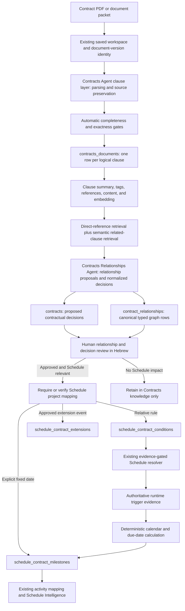

# BIDoc Contracts Pipeline Realignment — CTO Approval Proposal

- Version: 0.11
- Original proposal date: 2026-08-14
- Revision date: 2026-08-15
- Status: CTO-approved as reported by the user on 2026-08-15; R1 completed and remotely verified; R2 completed locally; later gates still require separate approval.
- Requested decision: Approve, amend, or reject the clause-first Contracts pipeline described below
- Runtime status: No runtime behavior changed by this document
- Database status: No migration, DDL, backfill, or remote write is authorized by this document
- Schedule status: Existing Schedule Engine behavior and the eight canonical `schedule_*` tables remain unchanged

This document is an engineering and data-model proposal, not legal advice.

## 1. Executive decision request

The current Contracts implementation should be realigned from a narrow, temporal-candidate-first workflow to a clause-first contract knowledge pipeline.

The proposed direction is:

1. Preserve every logical numbered clause and appendix item as an immutable, traceable source row.
2. Enrich every clause with a short Hebrew summary, tags, references, searchable content, and processing metadata.
3. Run a second agent that creates independently addressable relationship rows, detects conflicts, and creates normalized contractual decisions.
4. Require human review only at the relationship/decision layer, not at the deterministic parsing layer.
5. Keep immutable clause evidence, normalized contractual meaning, and the contractual relationship graph separate from runtime facts discovered later from project evidence.
6. Require Schedule project mapping only when an approved, schedule-relevant decision becomes eligible for projection.
7. Project only reviewed, schedule-relevant decisions into the existing `schedule_contract_milestones`, `schedule_contract_conditions`, and `schedule_contract_extensions` tables.
8. Reuse the current PDF/version storage, review/audit UI, Schedule resolver, and activity-mapping work instead of replacing them.

Exactly three new Contracts domain tables are proposed:

- `contracts_documents`: one row per logical contract clause or appendix item.
- `contracts`: one row per normalized contractual decision, which may be supported by multiple clause rows.
- `contract_relationships`: one canonical, typed, reviewable relationship row between two clause/decision endpoints.

The n8n `Meetings File Agent` is the behavioral reference for document extraction, row splitting, enrichment, indexing, and downstream intelligence. It is not the proposed runtime for new Contracts logic. The repository's standing direction is to implement new agents internally under `src/subagents/*`, while existing n8n ingestion workflows may remain active until separately migrated.

### CTO approval requested

Approve the architecture, three-table boundary, contractual-truth/runtime-truth separation, review point, relationship ontology, and staged implementation plan in Sections 5–17 before any code or database work begins.

## 2. Why realignment is required

The current system contains strong downstream capabilities:

- PDF reading and clause-aware segmentation;
- stable source hashes and document-version identity;
- private saved-contract storage and zero-model-call reopen;
- evidence-grounded review cards and Hebrew review UX;
- immutable review history and optimistic concurrency;
- fixed-milestone and relative-condition projection planning;
- deterministic condition due-date resolution;
- contract-to-activity mapping and schedule-version reconciliation.

However, it starts too late in the intended product flow. It selects a narrow set of temporal segments, produces a small set of typed candidates, and then moves quickly into review and Schedule mapping.

That is a useful downstream slice, but it does not provide the intended general contract knowledge layer:

- not every clause is persisted as a first-class row;
- ordinary contractual decisions are not summarized and indexed;
- related clauses are not represented as a general decision graph;
- conflicts are detected only for a small set of temporal roles;
- Schedule relevance is treated as the extraction scope instead of a later classification;
- the existing 12-candidate sample is not a complete contract-coverage baseline.

The older Schedule specification already records that 74 of 78 measured time obligations were relative conditions and that 76 conditions had previously been imported from an external extraction. This is materially broader than the accepted 12-candidate gold set and confirms that the extraction coverage baseline must be rebuilt.

The realignment is therefore a change in product scope and processing order, not a rejection of the existing safety and Schedule work.

## 3. Confirmed product decisions

The following decisions are treated as confirmed inputs to this proposal:

1. `contracts_documents`, `contracts`, and `contract_relationships` do not currently exist and must be designed and created.
2. Exactly three new Contracts domain tables are proposed at this stage: immutable clause truth, normalized decision truth, and canonical relationship/graph truth.
3. Every logical numbered contract clause and appendix item must be saved before semantic filtering.
4. A second agent must create first-class relationship rows connecting clauses and decisions that belong together.
5. Direct cross-references must be preserved and followed, for example a main clause referring to an appendix.
6. Conflicting clauses must remain visible; the model must not silently choose a winner.
7. Human review is required at the relationship/decision layer, not for routine clause splitting.
8. All user-facing decision text, relationship explanations, review states, and errors must be in Hebrew.
9. Existing code should be retained where it provides useful identity, evidence, review, Schedule, or mapping behavior.
10. No reviewed decision may affect the operational Schedule before explicit human approval and the existing server-owned promotion gate.
11. Runtime facts discovered later from meetings, email, Schedule data, site reports, notices, or other project evidence must not be written back into immutable clause truth or normalized contractual truth.
12. A contract and its clauses may be stored and reviewed without any Schedule project mapping. Schedule mapping is required only for an approved decision that becomes eligible for Schedule projection.

## 4. Meetings workflow reference

The supplied `Meetings File Agent.json` contains an active 35-node parent workflow. Its relevant pattern is:

1. Receive a file from another workflow.
2. Ensure binary and extracted-text inputs.
3. Send a PDF, image, or text payload to a structured-output model.
4. Require one output object per numbered source row and perform a count check.
5. Normalize dates.
6. Split the output array and process rows one by one.
7. Generate a summary and hashtags.
8. Insert a structured row into `meetings`.
9. Build searchable content, create an embedding, and update the source row.
10. Index the row in the shared data index.
11. Run downstream commitment/decision, delay, and relationship extractors.
12. Store document content through the `meetings_documents` document workflow.

This validates the proposed Contracts pattern, but the Contracts domain needs an important difference:

> A meeting action row normally becomes one source entity. A contract clause must remain an independent source row even when several clauses are later combined into one contractual decision.

### 4.1 Referenced sub-workflows not included in the export

The parent export calls eight child workflows whose internal prompts, schemas, and persistence logic were not included:

- `Ensure File Binary`
- `Ensure Extracted Text`
- `Generate Hashtags & Summary Sub-Workflow`
- `Create Meetings Document`
- `Data Index Processor`
- `Intelligence Extract & Upsert`
- `Delay Extract & Upsert`
- `Extract Relationships`

These exports are not required to implement the Contracts pipeline because new Contracts agents remain internal BIDoc code. They are needed only if the team later wants to measure behavioral parity with the Meetings workflow; until then, no parity claim should be made.

### 4.2 Security observation

The supplied export contains a callback secret directly inside a Code node. The value is intentionally omitted from this document. It should be rotated and moved to an n8n Credential, managed secret, or environment-owned configuration before the export is circulated further.

## 5. Proposed end-to-end flow



## 6. Agent boundaries

### 6.1 Contracts Agent — Clause Parser, Enricher, and Indexer

The Contracts Agent clause layer owns source preservation. It must:

- identify every logical numbered clause, sub-clause, and appendix item;
- preserve headings and document context needed to interpret those clauses;
- join a clause that continues across page boundaries into one logical row;
- preserve the exact source text and the complete list of contributing segments/pages;
- assign a stable `clause_key` scoped to an explicit document version and parser generation;
- produce a short Hebrew clause summary and controlled tags;
- extract explicit cross-references without deciding their legal effect;
- create searchable content and an embedding or data-index reference;
- mark the clause row as processed only after automatic validation passes.

The Contracts Agent clause layer must not:

- discard a clause because it appears irrelevant;
- merge two distinct source clauses;
- create a final contractual decision;
- resolve a contradiction;
- calculate a due date;
- write to Schedule tables;
- require a Schedule project mapping before storing a clause;
- require routine human review.

### 6.2 Contracts Relationships Agent — Relationships and Decisions

The Contracts Relationships Agent owns semantic connection and decision normalization. It must:

- load an unprocessed or changed clause and its document context;
- follow explicit references such as `section 6.1 -> Appendix B item 2`;
- retrieve semantically related clauses from the same authoritative document version;
- distinguish supporting, dependent, exceptional, amending, duplicate, and conflicting clauses;
- create canonical `contract_relationships` rows for clause-to-clause, clause-to-decision, decision-to-clause, and decision-to-decision links;
- group one or more clauses into a proposed normalized `contracts` decision while keeping the relationship rows independently addressable;
- retain every source clause and exact evidence snapshot;
- classify whether the decision has Schedule impact;
- extract a fixed date or a relative rule only when explicitly supported;
- preserve missing trigger, calendar, authority, and conflict information;
- save relationship and decision proposals for human review;
- remain idempotent under the same document version, endpoint set, relationship type, and relationship-policy version.

The Contracts Relationships Agent must not:

- choose a conflict winner;
- infer a missing date or triggering event;
- treat a header date as a verified execution or commencement date;
- write a later observed trigger-event date into contractual truth;
- calculate an effective date or lateness;
- write operational Schedule rows before review;
- remove or rewrite Contracts clause source rows.

## 7. New table 1 — `contracts_documents`

### 7.1 Purpose

`contracts_documents` stores the clause-level source layer. One row represents one logical numbered clause, sub-clause, appendix item, or explicitly typed document-context unit.

The existing private `contract_workspaces` table remains the file/version container. `contracts_documents` references a workspace instead of duplicating PDF storage, document hashing, or saved-workspace behavior. R0 verified that the deployed Phase 3F.1 workspace currently requires `schedule_project_id` and includes it in workspace uniqueness; this legacy constraint is incompatible with clause ingestion before Schedule mapping. R1 must adapt the technical workspace contract so new clause-first workspaces may have `schedule_project_id = null`, Schedule identity is excluded from extraction uniqueness, and existing Phase 3F.1 rows remain preserved.

### 7.2 Proposed columns

| Column | Proposed type | Required | Purpose |
| --- | --- | --- | --- |
| `id` | `uuid` | Yes | Clause-row primary key |
| `workspace_id` | `uuid` | Yes | FK to the saved contract workspace |
| `source_project_id` | `uuid` | Yes | Source/document project identity |
| `document_version_id` | `text` | Yes | Immutable SHA-based document version |
| `document_sha256` | `text` | Yes | Exact source-byte identity |
| `parser_generation_id` | `text` | Yes | Immutable parser/segmentation-policy generation for this clause representation |
| `clause_key` | `text` | Yes | Stable key such as `6.1` or `appendix_b.2` |
| `parent_clause_key` | `text` | No | Hierarchical parent clause |
| `clause_type` | `text` | Yes | `clause`, `subclause`, `appendix_item`, or `document_context` |
| `clause_title` | `text` | No | Source or normalized clause heading |
| `clause_order` | `integer` | Yes | Stable order within the document version |
| `page_start` | `integer` | Yes | First PDF page |
| `page_end` | `integer` | Yes | Last PDF page |
| `raw_text` | `text` | Yes | Exact logical-clause text |
| `raw_text_sha256` | `text` | Yes | Immutability and rerun verification |
| `raw_data` | `jsonb` | Yes | Source segments, page locators, headings, parser observations, and optional bounding boxes |
| `summary_he` | `text` | No | Short Hebrew clause summary |
| `hashtags` | `text[]` | Yes | Controlled and extracted clause tags |
| `cross_references` | `jsonb` | Yes | Explicit referenced clauses, appendices, and documents |
| `content` | `text` | No | Search/index text |
| `embedding` | shared vector type or external index reference | No | Semantic retrieval, aligned with the existing indexing contract |
| `processing_status` | `text` | Yes | `pending`, `processing`, `processed`, or `failed` |
| `processing_error` | `text` | No | Sanitized failure reason |
| `parser_version` | `text` | Yes | Parser/segmenter policy version |
| `extractor_version` | `text` | Yes | Clause-enrichment policy version |
| `processed_at` | `timestamptz` | No | Successful processing time |
| `created_at` | `timestamptz` | Yes | Creation time |
| `updated_at` | `timestamptz` | Yes | Last processing-state update |

### 7.3 Required constraints

- Unique logical clause per explicit processing generation: `(workspace_id, document_version_id, parser_generation_id, clause_key)`. This is the proposed final rule because it remains safe whether a workspace later contains one or several document versions and because the same source bytes may be re-segmented under a new parser policy.
- `page_end >= page_start`.
- Clause order must be positive and unique within `(workspace_id, document_version_id, parser_generation_id)`.
- `raw_text`, source identity, page range, and `raw_data` become immutable after insertion.
- Processing/enrichment fields may be updated through server-owned code only.
- Browser roles receive no direct insert, update, or delete privileges.
- Reprocessing the same bytes under the same parser generation creates no duplicate clause rows.
- A parser or segmentation-policy change creates a new `parser_generation_id` and a new immutable clause generation. It must never update historical clause boundaries or evidence in place.
- For example, if Parser V1 stores `6.1 + 6.1.1` as one logical row and Parser V2 stores them as two rows, both generations remain auditable; V2 is an explicit reprocessing result, not a rewrite of V1.
- R0 verified that one deployed workspace row contains exactly one immutable `document_version_id`, one `document_sha256`, and one `extraction_fingerprint`; several workspace rows may represent the same source bytes under different extraction fingerprints. The current fingerprint covers workspace/schema/agent/compiler/model versions but does not explicitly cover parser generation. R1 must add explicit `parser_generation_id` to workspace/extraction identity and fingerprint inputs. The clause composite uniqueness remains mandatory defense in depth.
- The current generation is selected only from a fully completed coverage ledger under an explicitly supported parser generation. Historical generations remain queryable and are never deleted or rewritten. There is no mutable `is_current` flag on immutable clause rows.
- Schedule project identity is deliberately absent from `contracts_documents`; clause ingestion is valid before Schedule relevance or Schedule mapping exists.

### 7.4 Clause completeness rule

Before the Contracts Agent clause layer marks a document version complete, it must produce a coverage ledger containing:

- source numbered-clause count;
- stored logical-clause count;
- appendix-item count;
- cross-page continuation count;
- duplicate-key count;
- unparsed numbered-line count;
- page coverage;
- errors and explicit exclusions.

A document generation with a missing numbered clause, duplicate version-scoped stable key, or truncated source must fail closed and remain incomplete. Completeness is evaluated independently for every `parser_generation_id`.

## 8. New table 2 — `contracts`

### 8.1 Purpose

`contracts` stores append-only normalized decision proposals and reviewed decision revisions. A decision may be supported, constrained, amended, or contradicted by multiple `contracts_documents` rows. Only the current `approved` or `corrected` revision qualifies as reviewed contractual decision truth; `proposed`, `rejected`, `unresolved`, and superseded revisions remain audit history rather than operational truth.

The table contains reviewed contractual meaning only. Canonical clause-to-decision linkage, decision-to-decision linkage, and conflicts live in `contract_relationships`; they are not stored as authoritative JSON/UUID collections on `contracts`.

Runtime facts discovered later from meetings, emails, notices, site reports, Schedule data, or other project evidence are excluded. In particular, the contractual rule may identify a trigger, offset, and calendar semantics, but the date on which that trigger actually occurs belongs to the existing Schedule evidence-resolution layer.

### 8.2 Proposed columns

| Column | Proposed type | Required | Purpose |
| --- | --- | --- | --- |
| `id` | `uuid` | Yes | Decision primary key |
| `workspace_id` | `uuid` | Yes | Authoritative document workspace |
| `source_project_id` | `uuid` | Yes | Source/document project |
| `schedule_project_id` | `uuid` | No | Optional downstream Schedule project; required only when an approved decision becomes eligible for Schedule projection |
| `document_version_id` | `text` | Yes | Immutable source version |
| `parser_generation_id` | `text` | Yes | Clause generation from which the decision was derived |
| `decision_key` | `text` | Yes | Stable decision identity within the version |
| `primary_clause_id` | `uuid` | No | Optional convenience/display FK; canonical clause linkage remains in `contract_relationships` |
| `source_evidence` | `jsonb` | Yes | Immutable evidence snapshot for review/audit |
| `title_he` | `text` | Yes | Hebrew review title |
| `summary_he` | `text` | Yes | Short Hebrew summary |
| `decision_text_he` | `text` | Yes | Normalized contractual meaning in Hebrew |
| `tags` | `text[]` | Yes | Decision tags |
| `people` | `jsonb` | Yes | Mentioned people and organizations with source roles |
| `responsible_party` | `text` | No | Source-grounded responsible party |
| `beneficiary` | `text` | No | Source-grounded beneficiary |
| `decision_category` | `text` | Yes | Controlled contract-domain category |
| `conflict_status` | `text` | Yes | Reconstructable summary state: `none`, `detected`, `reviewed`, or `unresolved`; canonical conflicts are relationship rows |
| `schedule_impact` | `text` | Yes | `yes`, `no`, or `unknown` |
| `temporal_kind` | `text` | Yes | `none`, `fixed`, `relative`, `recurring`, `extension`, or `consequence` |
| `contract_date` | `date` | No | Explicit fixed contractual date |
| `trigger_kind` | `text` | No | Controlled trigger type |
| `trigger_description_he` | `text` | No | Source-faithful trigger description |
| `offset_value` | `numeric` | No | Relative offset |
| `offset_unit` | `text` | No | `hours`, `calendar_days`, `working_days`, `weeks`, or `months` |
| `calendar_semantics` | `text` | Yes | `explicit`, `reviewed`, `unknown`, or `not_applicable` |
| `recurring` | `boolean` | Yes | Repeating obligation flag |
| `review_status` | `text` | Yes | `proposed`, `approved`, `corrected`, `rejected`, `split`, `merged`, `superseded`, or `unresolved` |
| `reviewer_id` | authenticated user ID | No | Server-owned reviewer identity |
| `reviewed_at` | `timestamptz` | No | Server-owned review time |
| `review_reason` | `text` | No | Hebrew review explanation |
| `revision` | `integer` | Yes | Positive append-only decision-lineage revision |
| `supersedes_decision_id` | `uuid` | No | Prior revision in the same scoped decision lineage |
| `projection_status` | `text` | Yes | `not_applicable`, `blocked`, `ready`, `projected`, or `superseded` |
| `model_version` | `text` | Yes | Relationship/decision policy version |
| `decision_policy_version` | `text` | Yes | Prompt, ontology, and normalization policy generation |
| `created_at` | `timestamptz` | Yes | Creation time |
| `updated_at` | `timestamptz` | Yes | Equal to creation time for an append-only decision revision |

### 8.3 Decision identity

The recommended stable identity is:

```text
contract:<document-sha-prefix>:clause:<primary-clause-key>:role:<controlled-decision-role>
```

The complete linked-clause set is not part of the identity. This allows the Contracts Relationships Agent to add or remove canonical relationship rows without changing the decision key. Any material change to the decision meaning is recorded as a new append-only revision linked through `supersedes_decision_id`, not a silent overwrite. The locked uniqueness is `(workspace_id, document_version_id, parser_generation_id, decision_key, revision)`, and stale expected revisions fail before insertion.

`primary_clause_id` and `conflict_status` are convenience fields only. They must be reconstructable and validated against canonical `contract_relationships` rows. No `source_clause_ids`, `relationships`, or `conflicts` collection is authoritative on this table. If a denormalized cache is later justified for performance, it requires separate approval and must be explicitly non-authoritative and reconstructable.

### 8.4 Contract truth boundary

Allowed contractual truth includes:

- an explicit `contract_date` stated by the source;
- `trigger_kind` and a source-faithful Hebrew trigger description;
- contractual `offset_value`, `offset_unit`, and `calendar_semantics`;
- parties, obligations, rights, consequences, and reviewed interpretations grounded in the contract.

Disallowed runtime truth includes:

- the actual date on which commencement, notice, approval, inspection, delivery, or another trigger later occurred;
- a calculated due date derived from project evidence;
- current Schedule progress, activity status, lateness, or completion evidence;
- facts learned only from meetings, email, site reports, notices, or operational systems.

These runtime facts stay in the existing evidence/Schedule resolution layer. They are never written back into contractual-truth fields.

### 8.5 Suggested decision categories

- `scope_and_execution`
- `commencement_and_completion`
- `stage_acceptance_and_handover`
- `payment_and_commercial`
- `notice_and_communication`
- `change_and_approval`
- `bond_and_security`
- `warranty_and_defects`
- `recurring_compliance`
- `delay_extension_and_consequence`
- `termination_and_remedy`
- `document_and_information_obligation`
- `other`

## 9. New table 3 — `contract_relationships`

### 9.1 Purpose

`contract_relationships` is the canonical Contracts graph. Every clause-to-clause, clause-to-decision, decision-to-clause, and decision-to-decision relationship is an independently addressable, queryable, reviewable, versioned, and auditable row.

The table is authoritative for clause-to-decision support and for conflicts. `contracts` must not compete with it through canonical relationship, conflict, or source-clause collections.

### 9.2 Proposed columns

| Column | Proposed type | Required | Purpose |
| --- | --- | --- | --- |
| `id` | `uuid` | Yes | Relationship-row primary key |
| `relationship_key` | `text` | Yes | Deterministic idempotency identity |
| `workspace_id` | `uuid` | Yes | FK to the authoritative workspace |
| `document_version_id` | `text` | Yes | Authoritative source-byte version |
| `parser_generation_id` | `text` | Yes | Clause generation containing the referenced clause endpoints |
| `source_clause_id` | `uuid` | No | FK to `contracts_documents.id` when the source endpoint is a clause |
| `source_decision_id` | `uuid` | No | FK to `contracts.id` when the source endpoint is a decision |
| `target_clause_id` | `uuid` | No | FK to `contracts_documents.id` when the target endpoint is a clause |
| `target_decision_id` | `uuid` | No | FK to `contracts.id` when the target endpoint is a decision |
| `relationship_type` | `text` | Yes | Controlled relationship ontology |
| `origin` | `text` | Yes | `explicit_reference`, `deterministic`, `model`, `human`, or `system` |
| `confidence` | `numeric` | No | Probabilistic confidence only when `origin = model` |
| `evidence` | `jsonb` | Yes | Source locators, exact excerpts, rationale, and deterministic signals |
| `model_version` | `text` | Yes | Model identity or explicit `not_applicable` marker |
| `relationship_policy_version` | `text` | Yes | Relationship ontology/retrieval/prompt policy generation |
| `review_status` | `text` | Yes | `proposed`, `approved`, `corrected`, `rejected`, `superseded`, or `unresolved` |
| `reviewer_id` | authenticated user ID | No | Server-owned reviewer identity |
| `reviewed_at` | `timestamptz` | No | Server-owned review time |
| `review_reason` | `text` | No | Hebrew review explanation |
| `revision` | `integer` | Yes | Optimistic-concurrency revision |
| `supersedes_relationship_id` | `uuid` | No | Optional self-FK for a new policy/review generation that supersedes an older row |
| `created_at` | `timestamptz` | Yes | Creation time |
| `updated_at` | `timestamptz` | Yes | Equal to creation time for an append-only relationship revision |

### 9.3 Endpoint and integrity constraints

The database must enforce:

```sql
check (num_nonnulls(source_clause_id, source_decision_id) = 1)
check (num_nonnulls(target_clause_id, target_decision_id) = 1)
```

Each endpoint column uses an actual foreign key to its typed source table. A generic `source_type + source_id` or `target_type + target_id` polymorphic reference is not approved.

The relationship row and both populated endpoints must belong to the same `workspace_id`, `document_version_id`, and compatible parser generation. The preferred design is database-enforced validation using composite keys where practical and a narrowly scoped constraint trigger for the optional typed endpoints where composite foreign keys cannot express the rule cleanly. R1 must verify the final Postgres implementation and test all four endpoint combinations; server-only validation is insufficient.

Additional checks:

- `confidence` is `null` unless `origin = model`; model confidence must be within `[0,1]`.
- An explicit clause reference uses `origin = explicit_reference` and `confidence = null`.
- A deterministic parser-derived link uses `origin = deterministic` and `confidence = null`.
- Reviewer fields are server-owned and must be consistent with `review_status`.
- A relationship cannot point from an endpoint to itself.
- Browser roles receive no direct insert, update, or delete privileges.

### 9.4 Relationship identity and versioning

`relationship_key` is calculated deterministically from:

```text
document_version_id
+ parser_generation_id
+ typed_source_endpoint
+ typed_target_endpoint
+ relationship_type
```

For directional relationships, source and target order is preserved. For symmetric relationships such as `duplicates` and `conflicts_with`, the two typed endpoint tokens are ordered canonically before hashing so the reverse direction cannot create a duplicate.

`relationship_key` is the logical relationship identity and therefore excludes the policy version. The locked uniqueness is `(workspace_id, document_version_id, parser_generation_id, relationship_policy_version, relationship_key, revision)`. Re-running the Contracts Relationships Agent under the same policy attempts revision 1 idempotently. Human correction appends the next revision under the same policy/key. A materially changed relationship policy creates revision 1 under the new policy and references the prior current row through `supersedes_relationship_id`; it never silently rewrites reviewed history.

## 10. Relationship and conflict ontology

The initial controlled relationship types are:

| Relationship | Meaning |
| --- | --- |
| `cross_reference` | One clause explicitly points to another clause or appendix |
| `supports_same_decision` | Clauses provide complementary facts for one decision |
| `depends_on` | One decision requires another event or decision first |
| `condition_of` | A clause is a condition for another obligation/right |
| `exception_to` | A clause limits or creates an exception to another clause |
| `amends` | A later or more specific provision changes another provision |
| `duplicates` | Clauses repeat materially equivalent content |
| `conflicts_with` | Clauses state materially incompatible values or rules |

Relationship proposals must contain:

- relationship type;
- one typed source endpoint and one typed target endpoint;
- relationship origin;
- source locators and actual typed foreign keys;
- exact evidence excerpts;
- model confidence only for model-origin proposals;
- deterministic evidence, such as an explicit clause reference, when available;
- a short Hebrew explanation;
- document, parser-generation, model, and relationship-policy versions;
- review status.

An explicit cross-reference is evidence of a clause-to-clause link and is stored with `origin = explicit_reference` and `confidence = null`. It is not automatically proof that two clauses form one decision. The Contracts Relationships Agent may separately propose `supports_same_decision` clause-to-decision rows with `origin = model`; the reviewer confirms, corrects, or rejects them.

## 11. Human-review boundary

### 11.1 No routine review for the Contracts Agent clause layer

Clause parsing should be accepted automatically when all deterministic completeness and exactness checks pass. Parsing failures remain visible as technical/document-processing errors; they are not converted into contractual decisions.

### 11.2 Required review for the Contracts Relationships Agent

The reviewer must see:

- the proposed decision in Hebrew;
- every supporting clause and page;
- every proposed first-class relationship row, its typed endpoints, type, origin, evidence, and applicable model confidence;
- direct cross-references;
- conflicting values and sources;
- responsible parties and beneficiaries;
- proposed Schedule impact;
- fixed or relative timing fields;
- missing triggers, calendars, authority, or document-packet dependencies;
- whether Schedule mapping is absent, optional, or required because the approved decision is now projection-eligible.

Recommended review actions:

- approve the decision and individual relationship rows;
- correct normalized fields;
- add or remove canonical clause-to-decision relationship rows;
- split one proposed decision into multiple decisions;
- merge compatible proposals;
- reject an invalid relationship/decision proposal;
- leave a conflict unresolved;
- mark Schedule impact as `no` or `unknown`.

Current review/audit and optimistic-concurrency components should be adapted to decision and relationship rows rather than replaced. Relationship corrections must preserve prior audited rows or revisions; they must not silently rewrite canonical graph history.

## 12. Schedule projection rules

Only reviewed decisions may be projected.

| Reviewed decision | Existing destination | Rule |
| --- | --- | --- |
| Explicit fixed contractual date | `schedule_contract_milestones` | `contract_date` must be present and source-grounded |
| Relative obligation waiting for an event | `schedule_contract_conditions` | Store trigger description plus offset; do not invent a date |
| Approved extension event | `schedule_contract_extensions` | Preserve approval evidence and never rewrite the original `contract_date` |
| No Schedule impact | None | Retain in `contracts` knowledge only |
| Unknown/ambiguous/conflicting | None | Remain blocked for review |

An approved decision with `schedule_impact = no` is complete contractual knowledge even when `schedule_project_id` is `null`. An approved decision with `schedule_impact = yes` does not become projection-eligible until the Schedule project mapping is present and validated.

The LLM must never calculate the due date. After a trigger event is found and verified from runtime/project evidence, the existing resolver and Schedule calendar calculate the due date deterministically and create or update the stable milestone representation. The observed trigger date and calculated due date remain Schedule/runtime truth; they are not copied into `contracts`.

### 12.1 Projection ownership

The preferred ownership model is one-way:

- `contracts.projection_status` records only high-level lifecycle state;
- the resulting canonical Schedule row references its source contractual decision through a field such as `source_contract_decision_id`;
- `contracts` does not store `projection_target_id` or another competing canonical pointer.

R0 verified both checked-in migrations and the read-only live KAPAIM catalog. `schedule_contract_milestones` and `schedule_contract_extensions` contain `source_document_id`; `schedule_contract_conditions` carries the legacy document version in `metadata`; all three carry the legacy Contracts candidate key in `metadata` through the current planner; and none has `source_contract_decision_id` or an equivalent typed decision foreign key. The locked design therefore requires an additive nullable `source_contract_decision_id` foreign key on each applicable Schedule target, subject to a separately approved migration. The Schedule row is authoritative for the projection link; `source_document_id` remains source traceability and the candidate key remains legacy metadata, neither is the canonical decision link. Idempotent projection must prevent duplicate active source projections and reject a stale/superseded decision revision. A milestone deterministically resolved from a condition remains owned through the condition's existing `resolved_milestone_key`; it must not create a second competing direct decision projection.

Activity mapping remains downstream of an approved decision. A global contractual milestone may remain unlinked and still be visible; low-confidence activity mappings must remain pending.

## 13. Worked examples from the Herzliya contract

### 13.1 Cross-reference and one combined completion decision

Source rows remain separate:

| Clause row | Source meaning |
| --- | --- |
| Clause `6.1` | The contractor must complete the works according to Appendix B and start by the Appendix B commencement date |
| Appendix B item `2` | The works must be completed and handed over within 100 working days from commencement |

The Contracts Relationships Agent proposes one normalized decision plus canonical relationship rows:

- Clause 6.1 → Appendix B item 2: `cross_reference`, `origin = explicit_reference`, `confidence = null`
- Clause 6.1 → decision: `supports_same_decision`, with origin and confidence recorded according to how it was produced
- Appendix B item 2 → decision: `supports_same_decision`, with origin and confidence recorded according to how it was produced
- Primary clause: Appendix B item 2
- Decision: complete and hand over the works within 100 working days after commencement
- Temporal kind: `relative`
- Trigger: commencement of the works
- Offset: `100 working_days`
- Schedule impact: `yes`
- Schedule project: nullable during extraction and review; required only before projection
- Projection after approval/mapping: `schedule_contract_conditions` until authoritative runtime commencement evidence and a working calendar are available

Neither source clause is deleted or rewritten. The later observed commencement date is not written into `contracts`.

### 13.2 Conflicting daily delay charges

Source rows remain separate:

| Clause row | Source value |
| --- | ---: |
| Clause `6.7` | ILS 2,000 per delay day |
| Appendix B item `3` | ILS 3,250 per day |

The Contracts Relationships Agent proposes:

- A first-class Clause 6.7 ↔ Appendix B item 3 `conflicts_with` relationship row, canonically ordered for idempotency
- Relationship origin and applicable model confidence recorded independently
- Decision summary `conflict_status = unresolved`, reconstructable from the canonical relationship row
- Both amounts and exact evidence retained
- No conflict winner
- Schedule impact: potentially `yes`, but operational use blocked
- Review required before any consequence is projected or used

### 13.3 Fixed-versus-relative distinction

Clause `14.1.1` requires delivery of the performance bond no later than 14 days after contract signing.

The decision remains relative until an authoritative execution date is discovered and verified by the runtime evidence layer. A visible header date or filename is insufficient. The contractual decision stores the signing trigger and 14-day offset, not the later observed signing date. After approval and Schedule project mapping, the correct initial destination is `schedule_contract_conditions`, not `schedule_contract_milestones`.

### 13.4 Valid decision with no Schedule mapping

A clause governing notice delivery channels may create a valid reviewed contractual decision with `schedule_impact = no` and `schedule_project_id = null`. It remains searchable and available to relationship analysis without ever entering Schedule projection.

## 14. Existing implementation reuse plan

| Existing component | Decision | Required adaptation |
| --- | --- | --- |
| `src/contracts/pdfReader.js` | Reuse | Preserve full page text and parser metadata |
| `src/contracts/segmenter.js` | Reuse and extend | Produce complete logical clauses, cross-page joins, headings, and coverage ledger |
| `src/subagents/contracts.js` | Refactor | Replace narrow temporal-first extraction with Contracts Agent clause-layer and Contracts Relationships Agent orchestration |
| `src/contracts/workspacePersistence.js` | Reuse and adapt | Keep PDF/version identity; make Schedule mapping optional and non-identifying for new clause-first workspaces; add explicit immutable parser generations; include parser, prompt, extractor, and schema versions in extraction reuse identity; keep relationship-policy identity downstream in the Contracts Relationships Agent |
| Saved workspace and private Storage | Reuse | Remain the source file/version container |
| Current candidate compiler/schema | Reuse concepts, version separately | Preserve evidence, typed timing, uncertainty, and stable keys; expand decision ontology |
| Hebrew Contracts UI | Adapt | Show decision groups and independently reviewable canonical relationship rows |
| Review drafts/history | Reuse and extend | Add relationship approval/correction, split/merge, and optimistic concurrency while preserving server-owned audit fields |
| Promotion planner/writer | Reuse | Accept only approved decision rows with validated Schedule mapping; never copy runtime trigger dates into Contracts |
| `schedule_contract_*` tables | Reuse as canonical Schedule truth | Add the verified-missing one-way nullable source decision reference under a separately approved migration; no duplicate Schedule tables |
| `scheduleConditionResolver.js` | Reuse | Continue evidence-gated trigger discovery and deterministic date calculation |
| Activity mapping and Phase 3G reconciliation | Pause, then reuse downstream | Resume only after approved decisions exist in the new pipeline |

The existing 12-candidate workspace remains an immutable legacy `v1` extraction snapshot. It is not treated as a complete contract inventory and must not be overwritten.

## 15. Proposed implementation phases

Every phase below is a separate approval gate. Approval of this architecture does not authorize remote writes or deployment.

### R0 — Architecture and schema lock

Deliverables:

- CTO-reviewable locked flow and three-table contract; approval is still required;
- final column names and controlled enums;
- verified existing workspace/document-version semantics and Schedule source-reference capabilities;
- documented n8n reference limitations with no new Contracts runtime dependency;
- privacy/RLS decision;
- approved examples and review actions.

Exit gate: satisfied by the approval record in Section 18 as reported by the user; the approver's item-by-item checklist was not supplied.

### R1 — Local schema and migration package

Deliverables:

- additive migration package for the three new domain tables;
- typed relationship foreign keys, endpoint CHECK constraints, same-version/generation enforcement, deterministic uniqueness, and relationship revision/audit behavior;
- RLS, grants, indexes, constraints, rollback, and isolated database tests for all three tables;
- no remote apply;
- no data backfill.

Exit gate: database/security review and separate migration-apply approval.

### R2 — Contracts clause parser and completeness ledger

Deliverables:

- logical clause extraction for the full Herzliya PDF;
- every numbered clause and appendix item persisted in an isolated/local fixture;
- cross-page clause support;
- stable version- and parser-generation-scoped rerun identity;
- proof that a parser-policy change creates a new immutable generation instead of mutating prior evidence;
- coverage report and hard-failure cases.

Exit gate: satisfied by the separately approved local implementation recorded in the [R2 Contracts clause parser checkpoint](./BIDoc_Contracts_Pipeline_R2_Contracts_Clause_Parser_Checkpoint_2026-08-15.md): 743/743 source lines accounted, 173 numbered units represented, 13 appendix items stored, eight cross-page clauses preserved, and zero semantic decisions created.

### R3 — Clause enrichment and indexing

Deliverables:

- Hebrew summary and tags per clause;
- explicit cross-reference extraction as input to the Contracts Relationships Agent without prematurely treating references as reviewed decisions;
- searchable content and index integration;
- incremental/idempotent processing state;
- bounded model and token behavior.

Exit gate: exact source preservation plus accepted enrichment quality.

### R4 — Contracts Relationships Agent: relationships, conflicts, and decisions

Deliverables:

- candidate retrieval from direct references and semantic similarity;
- canonical `contract_relationships` rows covering all four typed endpoint combinations;
- controlled relationship origin, confidence, ontology, and conflict behavior;
- same-policy idempotency and new-policy supersession behavior;
- normalized decision creation;
- multi-clause evidence snapshots;
- Hebrew human-review UI and audited actions.

Exit gate: CTO/product acceptance on the worked examples and a broader gold set.

### R5 — Reviewed Schedule projection in shadow mode

Deliverables:

- approved decision-to-target planner;
- zero-write preview;
- fixed/relative/extension classification;
- Schedule mapping required only at projection eligibility;
- one-way authoritative Schedule source-decision linkage using the R0-verified additive nullable FK direction;
- proof that runtime trigger dates and calculated due dates never update contractual truth;
- reuse of the existing condition resolver and activity mapper;
- explicit proof that unreviewed rows create zero Schedule changes.

Exit gate: separate approval for one eligible reviewed promotion.

### R6 — Controlled migration and rollout

Deliverables:

- remote schema verification;
- bounded document reprocessing under a new policy fingerprint;
- preserved `v1` workspace and decisions;
- monitoring, cost, rollback, and idempotency evidence;
- no automatic alerts until separately approved.

## 16. Acceptance criteria

### 16.1 Clause layer

- 100% of approved numbered clauses and appendix items are represented.
- Zero duplicate `(workspace_id, document_version_id, parser_generation_id, clause_key)` rows.
- Zero source-text or page-range mismatches.
- Cross-page continuations are stored as one logical clause with complete segment evidence.
- Identical reruns under the same policy create zero new rows and zero unnecessary model calls.
- Parser/segmentation policy changes create a new immutable generation while preserving all historical clause evidence.
- Clause storage succeeds without a Schedule project mapping.
- Parser or source incompleteness fails closed and remains visible.

### 16.2 Decision layer

- Every decision is linked to at least one existing clause through canonical `contract_relationships` rows.
- Multi-clause decisions retain all exact evidence.
- No authoritative `source_clause_ids`, `relationships`, or `conflicts` collection exists on `contracts`.
- Explicit cross-references are represented with `origin = explicit_reference` and `confidence = null`.
- Material conflicts retain every value and source in independently reviewable relationship rows.
- Zero automatic conflict winners.
- Zero silent clause deletion or mutation.
- All user-facing summaries and review explanations are Hebrew.
- Split, merge, correction, rejection, and unresolved states are auditable.
- A decision with `schedule_impact = no` remains valid when `schedule_project_id` is `null`.

### 16.3 Relationship layer

- Exactly one typed source endpoint and exactly one typed target endpoint are populated per row.
- Actual foreign keys protect every populated endpoint.
- All four endpoint combinations are tested.
- Relationship workspace, document version, and parser generation match both endpoints.
- Same-policy reruns create zero duplicate relationship rows.
- Symmetric relationships cannot be duplicated by reversing endpoints.
- Only model-origin relationships may contain probabilistic confidence.
- Relationship proposals, corrections, rejections, and supersession are independently auditable.

### 16.4 Contract/runtime truth and Schedule safety

- Zero Schedule writes from the Contracts Agent clause layer.
- Zero Schedule writes from unreviewed Contracts Relationships Agent proposals.
- Zero requirement for Schedule mapping during clause ingestion or general decision review.
- Fixed dates, relative rules, and extension events use only their canonical existing tables.
- Zero LLM-calculated due dates.
- Zero actual trigger-event dates, calculated due dates, progress facts, or other runtime evidence written into `contracts`.
- Missing triggers/calendars remain pending.
- Schedule rows, not `contracts`, own the canonical projection reference; no bidirectional pointer synchronization is required.
- Existing Schedule regression tests remain green.
- Existing activity-mapping confidence and conflict guards remain enforced.

### 16.5 Security and operations

- Contract source, decision, and relationship tables are server-owned and least-privilege.
- No secret is embedded in exported workflow code or documentation.
- No client-provided database credentials or reviewer identity are accepted.
- Request bodies, document sizes, and model work are bounded.
- Same-version concurrency is deterministic and stale writes are rejected.
- Prompt, parser, relationship-policy, model, and schema versions participate in extraction reuse identity.

## 17. CTO approval checklist — archived pre-approval template

The item-by-item marked checklist was not supplied. The approval record in Section 18 is authoritative for the approved R0 lock and local R1 scope; this archived template does not imply approval of later gates or confirmation of the historical evaluation-data question.

### Core architecture

- [ ] Approve the clause-first pipeline and the two-agent boundary.
- [ ] Approve exactly three new Contracts domain tables: `contracts_documents`, `contracts`, and `contract_relationships`.
- [ ] Approve retaining existing technical workspace/review tables behind the three domain tables.
- [ ] Approve `contract_relationships` as the canonical relationship, conflict, and clause-to-decision graph.
- [ ] Approve the strict separation between immutable clause truth, reviewed contractual decision truth, relationship graph truth, and runtime/Schedule evidence.
- [ ] Approve implementing new Contracts agents internally in code, using the n8n Meetings workflow as a behavioral reference rather than the target runtime.

### Clause layer

- [ ] Approve storing every logical numbered clause and appendix item before relevance filtering.
- [ ] Approve automatic parsing acceptance when deterministic completeness/exactness gates pass.
- [ ] Approve the proposed `contracts_documents` fields and immutability rules.
- [ ] Approve version- and parser-generation-scoped clause uniqueness and explicit new-generation reprocessing instead of in-place mutation.
- [ ] Approve omitting `schedule_project_id` from `contracts_documents`.
- [ ] Confirm whether unnumbered recitals, signatures, and document headers should be stored as typed `document_context` rows.

### Decision and relationship layer

- [ ] Approve one normalized decision being supported by multiple clause rows.
- [ ] Approve the initial relationship ontology in Section 10.
- [ ] Approve typed nullable clause/decision endpoint columns with actual foreign keys and exactly-one endpoint CHECK constraints.
- [ ] Approve the controlled relationship origins and confidence rule in Section 9.
- [ ] Approve deterministic relationship identity, symmetric endpoint canonicalization, same-policy idempotency, and explicit supersession for new policy generations.
- [ ] Approve removing authoritative `source_clause_ids`, `relationships`, and `conflicts` collections from `contracts`.
- [ ] Approve human review only at the relationship/decision layer.
- [ ] Approve the proposed review actions, including split and merge.
- [ ] Approve preserving unresolved conflicts without selecting a winner.

### Schedule integration

- [ ] Approve Schedule impact as a later decision classification, not a clause-ingestion filter.
- [ ] Approve nullable `contracts.schedule_project_id`, required only when an approved decision becomes projection-eligible.
- [ ] Approve excluding actual trigger dates, calculated due dates, progress, and other runtime facts from `contracts`.
- [ ] Approve reuse of the existing milestone, condition, extension, resolver, and activity-mapping components.
- [ ] Approve one-way projection ownership: the Schedule row should reference the source contract decision, subject to R0 schema verification, while `contracts` retains high-level `projection_status` only.
- [ ] Approve zero operational Schedule writes before explicit decision review.
- [ ] Approve pausing Phase 3G operational continuation until the new decision pipeline has an eligible reviewed decision.

### Data, workflow, and rollout

- [ ] Confirm the n8n child workflows in Section 4.1 are non-blocking reference artifacts, not Contracts runtime dependencies; obtain them only if behavioral parity evaluation is desired.
- [ ] Confirm the deployment schema and RLS/access pattern for the three new tables.
- [ ] Accept the R0 verification that each current workspace row binds one immutable document version, while the legacy workspace still requires Schedule mapping and therefore needs the scoped R1 adaptation described in Section 7.
- [ ] Accept the R0 verification that no Schedule target currently has a typed source-decision FK and approve the one-way additive source-decision reference described in Section 12.
- [ ] Confirm whether the historical 76-condition extraction is available as evaluation data.
- [ ] Approve retaining the current 12-candidate `v1` workspace as immutable historical evidence only.
- [ ] Approve R0 only; all migrations, remote applies, backfills, model reprocessing, and deployment remain separate gates.

## 18. Approval record

| Field | Value |
| --- | --- |
| Decision | Approved |
| Approver | CTO; approval reported by the user, name not supplied |
| Role | CTO |
| Date | 2026-08-15 |
| Approved scope | R0 schema lock and R1 local schema/migration/test package only |
| Required amendments | None reported |
| Additional constraints | No remote apply, backfill, model processing, application/agent/UI work, projection execution, n8n change, or deployment under this approval |
| First implementation gate authorized | R1 local implementation |
| Later implementation gates | Require separate written approval |

## 19. Source references

- Supplied reference workflow: `Meetings File Agent.json` (external file, reviewed 2026-08-14).
- [Contracts Agent and Schedule Intelligence implementation plan](./BIDoc_Contracts_Agent_and_Schedule_Intelligence_Implementation_Plan.md)
- [Schedule Intelligence Engine specification](./BIDoc_Schedule_Intelligence_Engine_Spec.md)
- [Phase 3 CTO handoff](./BIDoc_Phase_3_CTO_Night_Handoff_2026-08-13.md)
- [Phase 3F.1 saved contracts checkpoint](./BIDoc_Phase_3F1_Saved_Contracts_and_Resume_Checkpoint.md)
- [Phase 3G upload reconciliation checkpoint](./BIDoc_Phase_3G_Upload_Reconciliation_Checkpoint.md)
- [R0 architecture and schema lock checkpoint](./BIDoc_Contracts_Pipeline_R0_Architecture_and_Schema_Lock_Checkpoint.md)
- [`src/subagents/contracts.js`](../../src/subagents/contracts.js)
- [`src/contracts/segmenter.js`](../../src/contracts/segmenter.js)
- [`src/contracts/workspacePersistence.js`](../../src/contracts/workspacePersistence.js)
- [`src/subagents/scheduleConditionResolver.js`](../../src/subagents/scheduleConditionResolver.js)
