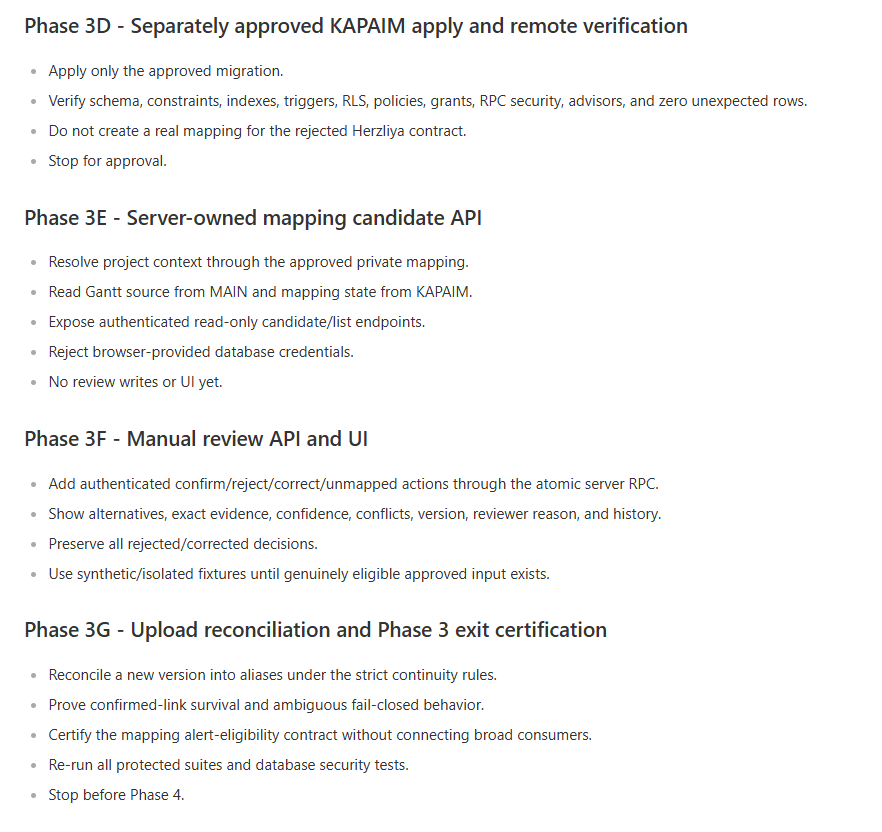

# BIDoc Contracts Agent - Phase 3A Contract-to-Schedule Mapping Audit and Plan

- Date: 2026-08-11
- Status: Phase 3A-3G local implementation complete; upload-reconciliation preview/apply orchestration is verified locally; live Phase 3 exit certification remains pending
- Scope: Repository/database audit, mapping contract, compatibility strategy, pure candidate/reconciliation module, versioned output schema, database controls, server APIs, manual review UI, fixtures, and acceptance evidence
- Code changes: Phase 3B pure module/schema/tests, Phase 3C database package, Phase 3D remote apply evidence, Phase 3E server-owned read-only APIs, Phase 3F gated review/history API plus UI, and Phase 3G server-owned upload-reconciliation orchestration
- Database changes: KAPAIM migrations `20260811170622` and `20260811171813`; Phase 3F history-read migration `20260811214619` exists locally only and was not applied; no mapping or review-event rows were created
- Application deployment: None

## 1. Checkpoint outcome

The Phase 3A audit began with five integration gaps that required bounded checkpoints before UI or database writes:

1. `activityKey` is version-scoped while `stableKey = task_uid` is only an unverified cross-upload assumption.
2. The existing Schedule read path uses one project UUID for both MAIN and KAPAIM even though the approved Phase 2 mapping proves that the two UUIDs differ.
3. `schedule_activity_map` can hold current aliases, confidence, state, and confirmation identity, but cannot preserve immutable review reasons, corrections, conflict groups, or unmapped decisions.
4. There is no mapping caller, API, manual-review UI, or upload reconciliation path.
5. The current alert planner gates on the final indicator confidence level, not an explicit mapping-confidence threshold. A mapping confidence of `0.79` can still produce an automatic alert if it is wired into the current path.

Phases 3B-3G now close the local pure mapping, database, server-owned API, manual-review UI, and upload-reconciliation orchestration gaps. Phase 3G accepts only `sourceProjectId`, loads the authoritative current/previous MAIN versions plus current KAPAIM mapping/history, and keeps apply fail closed behind `CONTRACTS_PHASE3G_UPLOAD_RECONCILIATION_APPROVED=TRUE`. No Phase 3G live RPC was called and no real alias continuation was created. Live exit certification, Schedule consumption, Engine behavior, and alerts remain separate checkpoints.

## 2. Binding boundaries retained

- Existing Schedule calculations remain in [`scheduleEngine.js`](../../src/scheduleEngine.js) and [`scheduleCalendar.js`](../../src/scheduleCalendar.js).
- No mapper, Contracts service, UI, prompt, or Indicator consumer may calculate schedule offsets or lateness.
- MAIN remains the uploaded Gantt source through `gantt_files_test` and `gantt_tasks_test`.
- APP DATA/KAPAIM remains the owner of `schedule_*` data through the existing `contentSource` connection.
- Contractor Gantt source rows are immutable from this workflow.
- The existing `schedule_activity_map` remains the current-state mapping table. No replacement mapping table is proposed.
- Global contractual milestones may remain unlinked and continue to appear as milestone-only indicators.
- Pending conditions remain pending until reviewed trigger evidence exists. Phase 3 does not fabricate trigger dates.
- Phase 5 observed evidence, dependency propagation, WBS/parser enrichment, and broad Phase 4 consumer integration remain out of scope.
- No real mapping is manufactured for the rejected Herzliya sample. It has no eligible approved contractual obligation.

## 3. Git and regression baseline

### 3.1 Git gate

| Check                             | Result                                                |
| --------------------------------- | ----------------------------------------------------- |
| Branch                            | `feature/contracts-indicator-schedule-intelligence` |
| HEAD                              | `b66f1a7ed409c1ef65872d50d74b585ca392b37d`          |
| HEAD subject                      | `feat: add Contracts Agent phases 1 and 2`          |
| Working tree at entry             | Clean                                                 |
| Local`origin/main`              | `ebd37c6f33e50384c73dd1d274dbe2f63c7e8834`          |
| Read-only remote`main` check    | Same`ebd37c6`; remote `main` has not advanced     |
| Branch relation to`origin/main` | `0` behind, `1` ahead                             |

No branch switch, fetch, reset, rebase, merge, commit, push, or deployment occurred.

### 3.2 Protected regression results

| Command                           | Exact result                                                                          |
| --------------------------------- | ------------------------------------------------------------------------------------- |
| `npm.cmd run test:contracts`    | 53 tests passed                                                                       |
| `npm.cmd run test:schedule`     | 47 tests passed                                                                       |
| `npm.cmd run react:build`       | Passed; 18 modules, 431.34 kB, 106.31 kB gzip                                         |
| `npm.cmd run test:contracts:ui` | 3 scenarios passed; 1 audit-only save, 1 migration-readiness error, 0 promotion calls |

The React build rewrote the tracked generated bundle. Because the working tree was proven clean before the build and no source changed, only `public/react/bidoc-react.js` was restored to its exact HEAD version after verification.

## 4. Source-of-truth map

| Responsibility                              | Current owner                                                                                 | Phase 3 finding                                                                                  |
| ------------------------------------------- | --------------------------------------------------------------------------------------------- | ------------------------------------------------------------------------------------------------ |
| Schedule arithmetic and status              | [`scheduleEngine.js`](../../src/scheduleEngine.js)                                           | Canonical and reusable; no parallel calculation allowed                                          |
| Calendar arithmetic                         | [`scheduleCalendar.js`](../../src/scheduleCalendar.js)                                       | Canonical and reusable; not a mapping concern                                                    |
| Source normalization and database selection | [`scheduleIngestion.js`](../../src/scheduleIngestion.js)                                     | Owns version-scoped`activityKey`, `stableKey`, MAIN/KAPAIM split, and current project-ID gap |
| Snapshots and alerts                        | [`subagents/schedule.js`](../../src/subagents/schedule.js)                                   | Does not load mappings; passes`mappingConfidence: null`; alert gate is not mapping-specific    |
| Pending trigger resolution                  | [`subagents/scheduleConditionResolver.js`](../../src/subagents/scheduleConditionResolver.js) | Remains evidence-gated and separate from activity mapping                                        |
| Contract operational projection             | [`contracts/promotionPlanner.js`](../../src/contracts/promotionPlanner.js)                   | Fixed milestone rows currently set`activity_key: null`                                         |
| Atomic Phase 2 transport                    | [`contracts/promotionWriter.js`](../../src/contracts/promotionWriter.js)                     | Uses server-owned APP DATA when called from the protected review routes                          |
| Schedule HTTP API                           | [`server.js`](../../src/server.js)                                                           | No mapping routes; generic Schedule routes use the request-config override mechanism             |
| Schedule UI                                 | [`react/SchedulePage.jsx`](../../src/react/SchedulePage.jsx)                                 | Axes/table, alerts, and pending conditions only; no mapping queue                                |
| Contracts UI                                | [`react/ContractsPage.jsx`](../../src/react/ContractsPage.jsx)                               | Reviews contractual candidates and project mapping only; no activity selection                   |

## 5. Findings by implementation state

### 5.1 Already implemented

- Gantt tasks normalize to:
  - `activityKey = gantt:<file_id>:<task_uid>`;
  - `stableKey = task_uid`;
  - `sourceVersionId = file_id`.
- Current Schedule version selection uses `relevancy_date`, then `uploaded_at`, then `file_id`.
- A tie on the highest `relevancy_date` is exposed as `versionConflict`.
- Cross-version slippage comparison uses `stableKey`, not the version-scoped `activityKey`.
- Contract milestone loading preserves `activity_key` when it already exists.
- Unlinked contract milestones remain visible as milestone-only indicators.
- Phase 2 has one active, reviewed MAIN-to-KAPAIM project mapping in private KAPAIM storage.
- `schedule_activity_map` exists and contains current-state fields for canonical key, alias, alias source, method, confidence, status, confirmer, and timestamps.
- Schedule alerts require a stored snapshot and maintain existing bootstrap, refresh, reopen, and resolution lifecycle behavior.

### 5.2 Verified in Phase 3A

- The remote GitHub `main` ref still equals the Phase 2 base `ebd37c6`.
- KAPAIM `schedule_activity_map` has zero rows and no database-function callers.
- The repository has no runtime caller for `schedule_activity_map`.
- MAIN contains one Gantt file and 382 tasks.
- All 382 current rows have a non-null `task_uid`; all 382 UIDs are distinct within the file.
- Only one version exists, so live cross-upload UID continuity cannot be verified.
- No Schedule mapping API or UI exists.
- The approved private project mapping exists once and is active:
  - MAIN source project: `652bf3e0-9a1e-47ca-b06f-cd8dc33907f7`;
  - KAPAIM Schedule project: `81b1cbac-8fcf-43c1-acdc-6b5c809de0e5`.
- A focused unchanged-code probe reproduced a broken cross-upload contract link even when `task_uid` remained `9`:
  - old key: `gantt:v1.xml:9`;
  - new key: `gantt:v2.xml:9`;
  - result: one milestone-only subject tied to the old key and one activity subject tied to the new key.
- A focused unchanged-code probe passed `mappingConfidence: 0.79` into the existing Engine and alert planner. The indicator confidence became `0.60`/`medium`, and the planner created one automatic alert.

### 5.3 Weak or incomplete

- `task_uid` stability is documented and used but not proven across a real second upload.
- MAIN has no unique constraint on `(project_id, file_id, task_uid)`; current data happens to be unique.
- `schedule_contract_milestones.activity_key` is matched only to the current exact version-scoped key.
- Mapping confidence is not returned as first-class indicator evidence; it only subtracts `0.15` from aggregate confidence when supplied.
- The alert gate accepts aggregate `medium` confidence (`>= 0.55`), which is insufficient for the Phase 3 mapping threshold.
- Bootstrap alert planning does not apply the confidence gate to baselined placeholders or the visible bootstrap summary.
- `schedule_activity_map.status` and `confidence` have no database checks.
- Confirmation fields are not constrained to the status lifecycle.
- There is no efficient project/status review-queue index or project/alias lookup index.
- The existing unique constraint permits the same alias to be confirmed against multiple canonical keys.
- Browser roles retain broad legacy table grants. RLS is enabled with no policies, so those roles are currently denied row access, but the privilege surface is not the intended backend-only model.
- Generic Schedule routes pass `buildRequestConfig(...)`, which can accept request-provided APP DATA URL/key overrides after the route authentication/shared-secret gate. New mapping routes must not inherit that credential path.

### 5.4 Missing

- Versioned mapping-domain contract.
- Candidate generator with alternatives, evidence, and confidence.
- Durable canonical activity identity and alias vocabulary.
- Current-version alias reconciliation after upload.
- Immutable mapping review/correction/conflict history.
- Atomic mapping decision transaction.
- Server-owned source-project to Schedule-project resolution for read paths.
- Authenticated mapping list/confirm/reject/correct APIs.
- Manual mapping review UI.
- Mapping-specific alert eligibility guard.
- Two-version fixtures and lifecycle/security tests.

### 5.5 Requires separate CTO/schema approval

- Any additive mapping audit table, function/RPC, constraint, index, trigger, grant, revoke, or policy.
- Server-only exposure of the existing private MAIN-to-KAPAIM mapping to Schedule read paths.
- Atomic current-state plus immutable-history mapping writes.
- Database enforcement of status, confidence, confirmation consistency, and one confirmed winner.
- Browser-role grant hardening on `schedule_activity_map`.
- Any later Schedule ingestion or Engine extension that consumes confirmed mappings.

## 6. Live `schedule_activity_map` audit

### 6.1 Columns

| Column            | Type            | Null | Default               | Phase 3 use                                                   |
| ----------------- | --------------- | ---: | --------------------- | ------------------------------------------------------------- |
| `id`            | `uuid`        |   no | `gen_random_uuid()` | Current-state mapping row ID                                  |
| `project_id`    | `uuid`        |   no | none                  | KAPAIM Schedule project scope                                 |
| `canonical_key` | `text`        |   no | none                  | Durable logical activity identity                             |
| `alias`         | `text`        |   no | none                  | Contract or Gantt identity attached to the canonical activity |
| `alias_source`  | `text`        |   no | none                  | Controlled alias namespace                                    |
| `match_method`  | `text`        |   no | none                  | Why the alias was proposed or linked                          |
| `confidence`    | `numeric`     |   no | `0.5`               | Final mapping confidence, not contract/date confidence        |
| `status`        | `text`        |   no | `suggested`         | Current-state mapping lifecycle                               |
| `confirmed_by`  | `uuid`        |  yes | none                  | Human confirmer when applicable                               |
| `confirmed_at`  | `timestamptz` |  yes | none                  | Human confirmation time when applicable                       |
| `created_at`    | `timestamptz` |   no | `now()`             | Row creation time                                             |
| `updated_at`    | `timestamptz` |   no | `now()`             | Current-state update time                                     |

### 6.2 Constraints and indexes

- Primary key: `(id)`.
- Foreign key: `project_id -> projects(id) on delete cascade`.
- Unique constraint: `(project_id, canonical_key, alias, alias_source)`.
- No confidence-range check.
- No status-vocabulary check.
- No confirmation-consistency check.
- No partial unique index enforcing one confirmed canonical winner per `(project_id, alias, alias_source)`.
- No dedicated review-queue or alias-lookup index.
- The only indexes are the primary-key and unique-constraint backing indexes.

### 6.3 Triggers, RLS, policies, grants, rows, and callers

- Owner: `postgres`.
- RLS: enabled, not forced.
- Policies: none.
- Trigger: `set_updated_at` before update, calling `set_updated_at()`.
- `anon`, `authenticated`, and `service_role` currently have `SELECT`, `INSERT`, `UPDATE`, `DELETE`, `TRUNCATE`, `REFERENCES`, and `TRIGGER` table grants.
- With RLS enabled and no policies, `anon` and `authenticated` cannot currently access rows; `service_role` can bypass RLS.
- Exact row count: `0`.
- Database functions referencing the table: none.
- Repository runtime callers: none.

### 6.4 What the existing table can and cannot own

The existing table can own:

- the current canonical activity identity;
- per-version Gantt aliases;
- a stable UID alias;
- a contract candidate or milestone alias;
- the current method, confidence, status, confirmer, and confirmation time;
- multiple suggested alternatives before a winner is confirmed.

It cannot safely own by itself:

- immutable review reason and reviewer-event history;
- correction/supersession chains;
- rejected and unmapped decisions when no canonical row should exist;
- a typed conflict group and complete alternatives snapshot;
- evidence snapshots for the contract and Gantt version reviewed;
- atomic proof that current state and immutable audit history changed together.

Encoding these missing facts into `alias_source`, `match_method`, or a sentinel canonical key would overload the existing schema and is rejected.

## 7. Upload identity and survival contract

### 7.1 Current upload behavior

MAIN live schema:

- `gantt_files_test.file_id` is globally unique.
- `gantt_tasks_test.file_id` references the file and cascades on delete.
- `gantt_tasks_test.task_uid` is a non-null integer.
- No database constraint makes `(project_id, file_id, task_uid)` unique.
- Current data has 382 distinct UIDs and no duplicate UID group.
- There is no second file, so `task_uid` survival is unknown rather than verified.

The current application does not contain the upload writer/parser. This repository reads the resulting MAIN tables but cannot prove how a future uploader assigns or preserves `task_uid`.

### 7.2 Canonical-key recommendation

Use an additive canonical activity identity in the existing table:

`canonical_key = schedule-activity:<server-generated-uuid>`

The canonical key is created once for a reviewed logical activity and never embeds a mutable task name, schedule date, model wording, or future file ID. This does not replace or change `activityKey` or `stableKey`.

Recommended alias namespaces:

| `alias_source`        | `alias` value                | Purpose                                        |
| ----------------------- | ------------------------------ | ---------------------------------------------- |
| `gantt_activity_key`  | `gantt:<file_id>:<task_uid>` | Exact version-specific task identity           |
| `gantt_task_uid`      | decimal`task_uid` string     | Candidate continuity signal across versions    |
| `contracts_candidate` | stable`candidateKey`         | Approved obligation identity                   |
| `contract_milestone`  | stable`milestone_key`        | Operational milestone identity when one exists |

Recommended `match_method` vocabulary for the initial phase:

- `manual_review`;
- `exact_uid_continuity`;
- `corrected_manual_review`.

Semantic/graph/WBS methods remain out of scope until their evidence exists.

### 7.3 Reconciliation after a new upload

The reconciliation service receives both old and current normalized tasks and performs no database I/O or date arithmetic.

An existing canonical activity may receive a new `gantt_activity_key` alias automatically only when all are true:

1. The approved MAIN-to-KAPAIM project mapping is active.
2. Current version selection is unambiguous.
3. `task_uid` exists exactly once in both versions.
4. Normalized task name matches exactly.
5. `outline_level` matches.
6. The prior version alias belongs to one confirmed canonical activity.
7. No alternative current task satisfies the same identity.
8. Reconciliation confidence is at least `0.95`.

Otherwise the canonical relationship survives as history, but the current-version alias remains `suggested` or conflict-blocked until review. A changed UID, duplicate UID, renamed/reparented task, or version tie can never silently select a winner.

### 7.4 Contract-link resolution boundary

Phase 3 stores contract and Gantt aliases against one canonical key. It does not change `schedule_contract_milestones.activity_key` semantics and does not update contractor source rows.

The later narrow Schedule-consumption adapter must:

1. load the confirmed contract alias;
2. resolve its canonical key;
3. resolve exactly one eligible current `gantt_activity_key` alias;
4. pass the current version-scoped task into the existing Engine;
5. preserve the canonical key, mapping confidence, review event, and aliases in the indicator evidence/snapshot;
6. fail closed to an unlinked milestone when resolution is missing or conflicting.

That consumption adapter and any Engine evidence-field extension require a separate checkpoint. Broad Chat, Insights, Health, Timeline, or Data Query integration remains Phase 4.

## 8. Project and database routing contract

### 8.1 Verified current gap

`listScheduleProjects()` discovers MAIN projects. `loadScheduleInputs()` then uses the same caller-provided UUID for:

- MAIN Gantt files and tasks; and
- KAPAIM calendars, milestones, extensions, snapshots, alerts, and conditions.

The live approved mapping proves these are different UUIDs. No Schedule read caller uses `private.schedule_contract_project_mappings` today.

### 8.2 Required Phase 3 project context

Every mapping operation uses an internal server-owned context:

```json
{
  "sourceSystem": "main",
  "sourceProjectId": "<MAIN uuid>",
  "scheduleProjectId": "<KAPAIM uuid>",
  "projectMappingId": "<private mapping uuid>"
}
```

Routing is fixed:

- `sourceProjectId` selects only MAIN `gantt_files_test` and `gantt_tasks_test`.
- `scheduleProjectId` scopes only KAPAIM `schedule_*` tables.
- `projectMappingId` is resolved and validated server-side from the existing private Phase 2 registry.
- Names, addresses, browser-selected pairs, and matching UUID text are not identity evidence.
- No second Schedule connection is added.
- Mapping routes use server-owned `config()` and reject content-database URL/key overrides.

Because the private schema is not a browser data surface and no current read RPC exists, a small service-role-only resolver function is a separate schema proposal, not part of Phase 3A.

## 9. Phase 3 mapping output contract

The pure mapping package returns versioned JSON with this minimum shape:

```json
{
  "mappingContractVersion": "contracts-activity-mapping.phase3.v1",
  "outputKind": "candidate_bundle",
  "projectContext": {
    "sourceSystem": "main",
    "sourceProjectId": "uuid",
    "scheduleProjectId": "uuid",
    "projectMappingId": "uuid",
    "mappingStatus": "active"
  },
  "obligation": {
    "documentVersionId": "sha256:...",
    "candidateKey": "contract:...",
    "milestoneKey": null,
    "label": "...",
    "mappingRequirement": "required",
    "conditionStatus": "not_applicable",
    "triggerEvidenceReviewed": true,
    "sourceEvidence": [
      {
        "evidenceId": "evidence:...",
        "sourceText": "...",
        "pdfPage": 12,
        "clause": "7.2"
      }
    ]
  },
  "scheduleVersion": {
    "fileId": "1776105870763_03.12.25.xml",
    "relevancyDate": "YYYY-MM-DD",
    "versionConflict": false
  },
  "candidates": [
    {
      "rank": 1,
      "canonicalKey": null,
      "taskUid": 9,
      "activityKey": "gantt:version.xml:9",
      "taskName": "...",
      "outlineLevel": 3,
      "isSummary": false,
      "isMilestone": false,
      "plannedStart": "YYYY-MM-DD",
      "plannedFinish": "YYYY-MM-DD",
      "confidence": 0.72,
      "evidence": [
        {
          "kind": "token_overlap",
          "detail": "...",
          "scoreDelta": 0.72
        }
      ],
      "blockers": ["human_review_required"]
    }
  ],
  "blockers": [],
  "conflict": null,
  "decisionState": "suggested",
  "automaticAlertEligible": false
}
```

Required invariants:

- Candidates are ranked, but ranking never selects a winner.
- Return up to five alternatives; return every tied candidate within the cap.
- Evidence identifies the exact contract evidence, schedule file, task UID/key, name, hierarchy, and features that affected confidence.
- No schedule date is fabricated and no offset/lateness arithmetic occurs.
- A global milestone sets `mappingRequirement = not_required`, produces no mapping rows, and stays unlinked.
- An unresolved condition without reviewed trigger evidence remains pending and produces no operational link or date.
- A contract date different from a contractor planned date is exposed as raw conflicting facts. The mapper does not calculate variance days.
- A version conflict, project-mapping failure, duplicate UID, or ambiguous winner returns a typed blocker.

## 10. Confidence and automatic-alert semantics

### 10.1 Definition

Mapping confidence answers only:

> How strongly does this contractual obligation refer to this logical/current Gantt activity?

It does not express contract authority, date certainty, Schedule freshness, calendar coverage, forecast quality, or overall indicator confidence.

Levels remain:

- `high`: `0.80-1.00`;
- `medium`: `0.55-0.79`;
- `low`: `0.00-0.54`.

The stored score must be finite and between `0` and `1`. Human confirmation changes status but does not automatically overwrite confidence with `1.0`.

### 10.2 Initial automation policy

- Initial obligation-to-activity selection is always manually reviewed.
- Only strict current-version alias continuation may become `auto_confirmed`, and only at `>= 0.95` under the exact reconciliation rules in Section 7.3.
- A manually confirmed mapping below `0.80` may remain visible for analysis but is never automatic-alert eligible.
- `suggested`, `rejected`, `unmapped`, conflicting, stale-version, or missing-current-alias mappings are never alert eligible.

The pure eligibility rule is:

```text
automaticAlertEligible =
  status in {auto_confirmed, manually_confirmed}
  and confidence >= 0.80
  and currentVersionAliasResolvedExactlyOnce
  and noOpenMappingConflict
  and projectMappingActive
```

Phase 3 does not call the Schedule alert writer. Before Phase 4 consumes mappings, the alert planner must gain a first-class mapping gate; subtracting from aggregate indicator confidence is insufficient. Bootstrap placeholders, bootstrap summary creation, new alerts, and alert reactivation must all respect the mapping gate when an indicator depends on a mapping.

## 11. Manual review lifecycle and history

### 11.1 Lifecycle

```text
candidate generated
  -> suggested
     -> manually_confirmed
     -> rejected
     -> corrected -> new manually_confirmed winner
     -> unmapped

confirmed current-version alias
  -> next upload exact continuation -> auto_confirmed alias
  -> ambiguous continuation -> suggested/conflict-blocked alias
```

Review actions require authenticated reviewer UUID, reviewed timestamp, reason, complete alternatives, selected candidate or explicit unmapped outcome, confidence at review time, exact evidence, and schedule version.

### 11.2 Conflict behavior

- All alternatives remain visible.
- A conflict group has zero or one confirmed winner.
- Rejecting one alternative does not confirm another.
- Correcting a mapping appends a new decision and supersedes current state atomically; it does not delete the old decision.
- A contract-versus-contractor-date conflict remains visible after mapping and does not lower either source into silence.
- Observed-evidence conflicts remain Phase 5.

### 11.3 Smallest schema-compatible proposal

Retain `public.schedule_activity_map` as the current-state alias table and propose one append-only companion audit table in the non-exposed `private` schema:

`private.schedule_activity_mapping_review_events`

Minimum responsibilities:

- stable event key and optional prior-event reference;
- KAPAIM project and approved project-mapping identity;
- document version, contract candidate/milestone identity;
- reviewed schedule version and all alternatives;
- action: confirm, reject, correct, or unmapped;
- selected canonical/activity alias when applicable;
- confidence, evidence, conflict snapshot;
- reviewer UUID, reviewed time, reason;
- immutable creation time.

This is not a replacement mapping table. It supplies the immutable history that the current-state table cannot represent.

The later exact migration proposal should also include:

1. confidence/status/confirmation checks on `schedule_activity_map`;
2. a partial unique index allowing at most one confirmed canonical winner per project/alias/source while preserving multiple suggestions;
3. project/status and project/alias lookup indexes;
4. an immutable trigger on the audit table;
5. a server-role-only, `SECURITY INVOKER`, empty-`search_path` project-context resolver;
6. a server-role-only atomic review RPC that appends the audit event and changes current mapping state together;
7. removal of direct browser-role access to mapping state/audit and RPC execution;
8. isolated database tests, lint, advisors, permission diff, and non-destructive rollback plan.

No SQL is created or applied in Phase 3A.

## 12. Required fixtures

| Fixture                                         | Required result                                                                          |
| ----------------------------------------------- | ---------------------------------------------------------------------------------------- |
| Same UID, name, and outline across two versions | Same canonical activity; new version alias may auto-confirm at`>= 0.95`                |
| Same UID but changed name or outline            | Suggested/conflict-blocked; no silent carry-forward                                      |
| Changed UID with similar name                   | Alternatives only; manual review required                                                |
| Duplicate UID in current version                | Typed identity conflict; no winner                                                       |
| Two equally plausible current tasks             | Both alternatives preserved; no winner                                                   |
| Mapping confidence`0.79`                      | `automaticAlertEligible = false`                                                       |
| Manually confirmed score`0.79`                | Remains visible but cannot create/reactivate/bootstrap an automatic mapping-driven alert |
| Corrected mapping                               | Old review retained; new winner references prior decision                                |
| Rejected mapping                                | Reviewer/time/reason/evidence retained; no operational link                              |
| Explicit unmapped decision                      | Audit event retained; no sentinel activity or fabricated date                            |
| Global contractual milestone                    | No mapping required; milestone remains unlinked and visible                              |
| Pending condition without trigger evidence      | Remains pending; no date and no activity link                                            |
| Contract date differs from planned finish       | Both dates visible as an open source conflict; mapper performs no date arithmetic        |
| Missing/inactive MAIN-to-KAPAIM mapping         | Fail closed before KAPAIM mapping access                                                 |
| Browser database credential override            | Mapping endpoint rejects the request                                                     |
| Schedule version tie                            | Mapping review blocked until version conflict is resolved                                |

## 13. Phase 3 acceptance criteria

Phase 3 is complete only when:

1. The existing table remains the current-state mapping source; no replacement or core activity-key change exists.
2. A confirmed logical link survives a two-version fixture through a new exact Gantt alias.
3. Ambiguous or changed identity never silently inherits a link.
4. Initial obligation mapping is manually reviewed.
5. Confidence below `0.80` cannot create, reactivate, or bootstrap an automatic mapping-driven alert.
6. Reviewer, time, reason, evidence, alternatives, rejected decisions, corrections, and prior history are immutable.
7. One alias cannot have two confirmed canonical winners.
8. Unmapped obligations remain explicit and do not receive placeholder activities or dates.
9. Global milestones remain valid without a mapping.
10. Pending conditions remain pending until reviewed trigger evidence exists.
11. Contract-versus-contractor facts remain separately visible.
12. MAIN source rows are never mutated.
13. Mapping APIs use the existing MAIN and APP DATA/KAPAIM connections with server-owned credentials only.
14. The active private Phase 2 project mapping is reused; no second project-mapping registry exists.
15. Protected Contracts and Schedule regressions remain green.
16. No Phase 5 observed evidence/dependency enrichment or broad Phase 4 consumer integration is introduced.

## 14. Proposed subphases

### Phase 3A - Audit and contract lock

This document. No runtime or database change. Stop for CTO approval.

### Phase 3B - Pure mapping contract and fixtures - complete

- Added a versioned, no-I/O mapping module.
- Added controlled alias/method/status vocabulary.
- Implemented candidate bundles, alternatives, blockers, confidence, and `automaticAlertEligible`.
- Added the two-version and safety fixtures from Section 12.
- Do not add APIs, UI, database access, migrations, writes, or Schedule Engine changes.

### Phase 3C - Exact schema/DCL proposal and isolated tests - complete

- Added the exact additive audit table, validated constraints, focused indexes, resolver RPC, review RPC, grants/revocations, non-destructive rollback plan, and SQL tests.
- Compiled and tested only in the isolated local Supabase/PostgreSQL environment.
- Did not apply to KAPAIM and did not create a real activity mapping.
- Stopped for CTO/security approval before Phase 3D.

### Phase 3D - Separately approved KAPAIM apply and remote verification - complete

- Applied the approved primary migration and the separately approved advisor-driven composite-index follow-up.
- Verified schema, constraints, indexes, triggers, RLS, policies, grants, RPC security, advisors, and zero unexpected rows.
- Did not create a real mapping for the rejected Herzliya contract.
- Stopped before Phase 3E.

### Phase 3E - Server-owned mapping candidate API - complete

- Resolves project context through the approved private mapping resolver.
- Reads the current Gantt source from MAIN and mapping state from KAPAIM.
- Exposes authenticated read-only activity-list and candidate endpoints.
- Rejects browser-provided database credentials/configuration and browser-supplied task/mapping lists.
- Performs no review write, Schedule arithmetic, alert integration, or UI change.
- Live read-only verification resolved the approved route, 382 current activities, and 0 mappings.
- Stopped before Phase 3F.

### Phase 3F - Manual review API and UI - locally complete, live gate closed

- Added authenticated confirm/reject/correct/unmapped actions through the single atomic server RPC.
- Added a service-role-only immutable history read RPC plus strict history filtering.
- The server rebuilds current alternatives and owns reviewer identity, review time, evidence, correction continuity, and database credentials.
- The Contracts UI shows maximum-five alternatives, exact evidence, confidence, blockers, conflicts, Schedule version, substantive reason, and immutable history.
- Synthetic/isolated fixtures verify confirmation and correction; the server activation gate remains closed and the local history migration was not applied to KAPAIM.
- No real mapping, alert, Schedule calculation, deployment, commit, or push occurred in this checkpoint.

### Phase 3G - Upload reconciliation locally complete; live exit certification pending

- Added read-only preview and separately gated apply routes that accept only the MAIN `sourceProjectId`.
- Retained authoritative current/previous tasks and versions, with exact source-count and ambiguity checks.
- Cross-checked current KAPAIM mapping rows against complete immutable history; drafts and browser-owned automation fields are never trusted.
- Added deterministic idempotency, reviewer-null/server-time evidence, manual-confirmation preservation, and fail-closed behavior for incomplete, ambiguous, or truncated source/history state.
- Apply uses only the existing atomic review RPC and performs no Schedule arithmetic or alert write.
- Local verifier and protected Contracts/Schedule suites pass; a real two-upload proof and live Phase 3 exit certification remain pending.

## 15. CTO decisions and recommendations

| ID    | Decision                    | Recommendation                                                                                                                                        | Reason                                                                                |
| ----- | --------------------------- | ----------------------------------------------------------------------------------------------------------------------------------------------------- | ------------------------------------------------------------------------------------- |
| D3-01 | Canonical activity identity | Approve additive`schedule-activity:<uuid>` canonical keys in `schedule_activity_map`; retain existing `activityKey` and `stableKey` unchanged | Survives file/UID changes without replacing Engine task identity                      |
| D3-02 | Project routing             | Approve server-only reuse of`private.schedule_contract_project_mappings` and separate internal source/Schedule project IDs                          | Current single-ID read path cannot consume KAPAIM rows for the MAIN-selected project  |
| D3-03 | Review history gap          | Approve one private append-only mapping review-event table; retain public map as current state                                                        | Existing table lacks immutable reasons, corrections, conflicts, and unmapped history  |
| D3-04 | Atomicity                   | Approve one server-only atomic review RPC                                                                                                             | Prevents current-state mapping changes without matching audit evidence                |
| D3-05 | Mapping table hardening     | Approve checks, focused indexes, one-confirmed-winner enforcement, and browser-role grant removal                                                     | Current schema permits invalid confidence/status and multiple confirmed winners       |
| D3-06 | Automation threshold        | Require manual initial mapping; allow only strict alias continuation at`>= 0.95`; keep alert threshold at `>= 0.80`                               | Live data cannot yet prove UID durability, and a wrong mapping is worse than no alert |
| D3-07 | Alert integration boundary  | Keep Phase 3 free of alert writes; require a first-class mapping gate before Phase 4 consumption                                                      | Current aggregate confidence gate allows a`0.79` mapping to create an alert         |
| D3-08 | Date conflicts              | Preserve raw contract and contractor dates; calculate variances only in the existing Engine                                                           | Maintains Rule 001 and keeps both sources visible                                     |
| D3-09 | Real sample behavior        | Do not create any live activity mapping for the all-rejected Herzliya review                                                                          | No eligible approved contractual fact exists                                          |

## 16. Risks and deferred items

| Risk                                             | Current control                                                                                | Deferred action                                                         |
| ------------------------------------------------ | ---------------------------------------------------------------------------------------------- | ----------------------------------------------------------------------- |
| UID reused or changed                            | No automatic initial mapping; strict continuation evidence                                     | Reassess after a real second upload exists                              |
| Incorrect mapping creates wrong alert            | Mapping-specific eligibility contract; no Phase 3 alert caller                                 | Enforce in narrow Schedule adapter before Phase 4                       |
| Project UUID crosses databases incorrectly       | Exact server-only resolver is packaged and locally tested against the approved private mapping | Apply and verify only in an approved Phase 3D                           |
| Review history lost                              | Immutable companion audit table and atomic review RPC are packaged and locally tested          | Apply and verify only in an approved Phase 3D                           |
| Browser writes mapping rows                      | Phase 3C migration revokes browser-role table/RPC privileges and retains RLS defense in depth  | Verify the permission diff remotely only in Phase 3D                    |
| Schedule activity renamed/reparented             | Exact carry-forward rules block automation                                                     | Manual review and correction history                                    |
| Contract and contractor dates differ             | Preserve both facts                                                                            | Existing Engine computes variance only after approved consumption       |
| No real eligible contract input                  | Synthetic fixtures only                                                                        | Wait for genuine approved fact; do not weaken gates                     |
| Snapshot/alert continuity remains version-scoped | No Phase 3 consumer integration                                                                | Address narrowly with the approved mapping adapter before broad Phase 4 |
| WBS/dependencies/observed evidence unavailable   | Explicitly excluded                                                                            | Phase 5 or separately approved parser enrichment                        |

## 17. Bounded implementation slices completed

The approved Phase 3B slice changed only:

- new pure module: `src/contracts/activityMapping.js`;
- versioned JSON schema: `docs/Indicator + Contracts/schemas/contracts-activity-mapping.phase3.v1.schema.json`;
- focused pure tests in `test/contracts-agent.tests.js`;
- this checkpoint document's status/progress sections.

The slice implements:

- input/output validation;
- controlled alias, method, status, blocker, and confidence semantics;
- ranked alternatives without winner selection;
- global-milestone and pending-condition fail-closed handling;
- strict two-upload alias reconciliation;
- explicit `automaticAlertEligible` logic;
- no-I/O and no-schedule-arithmetic source guards.

Verification for Phase 3B:

- `npm.cmd run test:contracts` - 64 tests passed, including 11 new Phase 3 mapping tests;
- `npm.cmd run test:schedule` - 47 tests passed;
- `node --check src/contracts/activityMapping.js` - passed;
- candidate and reconciliation fixtures validated against the Draft 2020-12 JSON schema;
- `git diff --check` - passed;
- protected-file proof confirmed that `src/scheduleEngine.js`, `src/scheduleCalendar.js`, database migrations, server routes, React files, and the generated bundle are unchanged.

The approved Phase 3C slice added only:

- the exact additive migration `supabase/migrations/20260811170622_contracts_phase3_activity_mapping_review.sql`;
- the non-destructive operational rollback `supabase/rollbacks/contracts_phase3_activity_mapping_review.rollback.sql`;
- isolated SQL fixtures, behavioral/security assertions, and post-rollback assertions under `supabase/tests/`;
- the dedicated Docker-backed harness `scripts/test-contracts-phase3-db.mjs` and two package scripts;
- the Phase 3C checkpoint document.

Phase 3C hardens the existing `schedule_activity_map`, adds immutable review-event history, and exposes two backend-only `SECURITY INVOKER` RPCs with empty `search_path`. It performs no API, UI, Schedule ingestion, Engine, alert, deployment, or KAPAIM change.

Verification for Phase 3C:

- `npm.cmd run test:contracts:phase3-db` - passed from a clean isolated database with 10 mapping rows, 6 immutable review events, and 8 confirmed winners;
- local Supabase schema lint - no schema errors;
- local Supabase security/performance advisors - no issues;
- `npm.cmd run test:contracts:phase3-db:rollback` - passed, preserving all 10 mapping rows and 6 review events;
- protected Contracts and Schedule regression results are recorded in the Phase 3C checkpoint.

## 18. Manual UI review for Phases 3B-3F

Automated browser verification covers the Phase 2 review-only regression and the Phase 3F mapping workspace at desktop and 390px mobile widths. Optional local acceptance:

1. Open `http://localhost:4000/#contracts` and run a dry extraction.
2. Under “סקירת קישור לפעילות בלוח”, open an extracted fact and confirm exact contract evidence, current Schedule version, blockers, and maximum-five alternatives are visible.
3. Confirm a tied/conflicting set requires the explicit conflict-resolution checkbox before confirmation or correction.
4. Confirm the history panel shows reviewer, time, reason, selected activity, and supersession without deleting older events.
5. Confirm the save action remains disabled while the server-only Phase 3F gate is closed.
6. At 390px width, confirm the mapping summary and alternatives stack without horizontal overflow.

## 19. Stop gate

Phase 3G now ends at a locally verified server-owned preview/apply orchestration. The separate apply gate remains closed and no live reconciliation was attempted. Do not enable `CONTRACTS_PHASE3G_UPLOAD_RECONCILIATION_APPROVED`, call the live automatic-continuation RPC, manufacture a mapping or second upload, certify Phase 3 exit, modify Schedule ingestion/Engine behavior, generate an alert, begin Phase 4, push, or deploy without the corresponding separate approval and real authoritative prerequisites.

## 20. Phase 3B completion record

| Area                    | Implemented result                                                                                                                                                                                         |
| ----------------------- | ---------------------------------------------------------------------------------------------------------------------------------------------------------------------------------------------------------- |
| Candidate generation    | Deterministic maximum-five review alternatives with exact evidence, confidence, controlled blockers, no initial winner, and no automatic alert eligibility                                                 |
| Fail-closed behavior    | Global milestones remain unlinked; unreviewed trigger conditions remain pending; inactive project mappings, version conflicts, duplicate UIDs, tied candidates, and alias conflicts block automation       |
| Upload reconciliation   | A confirmed canonical relationship receives a new version-scoped alias only when UID, normalized name, hierarchy, project routing, version selection, uniqueness, and the`0.95` confidence gate all pass |
| Alert contract          | Pure eligibility requires confirmed status, confidence`>= 0.80`, exactly one current alias, no open conflict, and an active project mapping; no alert caller was added                                   |
| Persistence and runtime | No database query/write, migration, RPC, API route, UI, Schedule Engine import, date arithmetic, environment access, or deployment                                                                         |
| Real sample             | No mapping row was created for the rejected Herzliya contract                                                                                                                                              |

## 21. Phase 3C completion record

| Area                     | Implemented result                                                                                                                                                                                                   |
| ------------------------ | -------------------------------------------------------------------------------------------------------------------------------------------------------------------------------------------------------------------- |
| Existing map hardening   | Validated canonical-key, vocabulary, confidence, confirmation-consistency, and alias-shape checks plus one-confirmed-alias-winner enforcement and focused indexes                                                    |
| Immutable review history | Private, RLS-enabled append-only event table captures idempotency fingerprint, supersession, exact project/document/Schedule context, alternatives, evidence, conflict, reviewer reason/time, submission, and result |
| Atomic review behavior   | Manual confirm/correct, reject, unmapped, and strict`>= 0.95` same-UID cross-version continuation update current state and audit evidence atomically                                                               |
| Fail-closed controls     | Project/version mismatch, changed UID, same-version continuation, duplicate winners, unresolved auto conflicts, invalid selections, and sub-threshold automation fail without partial rows                           |
| Access boundary          | Resolver and review RPCs are backend-only`SECURITY INVOKER` functions with empty `search_path`; browser table/function privileges are revoked                                                                    |
| Rollback                 | Operational entry points and mutation grants can be disabled without deleting current mappings or immutable review evidence                                                                                          |
| Live state               | KAPAIM, MAIN source data, server/API/UI/runtime files, Schedule arithmetic, alerts, deployment, and the rejected Herzliya sample remain unchanged                                                                    |

## 22. Phase 3D completion record

| Area | Verified result |
|---|---|
| Remote history | `20260811170622 contracts_phase3_activity_mapping_review` and `20260811171813 contracts_phase3_cover_project_mapping_fk` recorded after the three Phase 2 migrations |
| Catalog | 22 Phase 3 constraints validated, 9 planned indexes present, immutable trigger enabled, and both RPCs present |
| Access boundary | Both RPCs remain invoker functions with empty `search_path`, explicit service-role guards, no `PUBLIC`/browser execution, and minimum table privileges |
| Advisor closure | Composite project-mapping FK index corrected to `(project_mapping_id, project_id)`; no Phase 3 warning/error remains |
| Data preservation | 0 current mappings, 0 mapping-review events, 0 milestones, 0 extensions, and 0 conditions; Phase 2 audit counts remain 1 batch, 12 decisions, and 1 attempt |
| Runtime boundary | No API/UI caller, Schedule behavior, alert, application flag, deployment, commit, or push was added |

## 23. Phase 3E completion record

| Area | Verified result |
|---|---|
| API | Same-origin `GET /api/contracts/activity-mapping/activities` and `POST /api/contracts/activity-mapping/candidates` are implemented |
| Routing | The server accepts only the authoritative MAIN UUID, resolves the active private mapping through the approved KAPAIM RPC, then reads MAIN Gantt and KAPAIM map state |
| Client boundary | Database URL/key/table/RPC overrides, extra list query fields, and browser-supplied task/mapping lists fail closed |
| Runtime behavior | The pure Phase 3B mapper produces review candidates; no winner is selected, no review RPC is called, and `operationalWritesPerformed` remains false |
| Live proof | The approved route resolved to one conflict-free Gantt version with 382 current activities and 0 existing mappings |
| Regression | Contracts 69/69 and Schedule regressions remain green; service/server/script syntax and diff checks pass |
| Deferred | Manual review API/UI, mapping writes/history actions, upload reconciliation, consumer integration, alerts, deployment, commit, and push remain outside Phase 3E |

## 24. Phase 3F local completion record

| Area | Verified result |
|---|---|
| Review API | Same-origin `POST /api/contracts/activity-mapping/review` supports only confirm/reject/correct/unmapped; the server rebuilds current alternatives and owns reviewer/time/evidence |
| History API | Same-origin `GET /api/contracts/activity-mapping/history` calls a service-role-only invoker RPC with exact project/document/candidate filters and immutable newest-first events |
| Safety | Browser credentials, reviewer identity/time, task lists, automatic continuation, stale selections, unresolved conflicts, and unsafe blockers fail closed; writes require an exact server-only activation flag |
| UI | Hebrew review workspace shows exact evidence, version, alternatives, confidence, blockers/conflicts, explicit resolution, reason, correction supersession, and immutable history; controlled reviewer terminology is deterministically localized while source evidence remains explicitly marked |
| Database | Local migration `20260811214619` adds only the history read function; isolated full and non-destructive rollback suites pass; it was not applied to KAPAIM |
| Regression | Contracts 79/79, Schedule 47/47, existing Phase 2 UI, Phase 3F desktop/mobile UI, React build, syntax, and diff checks pass; Contracts includes alternate-model retry and validated-chunk resume, while 12 mapping cards show 0 clipping/overlap/controlled-English leaks at 1634px and 390px |
| Live boundary | The gate remains closed; no live review RPC, mapping row, review event, Schedule calculation, alert, deployment, commit, or push occurred |
| Deferred | KAPAIM history availability, live activation/first eligible review, live two-upload reconciliation, Phase 3 exit certification, consumers, and alerts require later approval |

## 25. Phase 3G local completion record

| Area | Verified result |
|---|---|
| Request boundary | Preview and apply accept only server-routed `sourceProjectId`; browser task state, drafts, credentials, reviewer/time, and `auto_continue` decisions are rejected |
| Source authority | The server retains exactly selected current/previous MAIN versions and tasks, validates declared counts, and combines them only with current KAPAIM mappings and complete immutable review history |
| Continuation safety | Only exact UID/name/outline continuity at `>=0.95` is eligible; conflicts, duplicates, missing provenance, truncated history, and ambiguous versions fail before any write |
| Apply behavior | A separate exact Phase 3G flag gates writes; deterministic keys make retries idempotent; an existing human-confirmed current alias is never overwritten; only the existing atomic review RPC is used |
| Regression | Dedicated Phase 3G verifier 16/16, Contracts 96/96, Schedule 47/47, and focused syntax checks pass |
| Live boundary | No Phase 3G RPC, KAPAIM write, server restart, Schedule calculation, alert, deployment, commit, or push occurred; real two-upload exit certification remains pending |
