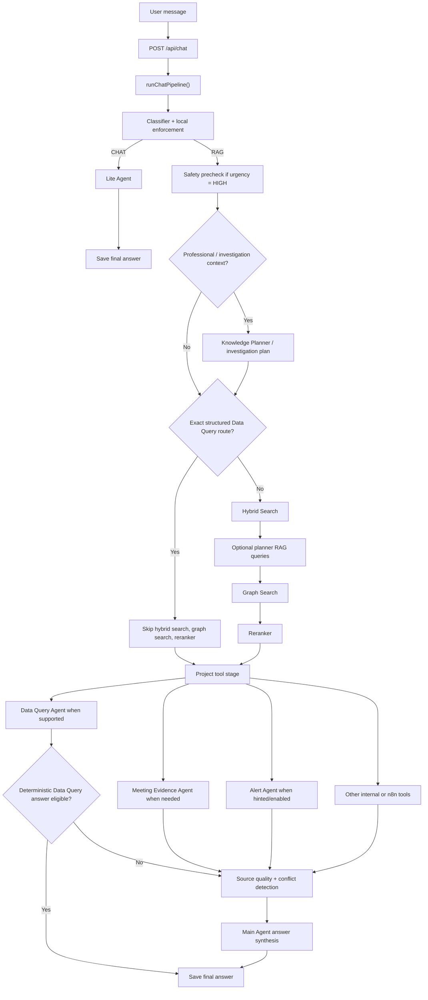
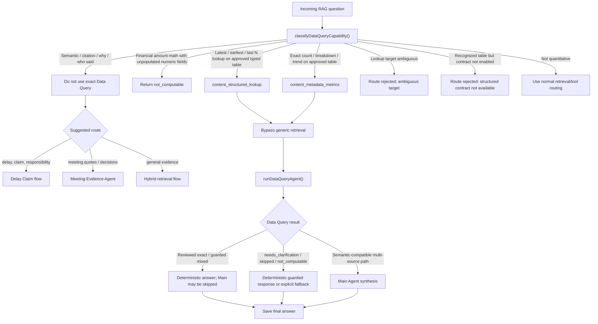
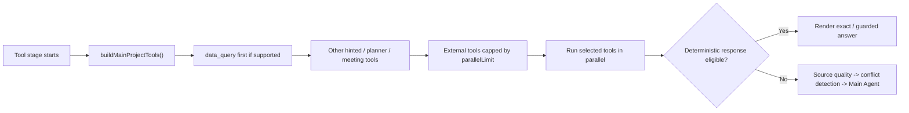
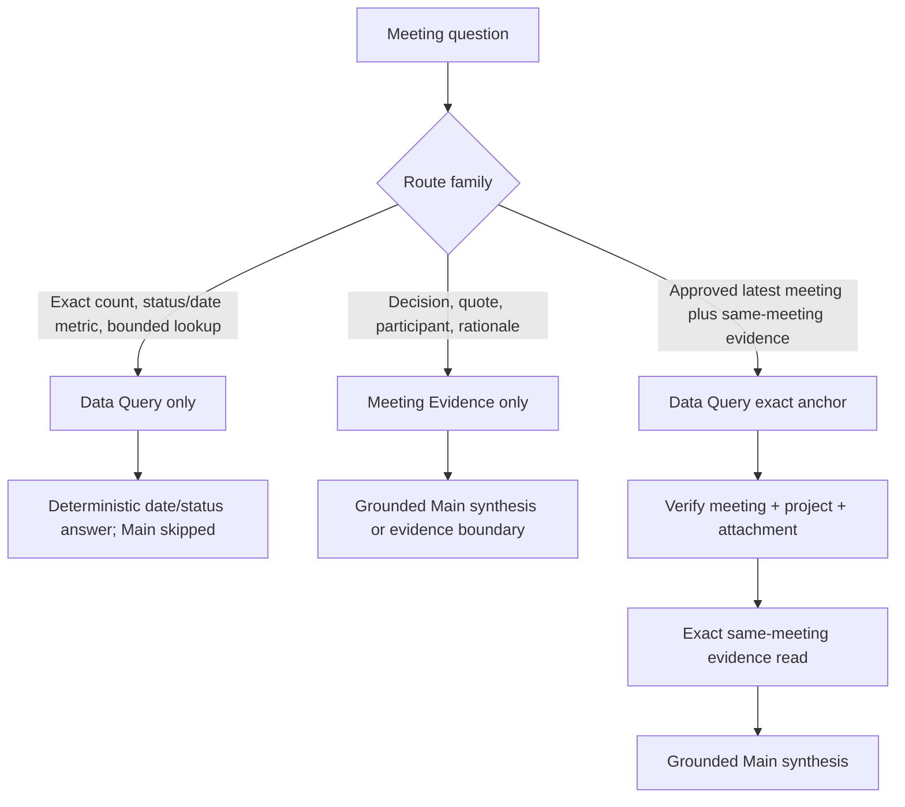

# Agent Routing Flow With Data Query Agent

Current runtime snapshot based on `src/agent.js`,
`src/subagents/dataQuery.js`, and `src/subagents/meeting.js` as of the completed
Phase 4D closeout on 2026-07-26.

This document describes live routing through the reviewed `meetings` capability.
Phase 4E and later table ideas remain deferred.

## 1. Main chat routing

## 2. Data Query routing decision

## 3. Practical route rules

- `CHAT` questions go straight to `Lite Agent`.
- `RAG` questions always go through the main pipeline, but exact structured Data Query can short-circuit retrieval.
- `shouldBypassGenericRetrieval()` bypasses `hybrid_search`, `graph_search`, and
  `reranker` for reviewed exact structured lookup/metadata routes, their
  deterministic guarded variants, the approved alert/meeting mixed routes, and
  the pure Meeting Evidence route.
- Reviewed deterministic financial, safety, alert, and meeting exact routes still reach
  the shared tool stage, then can finish through their deterministic answer or
  postcondition path and skip Main. Semantic or compatible multi-source routes
  continue to Main when required.
- Investigation and Knowledge Planner are skipped for every reviewed structured
  bypass route. They remain available on non-structured professional or
  investigation questions; planning activity alone is not project evidence.
- Semantic questions are intentionally not Data Query questions, even if they mention invoices, meetings, alerts, or reports.
- Current semantic redirect behavior from `classifyDataQueryCapability()` is:
  - delay / claim / responsibility -> `delay_claim`
  - meeting quotes / decisions -> `meeting_evidence`
  - other evidence questions -> `hybrid_search`

## 4. Current tool-stage order

- `data_query` is kept ahead of external tools.
- `data_query` does not consume the external `parallelLimit`.
- Meeting Evidence is included when the typed semantic redirect selects it, when
  meeting signals exist, or when an eligible non-structured investigation needs it.
- Safety precheck tools are handled earlier and are filtered out from the later shared tool list.

## 5. Current exact-route boundary

- Exact route now:
  - approved structured metadata metrics
  - approved latest / earliest / last-N lookups
- Exact route does not do:
  - semantic explanations
  - citations / quotes
  - responsibility / root cause
  - unsupported financial amount math
- For those cases, the system must combine or redirect to retrieval/evidence agents instead of forcing Data Query to answer alone.

## 6. Phase 4D meeting route supersession

The general parallel tool-stage diagram above does not apply to the approved
mixed meeting handoff. Current meeting routing is:

- All three branches skip Hybrid Search, graph search, reranking, investigation
  planning, and knowledge planning.
- Exact output contains only canonical meeting date and opaque stored status;
  no exact source link is available.
- Pure semantics never use Data Query as evidence. Mixed execution is sequential,
  never a parallel broad retrieval, and accepts chunks only after exact source,
  project, attachment, date, and status attestation.
- The semantic RPC remains first. Only structural HTTP 400/404 failures may use
  the temporary fixed, bodyless, 500-row-capped compatibility read. It performs
  no adjacency expansion and redacts identifiers, filenames, URLs, embeddings,
  scores, and provider errors.
- Main retry input is sanitized. Missing or mismatched evidence produces an
  explicit boundary without replacing the exact metadata.
- Local unscoped acceptance relies on the audited single-project shape.
  Production/multi-project use remains blocked on authorization-bound project
  scope; SEC-001 remains deferred.
