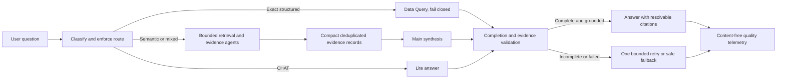

# BiDoc Chat Improvement Master Implementation Plan

Status: implementation in progress. Phases 0 and 1 completed locally. Phase 2
completed local automated and controlled live payload verification; direct
semantic citation links remain open. No deployment or production change occurred.
Prepared: 2026-08-22  
Repository: `main-rag-backend/bidoc-main-rag`

## 1. Purpose

This is the implementation source of truth for improving BiDoc chat quality,
reliability, and observability after the memory incident was fixed. Work is
split into small approval-gated phases. A phase is not complete until its
automated tests, manual checks, evidence, and rollback conditions pass.

This plan consolidates, rather than replaces the technical evidence in:

- `docs/agent-routing-flow-with-data-query.md`
- `docs/main-agent-context-compaction-plan.md`
- `docs/professional-rag-stabilization-plan.md`
- `docs/main-agent-calibration-results.md`
- `docs/presentations/BiDoc_Chat_Current_Status_and_Improvement_Plan_2026-08-20.pptx`

If an older document conflicts with runtime behavior, `src/agent.js` and
`src/subagents/dataQuery.js` are authoritative. This master plan governs the
order in which improvements should be implemented.

## 2. Planning Baseline

The latest reviewed post-memory-fix sample showed healthy execution: completed
chats, no observed memory load/write errors, no Main timeout or truncation, and
successful exact Data Query routes. Focused memory and routing/retrieval tests
were green. The broader test suite still contained unrelated legacy UI/static
assertion failures. This was a local review sample, not production certification.

The current code review still identifies structural risks:

1. Main synthesis receives both formatted retrieval context and raw retrieval
   results, plus graph data, tools, plans, sources, conflicts, and memory.
2. `chatCompletion()` returns only answer text. Provider finish metadata is
   recorded in telemetry but cannot be enforced by the caller.
3. `finish_reason=length` or native `MAX_TOKENS` can therefore be accepted as a
   valid non-empty answer.
4. Workflow state can say that Main is done even when retry or fallback was used,
   and conflicts can appear as an error instead of an evidence warning.
5. Exact Data Query routes correctly bypass generic semantic retrieval, but
   their failure diagnostics and route-level evaluation need improvement.
6. There is no stable end-to-end chat quality benchmark protecting routing,
   evidence, memory, synthesis, citations, latency, and cost together.

The plan addresses those risks without treating the repaired memory incident as
evidence that every other layer is faulty.

## 3. Non-Negotiable Constraints

- Implement one phase at a time and obtain approval before starting the next.
- Do not change production data, schemas, RLS, grants, or deployments without a
  separate explicit approval.
- Keep exact structured requests fail-closed. An exact Data Query failure must
  never silently fall through to an approximate semantic answer.
- Treat conversation memory as conversational context, not project evidence.
- Do not log raw chat content, retrieved document text, secrets, or personal data
  in new metrics.
- Preserve existing API response compatibility unless a versioned change is
  approved.
- Put behavior changes behind a reversible setting or feature flag when practical.
- Change models or prompts only after routing and evidence payload variables are
  measured and controlled.
- Use server-owned database configuration. Never accept database credentials or
  authorization scope from the browser.
- Before any Supabase implementation, re-check current Supabase guidance and the
  repository migration/permission conventions; run local checks and advisors
  where applicable.

## 4. Target Architecture

## 5. Phase Summary and Dependencies

| Phase | Outcome | Dependency | Relative size | Production behavior |
|---|---|---|---|---|
| 0 | Reproducible baseline and evaluation harness | None | Medium | No change |
| 1 | Truncation-safe completion handling and truthful status | Phase 0 smoke set | Medium | Guarded change |
| 2 | Compact, measured Main evidence payload | Phase 1 | Large | Feature-flagged |
| 3 | Explicit routing and Data Query reliability matrix | Phase 0, preferably 2 | Medium | Guarded change |
| 4 | Better semantic retrieval and evidence selection | Phases 0 and 2 | Large | Feature-flagged |
| 5 | Memory hardening and isolation regression suite | Phase 0 | Medium | Mostly tests/guards |
| 6 | Answer contracts and citation normalization | Phases 2 and 4 | Large | Feature-flagged |
| 7 | Operational observability and honest settings health | Phases 1-6 metrics | Medium | Additive |
| 8 | End-to-end calibration and model comparison | Phases 1-7 | Medium | No initial change |
| 9 | Controlled rollout and closeout | Phase 8 | Medium | Explicit approval |

## 6. Phase 0 - Baseline and Evaluation Harness

### Objective

Create a reproducible benchmark before changing chat behavior. It must tell us
whether a change improved routing, evidence, answer quality, memory behavior,
latency, and cost, rather than relying on a few impressive answers.

### Implementation

1. Add a versioned chat-quality case format with expected route, permitted tools,
   forbidden tools, evidence requirements, and answer assertions.
2. Start with a 12-case smoke set, then expand to a 40-60 case gold set.
3. Cover these families:
   - normal Lite conversation;
   - semantic RAG question;
   - exact Data Query count, lookup, and unsupported request;
   - approved mixed exact-plus-semantic route;
   - explicit memory recall and non-recall;
   - missing evidence and conflicting evidence;
   - Hebrew and English questions;
   - short answer, list, latest status, responsibility, and action requests;
   - prompt injection and sensitive-data boundary cases.
4. Add an evaluator that records route, tools, retrieval count, evidence IDs,
   finish reason, fallback, prompt/output tokens, latency, estimated cost, and
   deterministic assertion results.
5. Separate deterministic scoring from optional human review. Human review should
   score groundedness, completeness, usefulness, clarity, and unsupported claims.
6. Save timestamped results under `docs/evaluations/`; never overwrite history.
7. Classify current full-suite failures as real regression, obsolete assertion,
   or unrelated legacy test. Do not silently delete or weaken them.

### Proposed code surfaces

- `test/chat-quality.tests.js`
- `test/fixtures/chat-quality-cases.json`
- `scripts/evaluate-chat-quality.mjs`
- `docs/evaluations/chat-quality-baseline-YYYY-MM-DD.md`
- `package.json` scripts: `test:chat-quality` and `chat:eval`

### Tests and evidence

- Case schema validation fails on unknown routes/tools or missing assertions.
- Evaluator dry-run uses mocks and performs no network or database writes.
- Stable fixtures produce stable deterministic scores.
- Baseline report includes configuration fingerprint and commit hash.
- Live evaluation is opt-in and read-only; it requires explicit approval.

### Acceptance gate

- The 12-case smoke set runs locally and produces a readable baseline report.
- Every case declares its route and evidence contract.
- Current failures are visible rather than normalized away.
- The team approves the scorecard before behavior changes begin.

### Rollback

Delete only the new evaluator wiring if it disrupts the existing runner. No chat
runtime behavior is changed in this phase.

## 7. Phase 1 - Completion Integrity and Truthful Workflow State

### Objective

Never present a truncated or failed generation as a successful answer, and make
workflow diagnostics describe what actually happened.

### Implementation

1. Add a detailed OpenRouter result contract containing at least:
   `content`, `finishReason`, `nativeFinishReason`, `usage`, `model`, and call ID.
2. Preserve `chatCompletion()` compatibility initially. Prefer adding a detailed
   function and migrating callers deliberately instead of changing all consumers
   in one PR.
3. In Main synthesis, reject:
   - empty content;
   - `finish_reason=length`;
   - native `MAX_TOKENS`;
   - malformed provider responses;
   - explicit provider error finishes.
4. Permit one bounded compact retry for truncation, timeout, or supported provider
   capacity failures. Never loop and never retry authentication or validation
   failures as if they were context problems.
5. If retry fails, return a customer-safe structured fallback that distinguishes
   unavailable evidence from a system generation failure.
6. Record explicit Main outcomes: `done`, `retried`, `fallback`, `truncated`, or
   `error`.
7. Report evidence conflicts as `warning` unless they prevent an answer.
8. Add stable, content-free reason codes for Data Query and Main failures.

### Primary code surfaces

- `src/openrouter.js`
- `src/agent.js`
- workflow-log rendering in the server/UI
- focused tests in `test/run-tests.js` or a new chat completion test module

### Tests

- STOP returns a normal answer.
- `length` and `MAX_TOKENS` never return the first partial answer.
- Empty content enters the safe failure path.
- One compact retry succeeds and records `retried`.
- A failed retry records `fallback`; a second retry is impossible.
- Timeout and provider-capacity behavior preserve their current bounded policy.
- Authentication and invalid-request failures are not retried.
- Conflicts render as warnings while actual execution failures render as errors.

### Acceptance gate

- Zero accepted truncations in the smoke set.
- Workflow outcome matches the executed path in every test.
- Existing callers remain compatible.
- Focused chat tests pass, followed by the full local suite with any unrelated
  legacy failures explicitly documented.

### Rollback

Keep the existing text-returning wrapper and disable the new Main enforcement
flag. Do not remove the detailed telemetry contract after data has begun using it.

## 8. Phase 2 - Main Payload Measurement and Compaction

Implementation checkpoint, 2026-09-01: the compact payload builder, content-free
section telemetry, deterministic 24K preflight budget, compact retry payload,
Workflow/QA measurements, rollback flag, and focused tests are implemented
locally. The flag remains disabled by default. Automated checks pass, including
a 93.9 percent reduction on the deterministic size fixture. Live provider-token,
answer-quality, and citation comparison remain required before this phase is
approved for enablement. See
`docs/evaluations/chat-main-payload-compaction-phase2-2026-09-01.md`.

### Objective

Give Main one compact, deduplicated evidence representation with predictable
input size and enough room to produce a complete answer.

### Implementation

1. Add content-free payload telemetry by section: estimated tokens or bytes for
   memory, evidence, graph, tools, plans, conflicts, and prompts.
2. Build canonical evidence records containing stable source ID, agent/table,
   title, date, bounded excerpt, evidence type, relevance, and citation target.
3. Deduplicate using source URL or typed table identity first, then title/date and
   normalized text fingerprint.
4. Default to 8-12 records. Permit a reviewed broad-list ceiling near 18 rather
   than allowing unbounded expansion.
5. Keep one compact graph representation and one compact source map.
6. Compact tool results to verified machine facts and bounded evidence; remove
   internal retrieval calls from Main tool input.
7. Remove raw `retrieval_results`, duplicate global `sources`, and full graph
   objects from the first Main request once equivalence tests pass.
8. Add a preflight input budget. Initial target: approximately 24K or fewer
   estimated Main input tokens on the gold set.
9. When over budget, trim deterministically by relevance, diversity, recency, and
   source coverage. Do not trim the user question or exact machine facts.
10. Roll out behind `mainCompactEvidence`, default off until the phase gate passes.

### Primary code surfaces

- `src/agent.js`
- proposed `src/mainEvidence.js`
- `src/config.js` and settings schema/UI
- focused evidence-compaction tests

### Tests

- Stable input produces stable evidence IDs and order.
- Duplicate chunks and repeated tool evidence collapse correctly.
- Separate conflicting sources are retained.
- Exact typed facts are not rewritten or dropped.
- Sensitive/internal fields never enter the Main payload.
- Budget enforcement is deterministic and preserves minimum source diversity.
- Legacy and compact modes can be compared on the same fixtures.

### Acceptance gate

- Main receives only one evidence representation in compact mode.
- Gold-set p95 Main input is at or below the initial 24K target.
- Evidence recall does not materially regress against the Phase 0 baseline.
- No new truncation, grounding, or citation regression occurs.
- The compact flag can be disabled without a deployment rollback.

### Local checkpoint, 2026-09-01

- Semantic responsibility answer completed with 23,128 actual Main prompt
  tokens and `finish_reason=stop`.
- The first broad report exposed a Main timeout followed by a truncated retry.
  Broad/list payloads now omit duplicate bulky tool details, and broad timeout
  retries can use the configured 8,092-token output allowance.
- The final broad report completed with 17,038 actual Main prompt tokens,
  18 evidence records, `finish_reason=stop`, and no retry.
- Latest invoice remained exact: Data Query `done`, Main `skipped`, one document
  link, and 5.65-second end-to-end latency.
- Structured sources were present, but the broad answer rendered no clickable
  inline source links. This blocks rollout and is carried into the answer and
  citation phase.

### Rollback

Disable `mainCompactEvidence` and return to the legacy payload while retaining
payload-size telemetry for diagnosis.

## 9. Phase 3 - Routing and Data Query Reliability

### Objective

Make route selection explainable and deterministic while preserving exact
structured answers and semantic evidence quality.

### Implementation

1. Freeze a capability matrix for `CHAT`, semantic RAG, exact structured, mixed,
   unsupported, and clarification-needed requests.
2. Add stable route reason codes and permitted/forbidden tool lists to evaluation.
3. Preserve exact-route bypass of hybrid search, graph search, and reranking.
4. Preserve deterministic fail-closed answers for exact route failures.
5. Verify mixed routes sequentially: exact anchor first, then evidence restricted
   to the attested record or allowed scope.
6. Improve error classification for configuration, authorization, RPC, timeout,
   validation, empty-result, and unsupported-contract failures without exposing
   provider details to users.
7. Keep dormant table contracts dormant. Table activation, new RPCs, migrations,
   grants, and RLS changes require a separate approved database phase.
8. Add read-only capability probes for the Settings diagnostics view without
   performing chat-time schema discovery.

### Primary code surfaces

- `src/agent.js`
- `src/subagents/dataQuery.js`
- `docs/agent-routing-flow-with-data-query.md`
- Data Query and route evaluation tests

### Tests

- Exact questions route to Data Query and never approximate on failure.
- Semantic explanation/citation questions stay on evidence routes.
- Approved mixed questions retain exact anchors and bounded semantic evidence.
- Unsupported or dormant capabilities return explicit boundaries.
- Route choice is stable across Hebrew/English paraphrases in the gold set.
- Browser-provided database or project-scope overrides remain rejected.

### Acceptance gate

- 100% pass on exact-route gold cases.
- At least 95% route accuracy overall, with every miss reviewed.
- Zero semantic fallback after an exact execution failure.
- Focused Data Query tests and the full local suite are reported separately.

### Rollback

Revert only the new classifier/routing flag. Keep reason-code telemetry if it is
backward compatible. Database rollback is outside this phase because no schema or
permission change is authorized here.

## 10. Phase 4 - Semantic Retrieval and Evidence Quality

### Objective

Improve the evidence reaching Main before changing the model or answer prompt.

### Implementation

1. Extend the evaluator with evidence recall, source diversity, date correctness,
   and unsupported-evidence metrics.
2. Measure current hybrid retrieval, graph contribution, reranking, query rewrite,
   and planner expansion independently.
3. Bound planner-generated searches and reject invalid or duplicative queries.
4. Normalize dates, Hebrew terms, project names, hashtags, and entity aliases
   before retrieval while preserving the original question.
5. Tune candidate count, rerank top-K, recency, and diversity only from benchmark
   evidence, one variable at a time.
6. Prevent graph/planner artifacts from being treated as evidence unless they
   resolve to an authorized source record.
7. Add an explicit insufficient-evidence outcome instead of filling gaps with
   plausible language.
8. Put retrieval-policy changes behind a reversible configuration fingerprint.

### Tests

- Known relevant sources appear within the compact evidence limit.
- Date-scoped questions do not prefer newer but irrelevant documents.
- Duplicate chunks do not crowd out independent sources.
- Planner searches remain within configured count and length bounds.
- Missing evidence produces an explicit boundary.
- Graph relations cannot become uncited factual claims.

### Acceptance gate

- Evidence recall target of at least 90% on labeled gold cases.
- No regression on exact Data Query cases.
- Improved or equal grounded-answer score with controlled latency and cost.
- Every tuning change has before/after evaluation evidence.

### Rollback

Restore the previous retrieval-policy fingerprint; compact evidence and completion
integrity remain enabled if their own gates passed.

## 11. Phase 5 - Memory Hardening

### Objective

Protect the repaired memory behavior with isolation, recall, correction, and
budget tests so future chat work cannot reintroduce the incident.

### Implementation

1. Add a matrix for same-session recall, approved cross-session recall,
   non-recall, correction, stale facts, deletion, and ephemeral chat.
2. Verify user/session/project isolation and authorization before memory reads.
3. Mark recalled memory separately from retrieved project evidence in Main input.
4. Ensure memory cannot establish project facts or override exact structured data.
5. Replace or calibrate the simple character-based token estimate if gold-set
   measurements show unsafe budget error.
6. Add bounded memory summaries and deterministic trimming tests.
7. Keep secrets, credentials, sensitive personal data, and prompt-injection
   instructions out of stored summaries.
8. Add content-free health metrics for memory load, write, trim, and isolation
   failures.

### Tests

- Existing 12 focused memory tests remain green.
- No cross-user, cross-project, or unauthorized cross-session recall.
- Corrected information supersedes stale conversational memory.
- Ephemeral chats do not write memory.
- Memory cannot override source-backed dates, amounts, or statuses.
- Large histories remain inside the configured Main input allocation.

### Acceptance gate

- Zero isolation failures across the memory gold matrix.
- 100% expected recall and non-recall behavior in deterministic cases.
- No memory text is mislabeled as a citation-bearing project source.
- Any live recall smoke test is read-only and explicitly approved.

### Rollback

Disable cross-session recall independently while keeping same-session memory and
the new regression tests.

## 12. Phase 6 - Answer Contracts and Citation Normalization

### Objective

Make answers consistently useful, appropriately scoped, and traceable to the
evidence that supports each claim.

### Implementation

1. Define explicit answer modes:
   - standard grounded answer;
   - latest status;
   - responsibility with uncertainty;
   - blockers versus risks;
   - delay/entity list;
   - immediate actions;
   - insufficient evidence.
2. Keep list mode limited to genuine list requests; do not turn normal questions
   into verbose reports.
3. Require claim-level source IDs for material project facts.
4. Resolve source IDs through a server-controlled source map and approved UI link
   renderer. Do not let the model invent or print raw internal URLs.
5. Separate facts, interpretation, conflicts, and recommended actions.
6. Enforce uncertainty language for responsibility, causality, and incomplete
   evidence.
7. Add deterministic post-validation for unresolved source IDs, unsupported exact
   numbers, and prohibited raw URLs.

### Tests

- Every emitted source ID resolves to the supporting record.
- No raw internal URL appears in user-visible output.
- Exact numbers match machine results.
- Responsibility is not asserted without supporting evidence.
- Answer mode selection is stable across paraphrases.
- Short questions remain concise; list requests remain complete within scope.

### Acceptance gate

- 100% citation-ID resolution on the gold set.
- Zero unsupported exact values and zero raw internal URL leakage.
- Human review shows improved completeness and clarity without lower grounding.
- UI rendering is verified in both Hebrew RTL and English.

### Rollback

Disable answer-mode templates independently. Retain safe citation resolution and
raw-URL blocking because those are integrity controls.

## 13. Phase 7 - Observability, QA, and Settings Health

### Objective

Make quality failures diagnosable without reading private chat content and make
the Settings screen distinguish unknown health from actual failure.

### Implementation

1. Record content-free fields for route reason, selected tools, retrieval counts,
   evidence counts, payload sections, finish state, retry/fallback, tokens, cost,
   latency, memory state, and failure reason code.
2. Add correlation IDs across chat request, provider calls, retrieval, Data Query,
   memory, and final answer.
3. Keep detailed workflow diagnostics administrator-only.
4. Show connector state as `Not checked`, `Verified`, or `Failed`; neutral gray
   must not imply failure and green must require a real check.
5. Provide bounded read-only checks for Content RPC/tables, App Data, OpenRouter,
   and configured optional integrations.
6. Add alert thresholds for truncation, fallback rate, route drift, p95 payload,
   p95 latency, memory errors, and exact-query failures.
7. Repair or explicitly quarantine obsolete UI/static tests with owner and expiry;
   do not hide them in a generic allow-failure step.
8. Prefer existing workflow-log storage where adequate. New columns, tables,
   grants, or RLS policies require a separately reviewed migration.

### Tests

- No metric contains user text, document excerpts, credentials, or personal data.
- Health states change only after the corresponding check executes.
- A failed optional check does not falsely mark the whole chat unavailable.
- Correlation IDs join the correct events without exposing session secrets.
- Admin-only diagnostics are inaccessible to ordinary users.

### Acceptance gate

- Every smoke-set run has a complete content-free execution trail.
- Operators can distinguish route, evidence, generation, and memory failures.
- Settings health labels match performed checks.
- Full-suite status is green or every remaining legacy failure has an approved
  owner, reason, and removal date.

### Rollback

Disable the diagnostics UI while retaining server telemetry. Any database-backed
telemetry change must include its own tested migration rollback.

## 14. Phase 8 - End-to-End Calibration and Model Comparison

### Objective

Prove the complete chat flow and select models using controlled quality, latency,
and cost evidence.

### Implementation

1. Run the full gold set plus the existing M1-M5 and P1-P8 scenarios.
2. Freeze retrieval configuration, payload construction, prompt, sampling, token
   budget, and fixtures before comparing models.
3. Compare the current Main model with approved alternatives on the same cases.
4. Score grounded quality first, then completeness, latency, and cost.
5. Repeat live cases enough times to identify instability instead of comparing one
   lucky response per model.
6. Save model/configuration fingerprints and complete result tables under `docs`.
7. Do not switch the production model solely because it is cheaper or produces a
   more fluent answer.

### Acceptance gate

- Zero accepted truncations and zero exact-route semantic fallbacks.
- p95 Main input remains within the approved budget.
- Route accuracy is at least 95%; exact route accuracy is 100%.
- Evidence recall is at least 90% on labeled cases.
- Citation resolution is 100%; raw internal URL leakage is zero.
- Memory isolation failures are zero.
- The chosen configuration meets the agreed latency and cost envelope without a
  material grounded-quality regression.

### Rollback

Model choice and configuration are independently reversible. Keep the previous
approved fingerprint available until rollout closeout.

## 15. Phase 9 - Controlled Rollout and Closeout

### Objective

Release the approved configuration gradually, detect regressions quickly, and
retain a tested rollback path.

### Implementation

1. Review the exact code/config change set and confirm no unrelated dirty changes
   are included.
2. Enable changes for internal users or shadow evaluation first.
3. Progress through a small canary only after the internal gate passes.
4. Monitor truncation, fallback, exact-query failure, route distribution, memory
   errors, payload size, latency, cost, and user-rated quality.
5. Define stop thresholds and the person authorized to roll back.
6. Roll back by configuration/feature flag before attempting emergency code or
   schema edits.
7. Update architecture, Settings help text, operational runbook, and final
   calibration report.
8. Close the old plans only after their remaining requirements are either met or
   explicitly deferred with an owner.

### Acceptance gate

- Internal and canary windows meet the Phase 8 thresholds.
- No authorization, isolation, or data-integrity regression is observed.
- Rollback is tested and documented.
- Deployment and production verification are explicitly approved and evidenced;
  local test success alone is not considered rollout completion.

### Rollback

Disable the released feature flags or restore the previous approved configuration
fingerprint. If the rollout included a separately approved database migration,
use that migration's tested rollback procedure rather than improvising a schema
change during an incident.

## 16. Recommended PR Sequence

Each item should be a reviewable PR or equivalent isolated change set:

1. `chat-eval-01`: case schema, 12-case smoke set, dry-run evaluator.
2. `chat-integrity-01`: detailed completion envelope and unit tests.
3. `chat-integrity-02`: Main truncation enforcement, one retry, safe fallback.
4. `chat-payload-01`: payload-size telemetry and evidence-record builder.
5. `chat-payload-02`: compact Main payload behind a disabled flag.
6. `chat-routing-01`: route matrix, reason codes, exact failure regression cases.
7. `chat-retrieval-01`: evidence metrics and one measured retrieval-policy change.
8. `chat-memory-01`: isolation/recall matrix and budget guards.
9. `chat-answer-01`: answer modes, source IDs, citation validation.
10. `chat-ops-01`: admin telemetry and three-state Settings health.
11. `chat-calibration-01`: full comparison report and proposed production fingerprint.
12. `chat-rollout-01`: approved feature-flag rollout and closeout evidence.

Do not combine the evaluation harness, payload rewrite, routing changes, model
switch, and database migration into one change set. That would make regressions
impossible to attribute and rollback unsafe.

## 17. Definition of Done

The chat improvement program is complete only when all of the following are true:

- The versioned gold set and evaluation runner are reproducible.
- Exact structured requests are 100% correct or explicitly fail closed.
- Overall route accuracy meets or exceeds 95%.
- Labeled evidence recall meets or exceeds 90%.
- No truncated provider output is accepted.
- Main p95 input is within the approved budget.
- Every material citation resolves to the supporting source.
- No raw internal URLs or secrets are exposed.
- Cross-user/project memory isolation failures are zero.
- Workflow status truthfully reports retry, fallback, warning, and error states.
- Focused tests pass and full-suite legacy failures are resolved or formally owned.
- Latency and cost remain inside the approved envelope.
- The rollout and rollback paths are both verified.
- Documentation matches the deployed runtime.

## 18. First Work Slice to Approve

Start with Phase 0 only. The first implementation slice should contain:

1. A minimal case schema.
2. Twelve representative, non-sensitive chat cases.
3. A local dry-run evaluator using mocks or recorded sanitized fixtures.
4. Deterministic route/tool/finish/fallback assertions.
5. A baseline report template.
6. A `test:chat-quality` command.

It must not change routing, prompts, models, production settings, Supabase schema,
permissions, or stored data. After the Phase 0 report is reviewed, approve Phase
1 separately.
