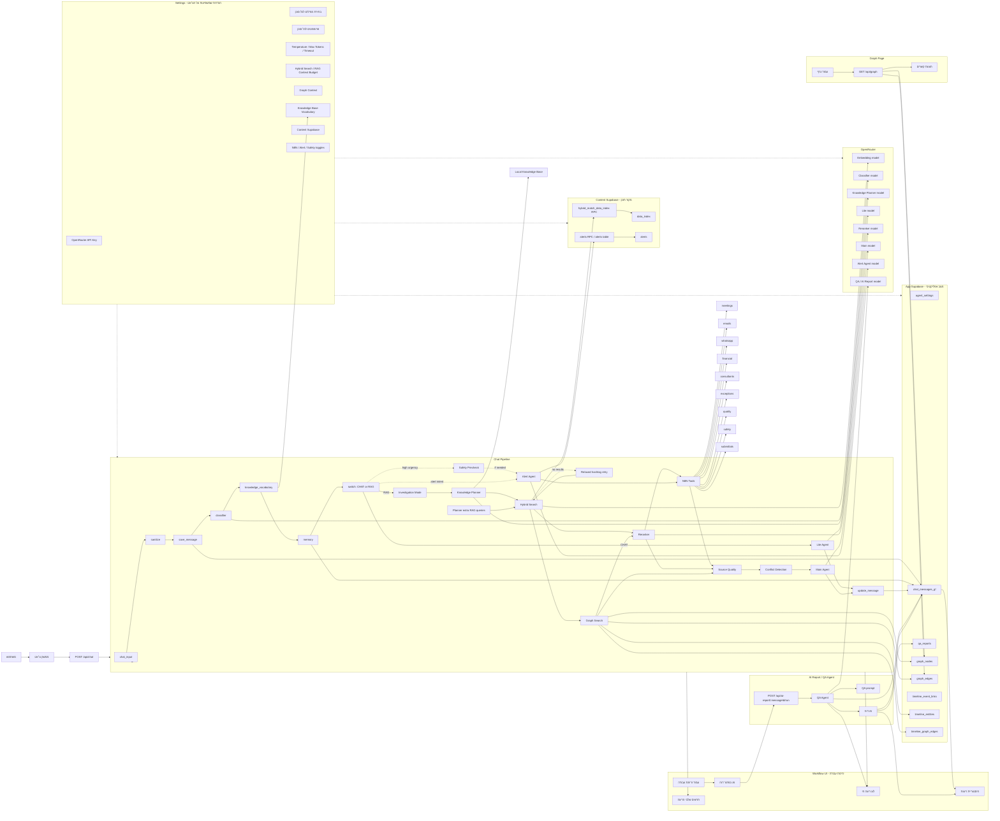

# תרשים מערכת הצ׳אט

מסמך זה מתאר את כל החיבורים האפשריים בין רכיבי הצ׳אט: הממשק, השרת, הסוכנים, המודלים, מקורות הדאטה, הגרף, כלי N8N ודוח ה-AI.

## תרשים זרימה

## מקרא

- חץ מלא: זרימה רגילה של מידע בזמן ריצת צ׳אט.
- חץ מקווקו: רכיב אופציונלי שמופעל לפי הגדרות, סוג שאלה או תוצאה.
- Settings לא מפעיל תשובה בעצמו, אבל הוא שולט במודלים, בפרומפטים, בכמות ההקשר, בגרף, ב-N8N ובמקורות התוכן.

## רכיבים מרכזיים

- `Classifier` מחליט אם השאלה היא צ׳אט קצר או RAG, ומחזיר גם hashtags, טווח תאריכים ורמזים לכלים.
- `Knowledge Planner` מוסיף תכנון מקצועי ושאילתות RAG נוספות כשזוהתה שאלה מקצועית.
- `Hybrid Search` מושך תוכן מ-Content Supabase דרך embedding ו-RPC היברידי.
- `Graph Search` מוסיף קשרים מ-App Supabase סביב תוצאות RAG, אירועים, התראות, נושאים וסיכונים.
- `Reranker` מדרג את המקורות לפני שהם נכנסים לתשובה.
- `Main Agent` מקבל את השאלה, המקורות, הקשרים מהגרף, תוצאות הכלים והנחיות האיכות ומייצר תשובה.
- `QA Agent` מופעל מכפתור “דוח AI” ומנתח את כל הלוג של הריצה כדי להציע איך לשפר אותה.

## מקורות דאטה

- App Supabase שומר מצב אפליקטיבי: הגדרות, היסטוריית צ׳אט, דוחות AI, גרף וקישורי timeline.
- Content Supabase משמש לשליפת תוכן בלבד: `data_index`, `alerts`, חיפוש היברידי ו-alerts.
- OpenRouter מספק את כל קריאות המודל: classifier, planner, main, lite, reranker, alert, QA ו-embeddings.
- N8N הוא שכבת כלים חיצונית אופציונלית עבור מקורות כמו פגישות, אימיילים, וואטסאפ, כספים, איכות ובטיחות.

## קבצים מרכזיים בקוד

- `src/agent.js` - זרימת הצ׳אט הראשית.
- `src/openrouter.js` - קריאות מודלים ו-embeddings.
- `src/supabase.js` - App Supabase, Content Supabase, חיפוש, גרף ודוחות.
- `src/qaAgent.js` - סוכן דוח AI.
- `src/subagents/alert.js` - סוכן ההתראות.
- `public/app.js` - UI של הצ׳אט, Workflow, Settings ו-Graph.
