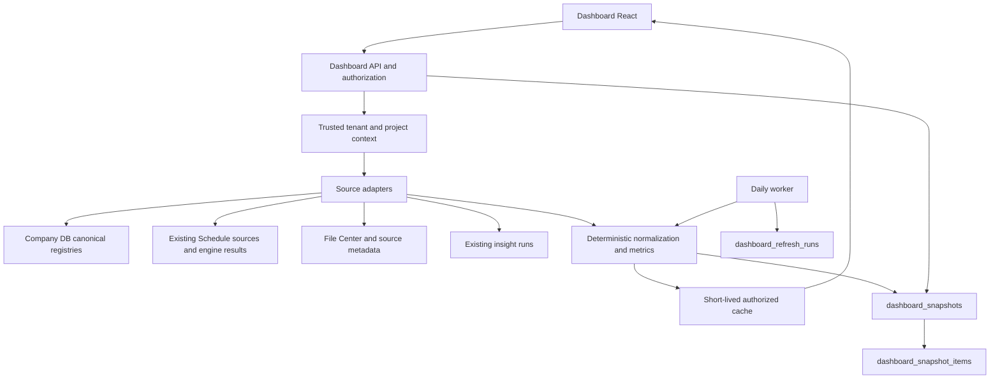

# BIDoc Dashboard — מקורות, API ושמירת snapshots

תאריך: 2026-10-04 · סטטוס: תכנון מוצע; לא נוצרו טבלאות ולא הופעלו jobs.

מסמך משלים ל[אפיון המוצר](BIDoc_Project_Dashboard_Spec.md). כל שם `dashboard_*` במסמך זה הוא שם מוצע, למעט `dashboard_enrichment_pilot` שכבר קיים.

## 1. ארכיטקטורה וגבולות אחריות



**Source adapters** אחראים למיפוי טבלאות, סטטוסים וגרסאות; **metric engine** הוא קוד טהור ללא fetch/SQL/LLM; **API** אחראי להרשאה, הקשר, cache ותקינות response; **React** מציג בלבד. רוב הקוד יוכל לעבור בין שרת Node הנוכחי ל־Next Route Handler באמצעות החלפת adapters.

הטבלאות החדשות המוצעות יישמרו ב־Company DB של הפרויקט, לצד מקורותיו. במעבדה זהו APP DATA שנפתר עבור הפרויקט; אין לרכז מידע עסקי של כל החברות ב־MAIN רק מפני שהמעבדה משתמשת בו להגדרות. אם מקור גאנט נמצא ב־MAIN, נשמר source locator עם זהות DB לוגית בלבד; אין FK חוצה מסדי נתונים.

לא יופעלו מסלולי Schedule sweep/condition resolution דרך GET של הדשבורד. חלק מהמסלולים הקיימים מסנכרנים וכותבים; dashboard reads חייבים להישאר ללא תופעות לוואי. צריכת תוצאה קיימת או חישוב טהור מותרת, ורענון מקור הוא job נפרד.

## 2. Source registry מוצע

| Adapter | מקור מאומת | זהות ושדות נדרשים | הערה |
|---|---|---|---|
| projectContext | Meta projects/companies/user_project_roles/profiles בפרודקשן | tenant/company/project/user/capabilities/settings | resolveCompanyClients קיים; לא לשכפל credentials ל־snapshot |
| attentionFeed | project_ai_alert_feed | project_id/entity_type/canonical_id/native_status/status_group/importance_or_severity/needs_attention | source discovery; lifecycle סופי נבדק בטבלת המקור |
| decisions | project_intelligence_items + sources/status_events | kind/status/due_date/owner/decision_maker/fingerprint/withdrawn/superseded | recorded אינו awaiting_decision |
| approvals | project_approval_items + sources | status/request_date/due_date/is_blocking/approver_text | approved_with_conditions אינו בקשת אישור פתוחה |
| questions | project_open_question_items + sources | status/requested_date/due_date/expected_respondent/is_blocking | אין להסיק SLA בלי שעון וכלל |
| delays | project_delay_items + sources | certainty/status/importance/priority_components/delay dates/impact | טווחי ימים ותיאור אינם CPM |
| safetyQuality | project_safety_items / project_quality_items + sources | native_status/severity/event date/stop_work/withdrawn/superseded | לכל סוג מיפוי משלו |
| commercial | project_commercial_issue_items | status/amount/disputed_amount/currency/is_blocking/source refs | אין חיבור חשיפות חופפות או מטבעות שונים |
| obligations | project_obligation_items | status/category/due_date/owner/source refs | הפיד המאוחד אינו כולל הכל; adapter מפורש אם התחום נדרש |
| progress | project_progress_items + sources | progress_type/percent_complete/as_of_date/work_area/status | נדרש קשר מאושר לפעילות; דיווח ≠ משקל בפרויקט |
| schedule | source resolver הקיים + gantt_* + schedule_* | גרסאות, task UID, baseline, activity key, as_of, payload, evidence | reuse מלא של מנוע ולוח ימי עבודה |
| contracts | contract_workspaces/contracts_documents/contract_decisions/contract_conflicts | workspace/document identity/type; conflict status; evidence clause keys | אין טבלת contracts במדגם; שמות נתיבים אינם בהכרח שמות טבלאות |
| recentSources | uploaded_files/jobs, configured document tables, data_index | file/source identity, event/ingestion time, status | אין לספור chunks כמסמכים |
| activity | *_status_events, project_ai_alert_history, File Center audit | transition/actor/occurred_at/recorded_at | history של AI הוא גם שינוי נוסח, לא תמיד שינוי סטטוס |
| insights | project_insight_runs | project_id/status/insights/metadata.findings/scanned_source_keys/parent_run_id | cumulative reports דורשים dedup |

שם טבלה בפועל נלקח מהגדרות הפרויקט ונבדק ב־allowlist. בחירת זהות כוללת `(company_id, project_id, source_database, source_table, source_id)`; מפתחות bigint מוחזרים כמחרוזת. שמות דומים או UUID זהה בשתי חברות אינם זהות משותפת.

## 3. Read model מנורמל

מפרט טיפוסים מוצע, ללא תלות בספריית UI:

```ts
type Availability =
  | 'ready' | 'partial' | 'stale' | 'empty'
  | 'unavailable' | 'error' | 'not_authorized';

type EntityRef = {
  companyId: string;
  projectId: string;
  sourceDatabase: string; // logical alias, no connection string
  sourceTable: string;
  sourceId: string;
  entityType: string;
  canonicalId: string;
  sourceRevision: string | null;
};

type Metric = {
  key: string;
  value: number | null;
  unit: 'count' | 'percent' | 'calendar_days' | 'working_days' | 'ILS';
  status: Availability;
  reasonCode: string | null;
  asOf: string;
  computedAt: string;
  sourceUpdatedAt: string | null;
  metricVersion: string;
  basis: string;
  coverage: {
    eligible: number | null;
    measured: number | null;
    unknown: number | null;
    stale: number | null;
    scopeComplete: boolean;
  };
  snapshotId: string | null;
  queryToken: string; // opaque, short-lived, bound to access scope
};
```

כרטיס מוסיף `attentionId`, ‏`refs[]`, ‏`nativeStatus`, ‏`normalizedStatus`, ‏`severity`, ‏`rankReasons[]`, ‏`owner`, ‏`dueDate`, ‏`evidenceRefs[]`, ‏`availableActions[]`. impact הוא אובייקט עם value/range/unit/method/evidence ולא מחרוזת שממנה מנסים לחלץ כסף או ימים בדפדפן.

נדרשות שתי הרשאות נפרדות: מי רואה את העובדה, ומי רשאי לבצע פעולה. היעדר הרשאה אינו דוחף פריט למכנה של KPI שנראה למשתמש. בספירות מעורבות תחומים מציינים ״בתחומים שבגישה שלך״.

## 4. Snapshot מול cache

**cache:** האצת מצב נוכחי בלבד, TTL מוצע 60–300 שניות. key כולל חברה, פרויקט, גרסאות נתונים/מדיניות, תאריך מצב וחתימת היקף הרשאה. invalidate לאחר שינוי מקור. עדכון או שלילת הרשאה מבטלים הצגה גם אם cache עדיין בתוקף. cache במופע Node יחיד מתאים להתחלה; במערכת מרובת מופעים נדרש shared cache/invalidations, או TTL קצר וללא הבטחת עקביות מיידית.

**snapshot:** תצפית בלתי משתנה לצורך השוואה ותחקור. נשמר פעם ביום בשעה מוצעת 00:10 בזמן הפרויקט, עבור cutoff של סוף היום הקודם. baseline לא משתנה אוטומטית. re-run יוצר revision חדש; הוא אינו מוחק את מה שהיה ידוע בריצה המקורית.

**עיקרון זמן:** snapshot מכיל `as_of_date` (יום עסקי), `cutoff_at` (UTC מדויק), `captured_at` ו־source watermarks. אין התחייבות לטרנזקציה חוצת־DB. אם מקור השתנה בזמן הקריאה או שאין דרך לשחזר אותו נכון ל־cutoff, התחום מסומן mixed/partial ולא מוצג כתמונת סוף יום מדויקת. מותר להציגו כתצפית במועד captured_at. worker יבדוק revisions לפני ואחרי קריאה, ישמור אותם ויבצע retry מוגבל.

נתונים שמגיעים באיחור נרשמים בתאריך שבו נקלטו ובתאריך האירוע בנפרד. חישוב מתוקן לעבר נקרא `restated`, עם parent snapshot וסיבה; default history מציג ״כפי שנצפה״, ואפשר לבחור סדרה מתוקנת במפורש. אין backfill ללא נתוני מקור היסטוריים ברמת הגרסה.

אין צורך בטבלה לכל Widget, בהעתקת מסמכי המקור, או materialized view היסטורי לכל ספירה. SQL aggregation/views יכולים לייעל את הקריאה הנוכחית; הם אינם תחליף לתצפיות היסטוריות.

## 5. שלוש טבלאות מוצעות

### 5.1 dashboard_refresh_runs

מטרה: זהות ריצה, בקרה על כפילויות, retries ותיעוד שלמות.

שדות: `id uuid PK`, ‏`company_id`, ‏`project_id`, ‏`run_kind` (daily/manual/restatement), ‏`as_of_date`, ‏`cutoff_at`, ‏`idempotency_key`, ‏`status` (queued/running/succeeded/partial/failed/cancelled), ‏`attempt`, ‏`lease_owner`, ‏`lease_expires_at`, ‏`started_at`, ‏`finished_at`, ‏`source_watermarks jsonb`, ‏`policy_version`, ‏`metric_version`, ‏`source_manifest_hash`, ‏`counts jsonb`, ‏`error_codes jsonb`, ‏`requested_by`, ‏`created_at`.

ייחודיות: `(company_id, project_id, idempotency_key)`. key מורכב מסוג ריצה, cutoff, גרסאות וכוונת restatement. claim של lease אטומי; ריצה חיה אחת לאותו context. כשל אינו מפרסם snapshot חלקי כשלם. אינדקסים: project/date descending, status/lease עבור worker. אין secrets או גוף מסמכים בשגיאות.

### 5.2 dashboard_snapshots

מטרה: snapshot אחד לכל תחום וריצה, כדי למנוע ערבוב של נתוני כספים/בטיחות עם הרשאות שונות.

שדות: `id uuid PK`, ‏`run_id`, ‏`company_id`, ‏`project_id`, ‏`domain`, ‏`as_of_date`, ‏`cutoff_at`, ‏`captured_at`, ‏`revision`, ‏`supersedes_snapshot_id`, ‏`snapshot_kind` (observed/restated), ‏`status` (ready/partial), ‏`metrics jsonb`, ‏`coverage jsonb`, ‏`source_manifest jsonb`, ‏`data_versions jsonb`, ‏`metric_version`, ‏`policy_version`, ‏`definition_hash`, ‏`authorization_schema_version`, ‏`published_at`, ‏`created_at`.

FK מורכב ל־run כולל company/project; ייחודיות `(run_id, domain)`. `metrics` הוא חוזה versioned ומאומת, לא JSON חופשי מהמודל. שלמות מוגדרת לכל מדד: all source partitions read, no unreported truncation, scope checked, versions consistent. publication באותה טרנזקציה עם כל חברי התחום או אחרי staging שאינו נגיש לקוראים.

אינדקסים: `(company_id, project_id, domain, as_of_date DESC, captured_at DESC)`; lookup של run. צריך להגדיר canonical published revision במפורש. דוח comparison לא משווה revisions שונים בלי לציין זאת.

### 5.3 dashboard_snapshot_items

מטרה: לדעת בדיוק מי נכלל בכל מספר, ולאפשר drill-down ו־delta נכונים גם כשהמקור משתנה.

שדות: `id uuid PK`, ‏`snapshot_id`, ‏`company_id`, ‏`project_id`, ‏`metric_key`, ‏`member_key`, ‏`source_refs jsonb`, ‏`source_revision`, ‏`normalized_status`, ‏`normalized_severity`, ‏`event_date`, ‏`due_date`, ‏`metric_contribution numeric`, ‏`weight numeric`, ‏`inclusion_reason`, ‏`evidence_refs jsonb`, ‏`definition_version`, ‏`created_at`.

ייחודיות `(snapshot_id, metric_key, member_key)`; FK מורכב הכולל חברה/פרויקט. member_key כולל entity/source identity ולא hash של כותרת בלבד. אותו מקרה עשוי להשתתף בשני מדדים שונים, אך לא פעמיים באותו מדד. COUNT בודק התאמה למספר members; באחוז נבדקים contribution/weight והמכנה.

אין לשמור גוף מייל, embedding, סיסמה או URL חתום. בעת drill-down מציגים ערכי מדידה שנשמרו ומנסים לטעון כותרת/מקור מורשים; מקור חסר מוצג כמקור שאינו זמין. נתון היסטורי נשאר מדידה היסטורית, אך אין להשיב תוכן רגיש שנמחק. מדיניות retention/מחיקה של החברה גוברת על immutable snapshots ומחייבת audit לפעולת המחיקה.

אינדקסים: `(snapshot_id, metric_key, member_key)` ו־company/project/source lookup כאשר יש צורך מוכח. אם היקף source refs גדל, לפצל לטבלת refs ייעודית רק לפי מדידת שימוש. לא ליצור GIN על כל JSON מראש.

### מה לא מוסיפים ב־MVP

- אין `dashboard_tasks`, ‏`dashboard_decisions` או `dashboard_alerts`.
- אין טבלת preferences: הגדרות משותפות versioned תחת `projects.settings.dashboard` במודל המארח; לא לכלול שם מידע אישי. העדפות משתמש אפשר לאחסן במנגנון קיים לאחר אימות שלו.
- אין כתיבה לטבלת הפיילוט מצפייה בדשבורד. approved proposal אינו אוטומטית canonical fact.
- אין טבלת action state עד שתידרש פעולה שאין לה מקור קנוני, למשל snooze אישי. אם תתווסף בעתיד, היא לא תשנה lifecycle של הבעיה.

## 6. מדיניות refresh ושימור

| נתון | רענון מצב נוכחי מוצע | היסטוריה | טריגר |
|---|---|---|---|
| נושאים, אישורים, החלטות | cache עד 5 דקות | יומית | אירוע שינוי מקור; polling כגיבוי |
| גאנט ומדדי לו״ז | לאחר פרסום תוצאת מנוע/גרסה | יומית + checkpoint מאושר בשינוי baseline | מנגנון Schedule הקיים |
| מסמכים ושינויי מצב | דקה בעת עבודה, אחרת 5 דקות | אירועי המקור; לא להעתיק את כל ה־feed | ingest/status update |
| תובנות | לאחר ריצה מוצלחת | run קיים + refs ב־snapshot | קריאת AI מפורשת/תזמון עתידי |
| מצב jobs | 30–60 שניות במהלך עבודה | runs טכניים | heartbeat ו־lease |

ברירת מחדל מוצעת לשימור: snapshots ומדידות 24 חודשים; ריצות טכניות מפורטות 90 יום, ואחר כך סיכום מינימלי כל עוד snapshot מפנה לריצה. זוהי הצעה תפעולית, לא קביעה משפטית. אין מחיקה אוטומטית לפני התאמה למדיניות החברה. capacity planning: מספר פרויקטים × ימים × members/metric; להתחיל pagination ו־batch insert, להוסיף partitioning רק לפי עומס.

worker צריך לרוץ בסביבה של jobs מתמשכים/תזמון המארח, לא `setInterval` בדפדפן ולא הבטחה שתהליך שרת מקומי פתוח תמיד. לא הוקמה כעת אוטומציה. attempts עד 3 עם backoff ו־jitter, lease מתחדש, timeouts למקור ו־dead-letter/failed state. work idempotent; retry אינו יוצר snapshot כפול.

## 7. API מוצע

נתיבים חדשים, לא קיימים עדיין:

| Method / path | תפקיד | אכיפה |
|---|---|---|
| GET `/api/dashboard/v1/overview?project_id=…` | context, KPI, readiness ותאריכי מקורות | authentication + project/domain capabilities |
| GET `/api/dashboard/v1/attention?project_id=…&cursor=…` | רשימה מדורגת, default 5 | canonical source dedup, stable cursor |
| GET `/api/dashboard/v1/metrics/{key}/items?query_token=…` | פירוט מדד נוכחי | opaque token קשור לפרויקט, נוסחה, גרסה, הרשאה ו־TTL |
| GET `/api/dashboard/v1/history?project_id=…&domain=…&from=…&to=…` | סדרת snapshots ו־coverage | אין חיבור אוטומטי בין baseline versions |
| GET `/api/dashboard/v1/snapshots/{id}/items?metric_key=…&cursor=…` | מי נכלל במדד ההיסטורי | snapshot ownership + הרשאות נוכחיות |
| GET `/api/dashboard/v1/evidence?project_id=…&entity_ref=…` | refs ופרטי מקור מורשים | allowlist ו־ownership לכל מקור; אין arbitrary URL fetch |
| POST `/api/dashboard/v1/refresh` | invalidate/queue חישוב דטרמיניסטי | project capability, CSRF לפי המארח, idempotency/rate limit; ללא AI |
| GET `/api/dashboard/v1/runs/{id}` | התקדמות refresh | run ownership והרשאה |

תשובה כוללת `schemaVersion`, ‏`requestId`, ‏`companyId`, ‏`projectId`, ‏`asOf`, ‏`computedAt`, ‏`sourceHealth[]`, ‏`capabilities`, ‏`metrics`/`items`, ‏`warnings[]`. count כולל מדויק מחושב ב־SQL או סריקה מלאה מדורגת; limit של דף אינו total. בלי endpoint aggregation מאומת, מחזירים partial במקום מספר מטעה.

pagination לפי מפתח יציב הכולל rank/date/id ו־context revision. token שפג או מקור שהשתנה מחזיר `409 CONTEXT_CHANGED`/רענון במקום מספר ופריטים שאינם תואמים. במסך היסטורי משתמשים ב־members השמורים. כניסה מחדש מחייבת authorization גם אם token עדיין תקף.

סטטוסים: 400 בקשה לא תקפה; 401 אין session; 403 פעולה אסורה; 404 משאב שאינו נגיש; 409 context/revision changed; 429 הגבלה; 503 אין אף מקור זמין. כאשר חלק מהמקורות זמינים: 200 עם מצבי widget, ללא stack traces או credentials.

## 8. הגנות עקביות מיוחדות שנדרשות בקוד הקיים

1. `getDashboardPilotScheduleOverview` קורא snapshots ללא בחירת cohort ומגביל עד 1,000. זה מתאים לפיילוט בלבד, לא מקור KPI המרכזי.
2. אותה פונקציה כוללת המרות `Number(null)` העלולות להפוך חוסר ל־0. החוזה החדש חייב null guards לפני normalization.
3. `persistIndicatorSnapshots` מדלג על subject שכבר קיים באותו as_of/engine_version; בדיקת הדילוג אינה מבדילה data_version/contract_version. צריך regression לשינוי באותו יום ופתרון תואם מנוע לפני שימוש לתוצאה ״עדכנית״. אין ליצור מנוע נוסחאות מתחרה.
4. הגדרות תאריך סיום פרויקט עשויות להשפיע על cutoff של Schedule; הדשבורד יחשוף את `asOfUsed` בפועל במקום להניח שהחישוב נעשה להיום.
5. פיד ה־AI שם needs_attention לפני completed. החוזה החדש שומר שני ממדים עצמאיים: lifecycle והצורך בפעולה.
6. `project_entity_registry` אינו תחליף אוטומטי לכל המקורות: במדגם רק 21 רשומות מול 480 בפיד. אין להגדיר אותו כמכנה בלי בדיקת כיסוי.

## 9. אבטחה וגרסת פרודקשן

המלצת MVP: backend בלבד קורא/כותב טבלאות dashboard באמצעות חיבור מורשה; RLS מופעל ולתפקידי browser אין grants חדשים באופן אוטומטי. הרשאת service_role עוקפת RLS ולכן בדיקת פרויקט/תחום בשרת הכרחית. אם תיבחר בעתיד קריאה ישירה, חייבים policies מבוססי project membership ולא authenticated=true בלבד. יש לבדוק את RLS וה־grants החיים, ולא להעתיק policy ממיגרציה ישנה ללא ביקורת. [תיעוד Supabase הרשמי](https://supabase.com/docs/guides/database/postgres/row-level-security).

snapshots לפי domain מאפשרים מניעת גישה לכספים, אך אינם מספיקים כשיש חסיון ברמת מסמך בתוך התחום. במקרה כזה נדרש סינון members וחישוב מורשה מחודש או מניעת חשיפה של המדד, בלי להחזיר aggregate כולל שחושף מידע חסוי. insights דורשים הרשאה לכל supporting evidence שמשמש בתוכן; הסרת לינק בלבד אינה מסירה מידע מהטקסט.

לפני rollout: שתי חברות, לפחות שני פרויקטים, viewer/manager/finance/safety fixtures, בדיקות IDOR לכל נתיב, החלפת פרויקט בזמן בקשה, הורדת הרשאה אחרי cache, ומקורות שנמשכו אחרי snapshot. אין להסתפק בבדיקת סופראדמין במעבדה.

## 10. Definition of done לתשתית

- טבלאות מקור קיימות משמשות truth; שלוש טבלאות חדשות מכילות רק נתונים נגזרים ומעקב.
- daily publication אטומי לכל domain, idempotent, וכולל manifest/versions/coverage; כשל אינו מחליף snapshot תקף.
- drill-down ו־KPI תואמים, לרבות historical membership; הגדרות המדד והמשקולות נשמרות.
- cache מבודד ותלוי הרשאה; נתונים לא מורשים אינם נחשפים גם בספירות.
- דף שימושי גם בלי AI, תקציב, תחזית או snapshot היסטורי.
- בדיקות הגירה ו־rollback שומרות את המקור וההיסטוריה; הפעלת schema/jobs/feature flag היא שלב מימוש נפרד שלא בוצע במסמך זה.
