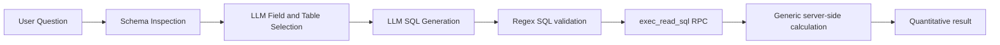
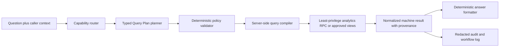

# Data Query Agent — Current-State Map, Risk Audit, and Hardening Roadmap

Date: 2026-07-22  
Repository baseline: `cc79b64` (`main`, clean worktree before this document)  
UI name: **Data Query Agent**  
Internal tool name: `data_query`

## Executive verdict

The Data Query Agent is a substantial prototype, not a stub. It has configuration, Main Agent routing, a direct API, a settings/test card, workflow telemetry, Supabase schema discovery, an allowlisted JSON Query Plan executor, a second LLM-generated SQL pipeline, and 15 focused mocked tests.

It is **not ready to be treated as a fully correct or production-safe analytics agent**. The most important reasons are:

1. Four Data Query endpoints are callable without the repository's API-secret checks, including endpoints that can generate and execute SQL with the Content Supabase service-role key.
2. The UI and saved settings say raw SQL is disabled, but the seven-stage SQL pipeline generates and executes raw SQL without checking `allowRawSql` or `requireHumanApprovalForRawSql`.
3. The SQL allowlist is regex-based and is not a safe SQL authorization boundary. It accepts table-free function calls such as `select pg_sleep(10)` and rejects some valid CTEs.
4. The original Query Plan executor fetches at most `limit` rows and then counts/groups/aggregates locally. Any table with more matching rows can therefore produce a plausible but wrong result.
5. The Main Agent uses the original Query Plan path, while the step-by-step UI uses the later raw-SQL path. These paths have different capabilities, safety models, outputs, and failure modes.
6. The runtime is now Content-DB-only, but several heuristics, defaults, tests, comments, and the Stage 2 specification still assume access to the App DB.

The recommended direction is to keep one canonical, typed Query Plan contract, execute exact aggregates inside a tightly scoped database API, and remove or disable arbitrary model-generated SQL until a least-privilege and parser-backed security design exists.

## Scope and evidence boundaries

This audit inspected the current repository, git history, project Bedrock notes, implementation specification, configuration, UI, tests, and SQL migration.

Verified in this pass:

- Current source and git state.
- Static request/data flows.
- Focused mocked/unit behavior through `npm.cmd test`.
- Direct probes of `validateReadOnlySql`.

Not verified in this pass:

- Live Content Supabase schema, data, RLS, grants, or RPC installation.
- Live OpenRouter planning quality or cost.
- Live API responses, because `localhost:4000` was not running.
- Browser/UI behavior.
- Production authentication, hosting, network controls, or tenant isolation.

## Source-of-truth map

### Runtime implementation

| File | Current responsibility | Key locations |
|---|---|---|
| `src/subagents/dataQuery.js` | Entire agent core: settings projection, schema discovery, manifests, LLM and heuristic planning, Query Plan validation/execution, synthesis, workflow log, SQL guard/RPC client, and seven-stage SQL pipeline | `5-61`, `89-183`, `185-347`, `349-760`, `764-860`, `883-1183` |
| `src/agent.js` | Main Agent routing, invocation, result collection, synthesis context, and chat workflow node | `431-469`, `670-695`, `764-769`, `1362-1459`, `1607-1612` |
| `src/server.js` | Direct step, full SQL pipeline, schema scan, and original Query Plan HTTP endpoints; run history and telemetry | `712-843` |
| `src/config.js` | Persisted/public settings normalization under `settings.subagents.dataQuery` | `469-485`, `587`, `655`, `926-970` |
| `src/heuristics.js` | Heuristic quantitative-question routing to `data_query,alert` | `9` |
| `src/prompts.js` | Classifier instructions describing when to recommend `data_query` | `75`, `82` |
| `src/tools.js` | Registers `data_query` as an internal project tool | `3-4` |

### UI and workflow presentation

| File | Current responsibility | Key locations |
|---|---|---|
| `public/app.js` | Frontend defaults, workflow template node/edges, Data Query settings card, table picker, direct test runner, step-by-step SQL runner, settings draft, and run-history label | `68-83`, `235`, `275-277`, `909-1195`, `6901-6907` |
| `public/app.js` | Reuses the Data Query schema endpoint to populate table choices for other internal content-agent cards | `595-617` |
| `public/styles.css` | Table picker and SQL pipeline presentation | `5486-5700` |
| `scripts/generate-app-graph.js` | Generated architecture graph declarations for the subagent and Content Supabase dependency | `92`, `195`, `204` |

### Database, tests, and specifications

| File | Current responsibility | Key locations |
|---|---|---|
| `supabase/data-query-exec-read-sql.sql` | Creates `public.exec_read_sql(q, max_rows)`, dynamically executes caller-supplied SQL, caps returned rows, enables transaction read-only, and grants execution to `service_role` | entire file |
| `test/run-tests.js` | 15 focused mocked/unit tests for validation, local derivation, workflow logs, SQL guard/pipeline, settings, introspection, and LLM planning | `342-695` |
| `docs/data-query-agent-codex-prompt.md` | Original v1 requirements plus a later **specification-only** Stage 2 for caller contracts, deduplication, machine results, linked plans, and code-side joins | v1 `1-447`; Stage 2 `461-679` |
| `bedrock/Memory/subagents.md` | Historical implementation notes; useful context but partly stale and internally contradictory with current code | `31-52`, `73` |

Generated Bedrock app-graph outputs and history files mention the agent but do not participate in runtime behavior.

## Runtime architecture

### Flow A — Main Agent and direct-test Query Plan path

```mermaid
flowchart LR
    U["User question"] --> C["Classifier and heuristics"]
    C --> R["shouldRunDataQuery"]
    R --> T["callProjectTool: data_query"]
    T --> S["Content-only settings and manifest"]
    S --> P["LLM JSON planner"]
    P -->|failure or rejected plan| H["Heuristic planner"]
    P --> V["Server-side Query Plan validator"]
    H --> V
    V --> E["PostgREST row fetch per plan"]
    E --> L["Local count/group/aggregate/timeseries"]
    L --> O["Generic result synthesis"]
    O --> M["Main Agent answer synthesis"]
    O --> W["Workflow and run history"]
```



Entry points:

- Main Agent: `src/agent.js` calls `runDataQueryAgent()`.
- Direct API/UI test: `POST /api/subagents/data-query` calls the same function and additionally creates a detailed workflow log.

Planning behavior:

- An explicit `queryPlan` supplied by the direct API is accepted as input but still passes validation.
- Otherwise, an OpenRouter JSON-only planner receives the selected-table manifest.
- If the LLM fails or its plan is rejected, a deterministic heuristic planner is attempted.
- The heuristic planner still proposes App DB tables for delay/gap/insight questions even though runtime settings now allow only Content DB tables. Only its alert branch is naturally compatible with the current restriction.

Execution behavior:

- Each plan becomes a PostgREST `GET /rest/v1/<table>?select=...&limit=...` request.
- Filtering and one allowed-field sort are pushed to PostgREST.
- Count, distinct, grouping, timeseries, and numeric aggregate operations are calculated in Node.js over only the fetched rows.
- Plans run sequentially. `timeoutMsPerPlan` is used; `totalTimeoutMs` is not.

Output behavior:

- Response fields are `status`, `answer`, `metrics`, `plans`, `tablesUsed`, `confidence`, `warnings`, `rawResultsPreview`, `queryPlan`, and `planner`.
- Synthesis only promotes positive `count`/`events_count` values into top-level metrics. It does not faithfully expose arbitrary `avg`, `min`, `max`, or `sum` aliases, and zero counts disappear from the metric list.
- The human answer is a generic execution sentence rather than the requested quantitative result. The Main Agent must infer the useful values from the tool payload.

### Flow B — step-by-step raw-SQL pipeline



The seven stages are:

1. `user_question`
2. `schema_inspection`
3. `field_selection`
4. `sql_generation`
5. `sql_execution`
6. `calculation`
7. `result`

Entry points:

- `POST /api/subagents/data-query/step` executes any single stage using client-supplied accumulated state.
- `POST /api/subagents/data-query/pipeline` executes all stages.
- The UI's “Run all” button calls the **step endpoint seven times**; it does not call the full-pipeline endpoint.

Important behavior:

- Schema inspection can fetch 2 sample rows for each of up to 15 selected tables.
- Field selection fetches another 3 sample rows for each chosen table.
- Sample values are sent to OpenRouter without a Data Query-specific redaction or column sensitivity policy.
- SQL generation is model-driven and accepts `SELECT`/`WITH` queries.
- SQL execution always uses the Content connection, regardless of the requested/selected connection label.
- Neither `allowRawSql` nor `requireHumanApprovalForRawSql` gates these endpoints or stages.

## Current settings and whether they work

| Setting | Used today? | Notes |
|---|---:|---|
| `enabled` | Yes | Gates Main/direct Query Plan path. The step/pipeline endpoints do not explicitly reject disabled state. |
| `plannerEnabled` | Query Plan path only | The SQL pipeline still requires its LLM field-selection and SQL-generation stages. |
| `plannerModel` | Yes | Used by both planner styles. |
| `plannerTimeoutMs` | Yes | Used for model calls. |
| `maxPlans` | Yes | Query Plan validation/planning only. Direct API `body.maxPlans` is passed as an unused top-level input. |
| `maxRowsPerPlan` | Yes | Caps fetched/returned rows; this also makes local aggregates inexact on larger result sets. |
| `timeoutMsPerPlan` | Yes | Applied to REST plan fetches and SQL RPC execution. |
| `totalTimeoutMs` | **No** | Normalized and editable, but no total-run deadline uses it. |
| `tables` | Yes | Selected Content tables and columns become the runtime manifest. App selections are dropped by `dataQuerySettings()`. |
| `allowedTables` | Derived | Runtime derives it from selected/legacy Content tables. |
| `allowedSchemas` | Forced | Runtime forces `['content']`; frontend defaults still say `['app','content']`. |
| `allowAggregations` | **No effective enforcement** | The validator and SQL pipeline do not gate aggregation operations with it. |
| `allowRawSql` | **No effective enforcement on SQL pipeline** | UI fixes it to false, but raw SQL is still generated/executed. |
| `allowJoins` | Query Plan rejects joins | SQL pipeline does not explicitly inspect this setting; SQL validation allows joins among selected table names. |
| `requireHumanApprovalForRawSql` | **No** | Persisted as true but no approval flow exists. |

## API surface

| Method and route | Purpose | Current response behavior | Secret check present? |
|---|---|---|---:|
| `GET /api/subagents/data-query/schema` | Scan Content PostgREST OpenAPI | `200` with connections or `502` if none | No |
| `POST /api/subagents/data-query` | Original Query Plan run plus workflow history | `200`, `400`, or `500` | No |
| `POST /api/subagents/data-query/step` | Execute one SQL pipeline stage from client state | Usually `200`, including stage errors | No |
| `POST /api/subagents/data-query/pipeline` | Execute all SQL stages and record run history | `200` even for pipeline-stage error; `500` for outer exception | No |

The server has `checkBidocSecret`/`checkBidocSecretForRead` helpers, but none of the four Data Query routes call them.

## Confirmed findings

### P0 — must resolve before trusting the agent

#### P0.1 Unauthenticated SQL-capable endpoints

The SQL stage and pipeline routes can invoke OpenRouter and the Content DB using server-held credentials without calling the available API-secret checks. This creates cost, data-exposure, denial-of-service, and database-query surface if the server is reachable by an untrusted caller.

#### P0.2 The declared safety contract is false for the current combined implementation

The card says the agent “never runs free raw SQL”; its raw-SQL checkbox is disabled and saved as false. Nevertheless, the same card exposes a SQL generator and executor. The backend never checks `allowRawSql` or a human approval token before executing it.

This is also inconsistent with the original v1 spec and the documented Stage 2 boundary, both of which explicitly defer raw SQL.

#### P0.3 Regex SQL validation is not an authorization boundary

Observed probes:

```text
select pg_sleep(10)                                  -> accepted
select current_setting('server_version')            -> accepted
with x as (select id from emails_gf) select * from x -> rejected because CTE alias x is treated as a table
```

The validator extracts only names following `FROM`/`JOIN`. It does not parse SQL semantics or control callable functions. The database RPC dynamically executes the supplied text as `service_role`; transaction read-only prevents ordinary database writes but is not a table/function allowlist, a cost limit, or an external-side-effect sandbox.

#### P0.4 Quantitative answers can be silently wrong

The Query Plan path performs:

1. fetch with `limit = plan.limit`, then
2. local count/group/aggregate.

For 12,000 matching rows and a limit of 200, `count` can return 200, a group breakdown covers only the first 200 rows, and averages/sums are sample aggregates—not database aggregates. No warning labels the result as truncated or sampled. This violates the agent's core quantitative purpose.

### P1 — architectural and reliability gaps

#### P1.1 Two divergent agents share one name and UI

The Main Agent and direct “Run test” use the JSON Query Plan path. The step cards use the raw-SQL path. Improving or testing one does not establish the behavior of the other.

#### P1.2 Content-only runtime conflicts with routing and fallbacks

The runtime correctly drops App DB access, but:

- heuristic plans for delays, gaps, and project-insight runs target App tables and are rejected;
- frontend defaults still advertise App plus Content;
- settings normalization tests preserve App selections even though runtime later drops them;
- the original Stage 2 relationship examples use App delay tables that this agent cannot access;
- broad quantitative heuristics can route questions that the Content-only manifest cannot answer.

The product capability boundary must be made explicit: either Content-only is authoritative and routing/specs must be rewritten, or App access needs a separate, deliberately authorized agent.

#### P1.3 Result synthesis does not return the requested numbers reliably

The Query Plan answer is generic, top-level metrics only recognize selected count aliases, zero results are omitted, and requested metrics are not mapped to a stable machine-readable contract. This is insufficient for dependable reuse by the Main Agent or other subagents.

#### P1.4 Total deadline is a dead control

`totalTimeoutMs` appears in backend defaults, normalization, UI, and the Stage 2 safety rules, but neither execution path enforces it. Multiple plans run sequentially and schema sampling is sequential.

#### P1.5 Data samples and previews lack a privacy policy

Real row samples are sent to the external model. Result previews are also placed in workflow details/history. There is no per-column denylist, sensitivity metadata, masking, truncation budget for the whole payload, or retention rule specific to this agent.

#### P1.6 Database migration/documentation drift

The SQL file says to install the RPC in every target DB, while current runtime is Content-only. Bedrock notes describe a dedicated read-only role and per-DB behavior that the checked-in SQL does not create. The actual function is `security invoker` and is called as `service_role`.

#### P1.7 Stage 2 is not implemented

The later section of `docs/data-query-agent-codex-prompt.md` is an unimplemented specification. Current code has no validated caller envelope, budget narrowing, per-run dedup cache, `machineResult.metricsByRequestId`, semantic-question rerouting contract, workflow nesting, declared relations, linked-plan dependency graph, code-side joins, join fan-out cap, or circular-dependency detection.

### P2 — quality and maintainability gaps

- `allowAggregations` is exposed but not enforced.
- Direct `body.maxPlans` is passed to `runDataQueryAgent()` in a field the function does not consume.
- OpenAPI discovery retains column names but not reliable types, keys, relationships, nullability, or sensitivity. Numeric/groupable behavior is inferred from names.
- The legacy manifest contains App tables that are immediately filtered out and a historically stale meeting table name.
- SQL pipeline calculation derives generic sums/averages over SQL result rows, which can double-aggregate already aggregated query output.
- SQL and Query Plan error/status semantics differ across routes.
- Query Plan filter serialization does not robustly encode all PostgREST grammar edge cases.
- Workflow previews can make run-history payloads large and leak row content.
- No cache, concurrency limit specific to this agent, per-caller budget, or run-level deduplication exists.
- The `/pipeline` endpoint records events but does not build the same detailed workflow graph as the direct Query Plan endpoint.

## Test status on 2026-07-22

Command:

```powershell
npm.cmd test
```

Results:

- All **15 Data Query-specific tests passed**.
- The repository-wide command exited `1` because **11 unrelated UI/static-regression tests failed** (settings, workflow, and timeline assertions after frontend migration).
- No test failure in this run was inside the Data Query block.

What the Data Query tests currently prove:

- Basic Query Plan allowlist and field validation.
- Rejection of obvious dangerous operation/raw-SQL strings in JSON plans.
- Plan and row-limit normalization.
- Local grouped-count and numeric-aggregate derivation over mock rows.
- Partial execution failure handling.
- Workflow graph construction and OpenRouter usage attachment.
- Basic SQL keyword/comment/table-name checks.
- A fully mocked seven-stage SQL happy path.
- Settings selection preservation.
- OpenAPI name/column parsing.
- LLM JSON planning and rejected-plan fallback.

What they do **not** prove:

- Exact count/group/aggregate correctness above `maxRowsPerPlan`.
- Main Agent routing and answer quality end to end.
- Any live HTTP endpoint contract.
- Any browser interaction or settings persistence for the Data Query card.
- Content-only selection consistency across UI, config, planner, and executor.
- SQL RPC installation, grants, RLS interaction, read-only guarantees, timeout, or least privilege.
- SQL parser bypass resistance, function allowlisting, resource exhaustion, or adversarial prompts.
- Authentication/authorization on the four routes.
- Sensitive-column redaction before OpenRouter or workflow persistence.
- Total timeout enforcement.
- Concurrent requests, cancellation, retry behavior, or cost budgets.
- Stage 2 behavior.

## Recommended target architecture

Use **one canonical agent**, not two parallel implementations:



Key properties:

- The model chooses from typed operations; it does not write executable SQL.
- The server compiles approved operations into parameterized, bounded database calls.
- Counts and aggregates run in the database over the full filtered set.
- The DB credential can read only approved analytics views/functions.
- Every metric includes table/view, filters, exact-vs-truncated status, row cardinality, and calculation definition.
- The caller contract is stable for Main Agent and future subagents.

## Improvement roadmap

### Phase 0 — freeze the safety boundary and choose the canonical path

1. Temporarily disable/remove the SQL step/pipeline execution routes and UI controls, or place them behind an explicit development-only flag plus authentication.
2. Declare Content-only as the authoritative scope, or split App analytics into a separately authorized agent. Do not keep a mixed implicit scope.
3. Decide that the typed Query Plan path is canonical.
4. Align UI text, settings defaults, docs, Bedrock notes, and tests with that decision.

Exit gate: no reachable path can execute model-authored SQL while the UI/settings claim raw SQL is disabled.

### Phase 1 — authorization and least privilege

1. Require the appropriate server authorization check on schema, direct-run, step, and pipeline routes.
2. Replace service-role execution with a dedicated least-privilege database role/API that can access only approved analytics views/functions.
3. Apply database-enforced statement timeout, row/output caps, and function restrictions.
4. Remove client-supplied accumulated execution state as an authority source; validate/rebuild trusted state server-side.
5. Add audit events for caller, selected data sources, filters, duration, row counts, truncation, and cost—without raw sensitive values.

Exit gate: adversarial callers cannot reach unapproved tables/functions, cause writes, bypass budgets, or use the agent without authorization.

### Phase 2 — quantitative correctness

1. Replace fetch-then-aggregate with exact database-side count/group/aggregate operations.
2. Define typed table metadata: data type, date semantics, allowed filters, groupability, aggregation permission, sensitivity, and stable source identity.
3. Return explicit `exact`, `truncated`, `sampled`, and `not_computable` states.
4. Make zero a valid, preserved metric.
5. Implement `totalTimeoutMs` and cancellation across the full run.
6. Build a deterministic metric formatter; use an LLM only for optional explanation after facts are fixed.

Exit gate: a gold dataset proves exact results for counts, groups, sums, averages, distincts, top-N, and timeseries across small and large tables.

### Phase 3 — routing and reusable agent contract

1. Define supported Content DB domains and unsupported semantic/citation questions.
2. Implement a normalized caller envelope: `source`, `runId`, `callerNodeId`, `budget`, date/project scope, and `requestedMetrics`.
3. Add budget narrowing, per-run deduplication, stable metric IDs, and provenance.
4. Route unsupported questions to the correct retrieval/evidence agent without executing a query.
5. Implement workflow nesting only after the caller contract is stable.

Exit gate: Main Agent and approved subagents consume the same versioned response contract without parsing prose.

### Phase 4 — relationships, only if the product needs them

1. Inventory real Content DB keys and approved relations.
2. Add only declared relations with bounded fan-out and dependency depth.
3. Prefer database views/precomputed aggregates over generic joins.
4. If linked plans remain necessary, implement topological ordering, cycle detection, exact key validation, and partial-result semantics.

Exit gate: every relationship query is backed by a declared relation and deterministic tests; no free-form join is possible.

### Phase 5 — observability, privacy, and performance

1. Redact or omit sensitive sample values before model calls and workflow persistence.
2. Stop sampling every selected table; use metadata and targeted sampling only after policy approval.
3. Add run-level time, token, cost, database-duration, cardinality, cache, and failure metrics.
4. Bound workflow previews and retention.
5. Add concurrency limits and backpressure.

Exit gate: operational dashboards can distinguish planner failure, validation rejection, DB failure, timeout, truncation, and answer-format failure without exposing sensitive rows.

## Required test program

### Unit and property tests

- Every operation, filter, type, limit, date boundary, zero/null case, and invalid plan shape.
- Exact metric formatting, stable IDs, provenance, and warning semantics.
- Budget can only narrow configured limits.
- Total deadline cancels planning and execution.
- Property/fuzz tests for plan validation and filter encoding.

### Security tests

- All four routes reject missing/invalid authorization when protection is configured.
- Attempts to access unselected tables, schemas, views, CTE tricks, functions, system catalogs, lateral/table functions, nested subqueries, comments, encodings, and expensive functions fail.
- Database role cannot write and cannot read outside approved analytics objects.
- Prompt injection inside schema names/sample data cannot alter policy.
- Sensitive columns never reach OpenRouter, API previews, or workflow history.

### Deterministic correctness suite

Create a seeded fixture DB with known answers for:

- zero rows;
- 1, 199, 200, 201, and 10,000 matching rows;
- skewed group distributions;
- null and nonnumeric values;
- Unicode/Hebrew filters;
- date/timezone boundaries;
- distinct values, top-N ties, and timeseries day/month buckets;
- multi-metric and partial-failure requests.

Compare agent outputs to direct trusted SQL fixture answers.

### API integration tests

- Schema endpoint contract and Content-only enforcement.
- Direct run success, clarification, validation rejection, timeout, and DB failure.
- Consistent HTTP and body status across endpoints.
- Run-history/workflow persistence with redacted details.
- Settings saved through `/api/settings` affect the next run.

### Main Agent integration tests

- Quantitative Content question routes to Data Query.
- Semantic/citation question does not route to Data Query.
- Disabled agent does not run through any endpoint.
- Main Agent states the numeric answer and its table/filter provenance.
- Zero, partial, truncated, and not-computable results are not rewritten as confident facts.

### Browser tests

- Card renders and identifies the authoritative execution path.
- Table scan/search/select/save/reload works.
- Content-only scope is visible.
- Disabled/raw-SQL controls match actual backend behavior.
- Test result shows values, provenance, warnings, exactness, and workflow link.
- Error and timeout states remain usable and do not leak raw credentials/data.

### Live smoke and operational tests

- Approved Content schema is visible using the deployed credential.
- Least-privilege RPC/views exist and grants match the migration.
- A small gold query returns the known answer.
- A deliberately slow query hits the database and run deadlines.
- Concurrent requests respect configured backpressure.
- OpenRouter and database failures produce bounded, diagnostic, non-sensitive results.

## Definition of done

The Data Query Agent should not be described as “working perfectly” until all of these are true:

1. One canonical execution architecture is used by Main Agent, API tests, and UI.
2. No model-authored SQL is executable outside an explicitly approved, least-privilege design.
3. Every endpoint is appropriately authenticated and authorized.
4. Exactness is proven on datasets larger than the row cap.
5. Content-only scope and supported question types are explicit and enforced.
6. Stable machine results include metric definitions, provenance, and exact/truncated state.
7. Total time, row, token, cost, concurrency, and privacy budgets are enforced.
8. Unit, security, fixture-DB, API, Main Agent, browser, and live smoke suites pass.
9. The repository-wide test suite is green or unrelated failures are separately accepted and tracked.
10. A production run is verified against a known answer and its workflow/audit record.

## Recommended immediate next slice

Start with **Phase 0 only**:

1. make the raw-SQL mismatch unreachable;
2. formalize Content-only scope;
3. choose the typed Query Plan path as canonical;
4. add failing tests for unauthenticated routes, row-cap correctness, dead settings, and SQL-pipeline gating.

That slice creates a safe baseline before improving planner intelligence or adding multi-table behavior.

## Phase 0 + 1 implementation status — 2026-07-22

Phase 0 and the executable part of Phase 1 are complete:

- The typed, allowlisted, Content-only Query Plan is the canonical runtime.
- The raw-SQL step/pipeline routes, browser controls, and schema-scan route are removed.
- Direct Data Query HTTP calls require `BIDOC_API_SECRET` and fail closed when it is not configured.
- Database reads require `DATA_QUERY_SUPABASE_READ_ACCESS_TOKEN`; the Content API key is no longer used as the Authorization bearer token for this agent.
- App/MAIN tables are removed from the manifest and normalized settings drop non-Content selections.
- Per-plan execution now observes the remaining total deadline.
- Workflow node details contain row counts and selected field names but no raw row previews.
- The tracked migration removes `exec_read_sql`, provisions the `bidoc_data_query` role, grants only `SELECT` on the currently approved `public.data_index`, adds an explicit RLS policy, and sets an 8-second statement timeout.
- The migration was applied and its privileges were verified live in Kapaim project `smxibuaowzuxkznuouwj`.
- All focused Data Query tests pass. The full repository suite still has 11 unrelated, pre-existing UI/static-contract failures.

The original prototype descriptions and test recommendations earlier in this audit are retained as historical audit evidence. The current operator contract is in `docs/data-query-agent-phase0-phase1-operations.md`.

The remaining Phase 1 production gate is deployment configuration: issue a trusted Supabase JWT with `role=bidoc_data_query`, set it as `DATA_QUERY_SUPABASE_READ_ACCESS_TOKEN`, configure `BIDOC_API_SECRET`, deploy, and run a live authenticated HTTP smoke test. Until then the code fails closed rather than falling back to `service_role`.

## Phase 2 implementation status - 2026-07-22

Phase 2 correctness hardening is complete for the currently approved `public.data_index` table:

- Exact quantitative operations now run in `public.bidoc_data_query_data_index_v1` over the complete filtered relation. The former silent 200-row local-aggregation cap no longer affects counts, groups, distinct values, date buckets, or approved aggregates.
- `src/subagents/dataQueryMetadata.js` provides an explicit typed field registry with filter, grouping, aggregation, date-semantics, and sensitivity capabilities.
- Content-bearing fields are excluded from quantitative planning, and unsupported tables or operations resolve to `not_computable` instead of an approximate answer.
- Results carry `exact`, `truncated`, `sampled`, or `not_computable`, plus cardinality and redacted provenance. Zero values are retained and metric identifiers are deterministic.
- The total-run deadline now includes planner time as well as database execution time.
- The exact RPC is a fixed-table `SECURITY INVOKER` function with an empty `search_path`; broad execution is revoked and only `bidoc_data_query` is granted access.
- Live comparison against trusted SQL covered all 1,248 production rows. A transactional 10,000-row gold fixture proved the `0`, `1`, `199`, `200`, `201`, and `10,000` boundaries and left no test rows after rollback.
- All 25 focused Data Query tests pass.

The detailed contract, evidence, limitations, and promotion gate for future tables are in `docs/data-query-agent-phase2-correctness.md`. Production HTTP validation remains gated on deploying the two required secrets described in the operator guide.

## Phase 3 implementation status - 2026-07-23

Phase 3 routing and reusable-contract work is complete:

- Every response now declares `contractVersion: "data-query.v2"` and returns normalized `caller`, `routing`, and `machineResult` objects.
- Caller sources, run/caller-node identity, requested metric IDs, date/project scope, and narrowing budgets are validated before planning.
- Semantic, citation, explanation, responsibility, and evidence questions route to `delay_claim`, `meeting_evidence`, or `hybrid_search` without invoking the planner or database.
- Project and date scopes are deterministically added to every plan before allowlist validation; unsupported scope is never silently discarded.
- Same-run equivalent plans use a bounded, process-local TTL cache and report `served_from_run_cache` plus per-plan `cacheHit`.
- Metric IDs use caller request IDs and `machineResult.metricsByRequestId`/`planStatusByRequestId` let Main Agent and future subagent callers consume values without parsing prose.
- Main Agent now passes its parent `runId`/`callerNodeId` and is explicitly instructed to consume only the machine result for numeric facts.
- Workflow telemetry includes the capability route, contract/caller metadata, machine result, and cache-hit count.
- The Settings/Subagents card exposes run-local cache enablement and TTL.
- All 31 focused Data Query tests pass. The full suite retains the same 11 unrelated UI/static-contract failures.
- Manual UI acceptance was confirmed on 2026-07-23: `data-query.v2`, enabled run-local cache, TTL `60000`, and only `data_index` selected.
- The live local API gate remains blocked: the server returns HTTP `503` because `BIDOC_API_SECRET` is absent, and no dedicated `DATA_QUERY_SUPABASE_READ_ACCESS_TOKEN` is configured. The fail-closed behavior is correct; an authenticated database smoke test is still pending.

The complete contract, request/response examples, verification, and remaining gates are in `docs/data-query-agent-phase3-contract.md`.

## Phase 3.1 managed-authentication status - 2026-07-23

Phase 3.1 supersedes the manually minted `role=bidoc_data_query` JWT as the canonical deployment path:

- The server now signs in a dedicated Supabase Auth service account, validates `app_metadata.data_query_role=bidoc_data_query`, caches only the short-lived access token in process memory, and refreshes it before expiry.
- Managed credentials stay outside public and persisted settings. Incomplete credentials fail closed, and the static read token remains only as a compatibility fallback.
- The live Kapaim migration is applied. `bidoc_data_query` remains `NOLOGIN`/`NOINHERIT`, has no direct table or sequence privileges, and cannot execute the exact implementation function.
- The public exact RPC is now a claim-gated `SECURITY DEFINER` wrapper with an empty `search_path`; the fixed-table Phase 2 implementation remains `SECURITY INVOKER` and inaccessible to API roles.
- A valid synthetic service claim returned the exact live count of 1,248. An ordinary authenticated claim without the service marker failed with PostgreSQL `42501`.
- Three pre-existing `SECURITY DEFINER` functions no longer inherit execution through `PUBLIC`; their explicit `anon`, `authenticated`, and `service_role` grants remain intact.
- Supabase's security advisor reports the wrapper as authenticated-executable `SECURITY DEFINER`. This is intentional and is mitigated by the immutable claim gate; the exact contract test and live negative authorization proof cover it.
- When the persisted Data Query table selection is absent, runtime fallback is now the canonical exact `data_index` table rather than the hybrid-search embedding table.
- Local acceptance is complete: the runtime uses the explicit Kapaim Content host with no App fallback, the confirmed managed identity carries `app_metadata.data_query_role=bidoc_data_query`, and provisioning succeeds.
- The authenticated HTTP route returned `data-query.v2` and the exact live count of 1,248 through both a provided plan and the live LLM planner. A same-run repeat hit the local cache.
- Missing or incorrect API secrets returned HTTP `401`; a semantic question routed to `delay_claim` without execution; and an `auth.users` plan was rejected with HTTP `400`.
- All 36 focused Data Query tests pass. The full suite retains 11 unrelated UI/static-contract failures.
- The remaining release gate is propagating the server-only variables to each deployed environment and repeating the authenticated smoke suite there.

The implementation, operator steps, live boundary, and acceptance request are in `docs/data-query-agent-phase3-1-managed-auth.md`.
