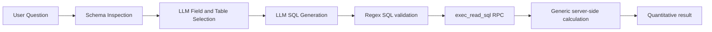
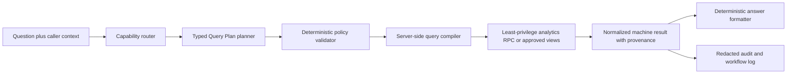

# Data Query Agent — Current-State Map, Risk Audit, and Hardening Roadmap

Historical baseline date: 2026-07-22
Repository baseline: `cc79b64` (`main`, clean worktree before this document)  
UI name: **Data Query Agent**  
Internal tool name: `data_query`

Current-status note (2026-07-26): the opening verdict and source map preserve
the 2026-07-22 audit baseline. Later implementation-status sections supersede
that baseline, culminating in the later table-promotion closeouts at the end of
this file. The reviewed exact runtime now includes `meetings`, `emails`, and
`exceptions_report`; Phase 4D, Phase 4E, and Phase 4F are complete through their
authenticated UI closeouts.

## Executive verdict

The Data Query Agent is a substantial prototype, not a stub. It has configuration, Main Agent routing, a direct API, a settings/test card, workflow telemetry, Supabase schema discovery, an allowlisted JSON Query Plan executor, a second LLM-generated SQL pipeline, and 15 focused mocked tests.

It is **not ready to be treated as a fully correct or production-safe analytics agent**. The most important reasons are:

1. Four Data Query endpoints are callable without the repository's API-secret checks, including endpoints that can generate and execute SQL with the Content Supabase service-role key.
2. The UI and saved settings say raw SQL is disabled, but the seven-stage SQL pipeline generates and executes raw SQL without checking `allowRawSql` or `requireHumanApprovalForRawSql`.
3. The SQL allowlist is regex-based and is not a safe SQL authorization boundary. It accepts table-free function calls such as `select pg_sleep(10)` and rejects some valid CTEs.
4. The original Query Plan executor fetches at most `limit` rows and then counts/groups/aggregates locally. Any table with more matching rows can therefore produce a plausible but wrong result.
5. The Main Agent uses the original Query Plan path, while the step-by-step UI uses the later raw-SQL path. These paths have different capabilities, safety models, outputs, and failure modes.
6. The runtime is now Content-DB-only, but several heuristics, defaults, tests, comments, and the Stage 2 specification still assume access to the App DB.

The recommended direction is to keep one canonical, typed Query Plan contract, execute exact aggregates inside a tightly scoped database API, and remove or disable arbitrary model-generated SQL until a least-privilege and parser-backed security design exists.

## Scope and evidence boundaries

This audit inspected the current repository, git history, project Bedrock notes, implementation specification, configuration, UI, tests, and SQL migration.

Verified in this pass:

- Current source and git state.
- Static request/data flows.
- Focused mocked/unit behavior through `npm.cmd test`.
- Direct probes of `validateReadOnlySql`.

Not verified in this pass:

- Live Content Supabase schema, data, RLS, grants, or RPC installation.
- Live OpenRouter planning quality or cost.
- Live API responses, because `localhost:4000` was not running.
- Browser/UI behavior.
- Production authentication, hosting, network controls, or tenant isolation.

## Source-of-truth map

### Runtime implementation

| File | Current responsibility | Key locations |
|---|---|---|
| `src/subagents/dataQuery.js` | Entire agent core: settings projection, schema discovery, manifests, LLM and heuristic planning, Query Plan validation/execution, synthesis, workflow log, SQL guard/RPC client, and seven-stage SQL pipeline | `5-61`, `89-183`, `185-347`, `349-760`, `764-860`, `883-1183` |
| `src/agent.js` | Main Agent routing, invocation, result collection, synthesis context, and chat workflow node | `431-469`, `670-695`, `764-769`, `1362-1459`, `1607-1612` |
| `src/server.js` | Direct step, full SQL pipeline, schema scan, and original Query Plan HTTP endpoints; run history and telemetry | `712-843` |
| `src/config.js` | Persisted/public settings normalization under `settings.subagents.dataQuery` | `469-485`, `587`, `655`, `926-970` |
| `src/heuristics.js` | Heuristic quantitative-question routing to `data_query,alert` | `9` |
| `src/prompts.js` | Classifier instructions describing when to recommend `data_query` | `75`, `82` |
| `src/tools.js` | Registers `data_query` as an internal project tool | `3-4` |

### UI and workflow presentation

| File | Current responsibility | Key locations |
|---|---|---|
| `public/app.js` | Frontend defaults, workflow template node/edges, Data Query settings card, table picker, direct test runner, step-by-step SQL runner, settings draft, and run-history label | `68-83`, `235`, `275-277`, `909-1195`, `6901-6907` |
| `public/app.js` | Reuses the Data Query schema endpoint to populate table choices for other internal content-agent cards | `595-617` |
| `public/styles.css` | Table picker and SQL pipeline presentation | `5486-5700` |
| `scripts/generate-app-graph.js` | Generated architecture graph declarations for the subagent and Content Supabase dependency | `92`, `195`, `204` |

### Database, tests, and specifications

| File | Current responsibility | Key locations |
|---|---|---|
| `supabase/data-query-exec-read-sql.sql` | Creates `public.exec_read_sql(q, max_rows)`, dynamically executes caller-supplied SQL, caps returned rows, enables transaction read-only, and grants execution to `service_role` | entire file |
| `test/run-tests.js` | 15 focused mocked/unit tests for validation, local derivation, workflow logs, SQL guard/pipeline, settings, introspection, and LLM planning | `342-695` |
| `docs/data-query-agent-codex-prompt.md` | Original v1 requirements plus a later **specification-only** Stage 2 for caller contracts, deduplication, machine results, linked plans, and code-side joins | v1 `1-447`; Stage 2 `461-679` |
| `bedrock/Memory/subagents.md` | Historical implementation notes; useful context but partly stale and internally contradictory with current code | `31-52`, `73` |

Generated Bedrock app-graph outputs and history files mention the agent but do not participate in runtime behavior.

## Runtime architecture

### Flow A — Main Agent and direct-test Query Plan path

```mermaid
flowchart LR
    U["User question"] --> C["Classifier and heuristics"]
    C --> R["shouldRunDataQuery"]
    R --> T["callProjectTool: data_query"]
    T --> S["Content-only settings and manifest"]
    S --> P["LLM JSON planner"]
    P -->|failure or rejected plan| H["Heuristic planner"]
    P --> V["Server-side Query Plan validator"]
    H --> V
    V --> E["PostgREST row fetch per plan"]
    E --> L["Local count/group/aggregate/timeseries"]
    L --> O["Generic result synthesis"]
    O --> M["Main Agent answer synthesis"]
    O --> W["Workflow and run history"]
```



Entry points:

- Main Agent: `src/agent.js` calls `runDataQueryAgent()`.
- Direct API/UI test: `POST /api/subagents/data-query` calls the same function and additionally creates a detailed workflow log.

Planning behavior:

- An explicit `queryPlan` supplied by the direct API is accepted as input but still passes validation.
- Otherwise, an OpenRouter JSON-only planner receives the selected-table manifest.
- If the LLM fails or its plan is rejected, a deterministic heuristic planner is attempted.
- The heuristic planner still proposes App DB tables for delay/gap/insight questions even though runtime settings now allow only Content DB tables. Only its alert branch is naturally compatible with the current restriction.

Execution behavior:

- Each plan becomes a PostgREST `GET /rest/v1/<table>?select=...&limit=...` request.
- Filtering and one allowed-field sort are pushed to PostgREST.
- Count, distinct, grouping, timeseries, and numeric aggregate operations are calculated in Node.js over only the fetched rows.
- Plans run sequentially. `timeoutMsPerPlan` is used; `totalTimeoutMs` is not.

Output behavior:

- Response fields are `status`, `answer`, `metrics`, `plans`, `tablesUsed`, `confidence`, `warnings`, `rawResultsPreview`, `queryPlan`, and `planner`.
- Synthesis only promotes positive `count`/`events_count` values into top-level metrics. It does not faithfully expose arbitrary `avg`, `min`, `max`, or `sum` aliases, and zero counts disappear from the metric list.
- The human answer is a generic execution sentence rather than the requested quantitative result. The Main Agent must infer the useful values from the tool payload.

### Flow B — step-by-step raw-SQL pipeline



The seven stages are:

1. `user_question`
2. `schema_inspection`
3. `field_selection`
4. `sql_generation`
5. `sql_execution`
6. `calculation`
7. `result`

Entry points:

- `POST /api/subagents/data-query/step` executes any single stage using client-supplied accumulated state.
- `POST /api/subagents/data-query/pipeline` executes all stages.
- The UI's “Run all” button calls the **step endpoint seven times**; it does not call the full-pipeline endpoint.

Important behavior:

- Schema inspection can fetch 2 sample rows for each of up to 15 selected tables.
- Field selection fetches another 3 sample rows for each chosen table.
- Sample values are sent to OpenRouter without a Data Query-specific redaction or column sensitivity policy.
- SQL generation is model-driven and accepts `SELECT`/`WITH` queries.
- SQL execution always uses the Content connection, regardless of the requested/selected connection label.
- Neither `allowRawSql` nor `requireHumanApprovalForRawSql` gates these endpoints or stages.

## Current settings and whether they work

| Setting | Used today? | Notes |
|---|---:|---|
| `enabled` | Yes | Gates Main/direct Query Plan path. The step/pipeline endpoints do not explicitly reject disabled state. |
| `plannerEnabled` | Query Plan path only | The SQL pipeline still requires its LLM field-selection and SQL-generation stages. |
| `plannerModel` | Yes | Used by both planner styles. |
| `plannerTimeoutMs` | Yes | Used for model calls. |
| `maxPlans` | Yes | Query Plan validation/planning only. Direct API `body.maxPlans` is passed as an unused top-level input. |
| `maxRowsPerPlan` | Yes | Caps fetched/returned rows; this also makes local aggregates inexact on larger result sets. |
| `timeoutMsPerPlan` | Yes | Applied to REST plan fetches and SQL RPC execution. |
| `totalTimeoutMs` | **No** | Normalized and editable, but no total-run deadline uses it. |
| `tables` | Yes | Selected Content tables and columns become the runtime manifest. App selections are dropped by `dataQuerySettings()`. |
| `allowedTables` | Derived | Runtime derives it from selected/legacy Content tables. |
| `allowedSchemas` | Forced | Runtime forces `['content']`; frontend defaults still say `['app','content']`. |
| `allowAggregations` | **No effective enforcement** | The validator and SQL pipeline do not gate aggregation operations with it. |
| `allowRawSql` | **No effective enforcement on SQL pipeline** | UI fixes it to false, but raw SQL is still generated/executed. |
| `allowJoins` | Query Plan rejects joins | SQL pipeline does not explicitly inspect this setting; SQL validation allows joins among selected table names. |
| `requireHumanApprovalForRawSql` | **No** | Persisted as true but no approval flow exists. |

## API surface

| Method and route | Purpose | Current response behavior | Secret check present? |
|---|---|---|---:|
| `GET /api/subagents/data-query/schema` | Scan Content PostgREST OpenAPI | `200` with connections or `502` if none | No |
| `POST /api/subagents/data-query` | Original Query Plan run plus workflow history | `200`, `400`, or `500` | No |
| `POST /api/subagents/data-query/step` | Execute one SQL pipeline stage from client state | Usually `200`, including stage errors | No |
| `POST /api/subagents/data-query/pipeline` | Execute all SQL stages and record run history | `200` even for pipeline-stage error; `500` for outer exception | No |

The server has `checkBidocSecret`/`checkBidocSecretForRead` helpers, but none of the four Data Query routes call them.

## Confirmed findings

### P0 — must resolve before trusting the agent

#### P0.1 Unauthenticated SQL-capable endpoints

The SQL stage and pipeline routes can invoke OpenRouter and the Content DB using server-held credentials without calling the available API-secret checks. This creates cost, data-exposure, denial-of-service, and database-query surface if the server is reachable by an untrusted caller.

#### P0.2 The declared safety contract is false for the current combined implementation

The card says the agent “never runs free raw SQL”; its raw-SQL checkbox is disabled and saved as false. Nevertheless, the same card exposes a SQL generator and executor. The backend never checks `allowRawSql` or a human approval token before executing it.

This is also inconsistent with the original v1 spec and the documented Stage 2 boundary, both of which explicitly defer raw SQL.

#### P0.3 Regex SQL validation is not an authorization boundary

Observed probes:

```text
select pg_sleep(10)                                  -> accepted
select current_setting('server_version')            -> accepted
with x as (select id from emails_gf) select * from x -> rejected because CTE alias x is treated as a table
```

The validator extracts only names following `FROM`/`JOIN`. It does not parse SQL semantics or control callable functions. The database RPC dynamically executes the supplied text as `service_role`; transaction read-only prevents ordinary database writes but is not a table/function allowlist, a cost limit, or an external-side-effect sandbox.

#### P0.4 Quantitative answers can be silently wrong

The Query Plan path performs:

1. fetch with `limit = plan.limit`, then
2. local count/group/aggregate.

For 12,000 matching rows and a limit of 200, `count` can return 200, a group breakdown covers only the first 200 rows, and averages/sums are sample aggregates—not database aggregates. No warning labels the result as truncated or sampled. This violates the agent's core quantitative purpose.

### P1 — architectural and reliability gaps

#### P1.1 Two divergent agents share one name and UI

The Main Agent and direct “Run test” use the JSON Query Plan path. The step cards use the raw-SQL path. Improving or testing one does not establish the behavior of the other.

#### P1.2 Content-only runtime conflicts with routing and fallbacks

The runtime correctly drops App DB access, but:

- heuristic plans for delays, gaps, and project-insight runs target App tables and are rejected;
- frontend defaults still advertise App plus Content;
- settings normalization tests preserve App selections even though runtime later drops them;
- the original Stage 2 relationship examples use App delay tables that this agent cannot access;
- broad quantitative heuristics can route questions that the Content-only manifest cannot answer.

The product capability boundary must be made explicit: either Content-only is authoritative and routing/specs must be rewritten, or App access needs a separate, deliberately authorized agent.

#### P1.3 Result synthesis does not return the requested numbers reliably

The Query Plan answer is generic, top-level metrics only recognize selected count aliases, zero results are omitted, and requested metrics are not mapped to a stable machine-readable contract. This is insufficient for dependable reuse by the Main Agent or other subagents.

#### P1.4 Total deadline is a dead control

`totalTimeoutMs` appears in backend defaults, normalization, UI, and the Stage 2 safety rules, but neither execution path enforces it. Multiple plans run sequentially and schema sampling is sequential.

#### P1.5 Data samples and previews lack a privacy policy

Real row samples are sent to the external model. Result previews are also placed in workflow details/history. There is no per-column denylist, sensitivity metadata, masking, truncation budget for the whole payload, or retention rule specific to this agent.

#### P1.6 Database migration/documentation drift

The SQL file says to install the RPC in every target DB, while current runtime is Content-only. Bedrock notes describe a dedicated read-only role and per-DB behavior that the checked-in SQL does not create. The actual function is `security invoker` and is called as `service_role`.

#### P1.7 Stage 2 is not implemented

The later section of `docs/data-query-agent-codex-prompt.md` is an unimplemented specification. Current code has no validated caller envelope, budget narrowing, per-run dedup cache, `machineResult.metricsByRequestId`, semantic-question rerouting contract, workflow nesting, declared relations, linked-plan dependency graph, code-side joins, join fan-out cap, or circular-dependency detection.

### P2 — quality and maintainability gaps

- `allowAggregations` is exposed but not enforced.
- Direct `body.maxPlans` is passed to `runDataQueryAgent()` in a field the function does not consume.
- OpenAPI discovery retains column names but not reliable types, keys, relationships, nullability, or sensitivity. Numeric/groupable behavior is inferred from names.
- The legacy manifest contains App tables that are immediately filtered out and a historically stale meeting table name.
- SQL pipeline calculation derives generic sums/averages over SQL result rows, which can double-aggregate already aggregated query output.
- SQL and Query Plan error/status semantics differ across routes.
- Query Plan filter serialization does not robustly encode all PostgREST grammar edge cases.
- Workflow previews can make run-history payloads large and leak row content.
- No cache, concurrency limit specific to this agent, per-caller budget, or run-level deduplication exists.
- The `/pipeline` endpoint records events but does not build the same detailed workflow graph as the direct Query Plan endpoint.

## Test status on 2026-07-22

Command:

```powershell
npm.cmd test
```

Results:

- All **15 Data Query-specific tests passed**.
- The repository-wide command exited `1` because **11 unrelated UI/static-regression tests failed** (settings, workflow, and timeline assertions after frontend migration).
- No test failure in this run was inside the Data Query block.

What the Data Query tests currently prove:

- Basic Query Plan allowlist and field validation.
- Rejection of obvious dangerous operation/raw-SQL strings in JSON plans.
- Plan and row-limit normalization.
- Local grouped-count and numeric-aggregate derivation over mock rows.
- Partial execution failure handling.
- Workflow graph construction and OpenRouter usage attachment.
- Basic SQL keyword/comment/table-name checks.
- A fully mocked seven-stage SQL happy path.
- Settings selection preservation.
- OpenAPI name/column parsing.
- LLM JSON planning and rejected-plan fallback.

What they do **not** prove:

- Exact count/group/aggregate correctness above `maxRowsPerPlan`.
- Main Agent routing and answer quality end to end.
- Any live HTTP endpoint contract.
- Any browser interaction or settings persistence for the Data Query card.
- Content-only selection consistency across UI, config, planner, and executor.
- SQL RPC installation, grants, RLS interaction, read-only guarantees, timeout, or least privilege.
- SQL parser bypass resistance, function allowlisting, resource exhaustion, or adversarial prompts.
- Authentication/authorization on the four routes.
- Sensitive-column redaction before OpenRouter or workflow persistence.
- Total timeout enforcement.
- Concurrent requests, cancellation, retry behavior, or cost budgets.
- Stage 2 behavior.

## Recommended target architecture

Use **one canonical agent**, not two parallel implementations:



Key properties:

- The model chooses from typed operations; it does not write executable SQL.
- The server compiles approved operations into parameterized, bounded database calls.
- Counts and aggregates run in the database over the full filtered set.
- The DB credential can read only approved analytics views/functions.
- Every metric includes table/view, filters, exact-vs-truncated status, row cardinality, and calculation definition.
- The caller contract is stable for Main Agent and future subagents.

## Improvement roadmap

Historical-roadmap note: this Phase 0-5 sequence was written for the original
2026-07-22 hardening program. It is preserved as implementation history and is
not the later per-table Phase 4A-4K naming scheme. Current remaining table phases
are defined at the end of this file and in
`docs/data-query-agent-phases4c-4k-roadmap.md`.

### Phase 0 — freeze the safety boundary and choose the canonical path

1. Temporarily disable/remove the SQL step/pipeline execution routes and UI controls, or place them behind an explicit development-only flag plus authentication.
2. Declare Content-only as the authoritative scope, or split App analytics into a separately authorized agent. Do not keep a mixed implicit scope.
3. Decide that the typed Query Plan path is canonical.
4. Align UI text, settings defaults, docs, Bedrock notes, and tests with that decision.

Exit gate: no reachable path can execute model-authored SQL while the UI/settings claim raw SQL is disabled.

### Phase 1 — authorization and least privilege

1. Require the appropriate server authorization check on schema, direct-run, step, and pipeline routes.
2. Replace service-role execution with a dedicated least-privilege database role/API that can access only approved analytics views/functions.
3. Apply database-enforced statement timeout, row/output caps, and function restrictions.
4. Remove client-supplied accumulated execution state as an authority source; validate/rebuild trusted state server-side.
5. Add audit events for caller, selected data sources, filters, duration, row counts, truncation, and cost—without raw sensitive values.

Exit gate: adversarial callers cannot reach unapproved tables/functions, cause writes, bypass budgets, or use the agent without authorization.

### Phase 2 — quantitative correctness

1. Replace fetch-then-aggregate with exact database-side count/group/aggregate operations.
2. Define typed table metadata: data type, date semantics, allowed filters, groupability, aggregation permission, sensitivity, and stable source identity.
3. Return explicit `exact`, `truncated`, `sampled`, and `not_computable` states.
4. Make zero a valid, preserved metric.
5. Implement `totalTimeoutMs` and cancellation across the full run.
6. Build a deterministic metric formatter; use an LLM only for optional explanation after facts are fixed.

Exit gate: a gold dataset proves exact results for counts, groups, sums, averages, distincts, top-N, and timeseries across small and large tables.

### Phase 3 — routing and reusable agent contract

1. Define supported Content DB domains and unsupported semantic/citation questions.
2. Implement a normalized caller envelope: `source`, `runId`, `callerNodeId`, `budget`, date/project scope, and `requestedMetrics`.
3. Add budget narrowing, per-run deduplication, stable metric IDs, and provenance.
4. Route unsupported questions to the correct retrieval/evidence agent without executing a query.
5. Implement workflow nesting only after the caller contract is stable.

Exit gate: Main Agent and approved subagents consume the same versioned response contract without parsing prose.

### Phase 4 — relationships, only if the product needs them

1. Inventory real Content DB keys and approved relations.
2. Add only declared relations with bounded fan-out and dependency depth.
3. Prefer database views/precomputed aggregates over generic joins.
4. If linked plans remain necessary, implement topological ordering, cycle detection, exact key validation, and partial-result semantics.

Exit gate: every relationship query is backed by a declared relation and deterministic tests; no free-form join is possible.

### Phase 5 — observability, privacy, and performance

1. Redact or omit sensitive sample values before model calls and workflow persistence.
2. Stop sampling every selected table; use metadata and targeted sampling only after policy approval.
3. Add run-level time, token, cost, database-duration, cardinality, cache, and failure metrics.
4. Bound workflow previews and retention.
5. Add concurrency limits and backpressure.

Exit gate: operational dashboards can distinguish planner failure, validation rejection, DB failure, timeout, truncation, and answer-format failure without exposing sensitive rows.

## Required test program

### Unit and property tests

- Every operation, filter, type, limit, date boundary, zero/null case, and invalid plan shape.
- Exact metric formatting, stable IDs, provenance, and warning semantics.
- Budget can only narrow configured limits.
- Total deadline cancels planning and execution.
- Property/fuzz tests for plan validation and filter encoding.

### Security tests

- All four routes reject missing/invalid authorization when protection is configured.
- Attempts to access unselected tables, schemas, views, CTE tricks, functions, system catalogs, lateral/table functions, nested subqueries, comments, encodings, and expensive functions fail.
- Database role cannot write and cannot read outside approved analytics objects.
- Prompt injection inside schema names/sample data cannot alter policy.
- Sensitive columns never reach OpenRouter, API previews, or workflow history.

### Deterministic correctness suite

Create a seeded fixture DB with known answers for:

- zero rows;
- 1, 199, 200, 201, and 10,000 matching rows;
- skewed group distributions;
- null and nonnumeric values;
- Unicode/Hebrew filters;
- date/timezone boundaries;
- distinct values, top-N ties, and timeseries day/month buckets;
- multi-metric and partial-failure requests.

Compare agent outputs to direct trusted SQL fixture answers.

### API integration tests

- Schema endpoint contract and Content-only enforcement.
- Direct run success, clarification, validation rejection, timeout, and DB failure.
- Consistent HTTP and body status across endpoints.
- Run-history/workflow persistence with redacted details.
- Settings saved through `/api/settings` affect the next run.

### Main Agent integration tests

- Quantitative Content question routes to Data Query.
- Semantic/citation question does not route to Data Query.
- Disabled agent does not run through any endpoint.
- Main Agent states the numeric answer and its table/filter provenance.
- Zero, partial, truncated, and not-computable results are not rewritten as confident facts.

### Browser tests

- Card renders and identifies the authoritative execution path.
- Table scan/search/select/save/reload works.
- Content-only scope is visible.
- Disabled/raw-SQL controls match actual backend behavior.
- Test result shows values, provenance, warnings, exactness, and workflow link.
- Error and timeout states remain usable and do not leak raw credentials/data.

### Live smoke and operational tests

- Approved Content schema is visible using the deployed credential.
- Least-privilege RPC/views exist and grants match the migration.
- A small gold query returns the known answer.
- A deliberately slow query hits the database and run deadlines.
- Concurrent requests respect configured backpressure.
- OpenRouter and database failures produce bounded, diagnostic, non-sensitive results.

## Definition of done

The Data Query Agent should not be described as “working perfectly” until all of these are true:

1. One canonical execution architecture is used by Main Agent, API tests, and UI.
2. No model-authored SQL is executable outside an explicitly approved, least-privilege design.
3. Every endpoint is appropriately authenticated and authorized.
4. Exactness is proven on datasets larger than the row cap.
5. Content-only scope and supported question types are explicit and enforced.
6. Stable machine results include metric definitions, provenance, and exact/truncated state.
7. Total time, row, token, cost, concurrency, and privacy budgets are enforced.
8. Unit, security, fixture-DB, API, Main Agent, browser, and live smoke suites pass.
9. The repository-wide test suite is green or unrelated failures are separately accepted and tracked.
10. A production run is verified against a known answer and its workflow/audit record.

## Recommended immediate next slice

Start with **Phase 0 only**:

1. make the raw-SQL mismatch unreachable;
2. formalize Content-only scope;
3. choose the typed Query Plan path as canonical;
4. add failing tests for unauthenticated routes, row-cap correctness, dead settings, and SQL-pipeline gating.

That slice creates a safe baseline before improving planner intelligence or adding multi-table behavior.

## Phase 0 + 1 implementation status — 2026-07-22

Phase 0 and the executable part of Phase 1 are complete:

- The typed, allowlisted, Content-only Query Plan is the canonical runtime.
- The raw-SQL step/pipeline routes, browser controls, and schema-scan route are removed.
- Direct Data Query HTTP calls require `BIDOC_API_SECRET` and fail closed when it is not configured.
- Database reads require `DATA_QUERY_SUPABASE_READ_ACCESS_TOKEN`; the Content API key is no longer used as the Authorization bearer token for this agent.
- App/MAIN tables are removed from the manifest and normalized settings drop non-Content selections.
- Per-plan execution now observes the remaining total deadline.
- Workflow node details contain row counts and selected field names but no raw row previews.
- The tracked migration removes `exec_read_sql`, provisions the `bidoc_data_query` role, grants only `SELECT` on the currently approved `public.data_index`, adds an explicit RLS policy, and sets an 8-second statement timeout.
- The migration was applied and its privileges were verified live in Kapaim project `smxibuaowzuxkznuouwj`.
- All focused Data Query tests pass. The full repository suite still has 11 unrelated, pre-existing UI/static-contract failures.

The original prototype descriptions and test recommendations earlier in this audit are retained as historical audit evidence. The current operator contract is in `docs/data-query-agent-phase0-phase1-operations.md`.

The remaining Phase 1 production gate is deployment configuration: issue a trusted Supabase JWT with `role=bidoc_data_query`, set it as `DATA_QUERY_SUPABASE_READ_ACCESS_TOKEN`, configure `BIDOC_API_SECRET`, deploy, and run a live authenticated HTTP smoke test. Until then the code fails closed rather than falling back to `service_role`.

## Phase 2 implementation status - 2026-07-22

Phase 2 correctness hardening is complete for the currently approved `public.data_index` table:

- Exact quantitative operations now run in `public.bidoc_data_query_data_index_v1` over the complete filtered relation. The former silent 200-row local-aggregation cap no longer affects counts, groups, distinct values, date buckets, or approved aggregates.
- `src/subagents/dataQueryMetadata.js` provides an explicit typed field registry with filter, grouping, aggregation, date-semantics, and sensitivity capabilities.
- Content-bearing fields are excluded from quantitative planning, and unsupported tables or operations resolve to `not_computable` instead of an approximate answer.
- Results carry `exact`, `truncated`, `sampled`, or `not_computable`, plus cardinality and redacted provenance. Zero values are retained and metric identifiers are deterministic.
- The total-run deadline now includes planner time as well as database execution time.
- The exact RPC is a fixed-table `SECURITY INVOKER` function with an empty `search_path`; broad execution is revoked and only `bidoc_data_query` is granted access.
- Live comparison against trusted SQL covered all 1,248 production rows. A transactional 10,000-row gold fixture proved the `0`, `1`, `199`, `200`, `201`, and `10,000` boundaries and left no test rows after rollback.
- All 25 focused Data Query tests pass.

The detailed contract, evidence, limitations, and promotion gate for future tables are in `docs/data-query-agent-phase2-correctness.md`. Production HTTP validation remains gated on deploying the two required secrets described in the operator guide.

## Phase 3 implementation status - 2026-07-23

Phase 3 routing and reusable-contract work is complete:

- Every response now declares `contractVersion: "data-query.v2"` and returns normalized `caller`, `routing`, and `machineResult` objects.
- Caller sources, run/caller-node identity, requested metric IDs, date/project scope, and narrowing budgets are validated before planning.
- Semantic, citation, explanation, responsibility, and evidence questions route to `delay_claim`, `meeting_evidence`, or `hybrid_search` without invoking the planner or database.
- Project and date scopes are deterministically added to every plan before allowlist validation; unsupported scope is never silently discarded.
- Same-run equivalent plans use a bounded, process-local TTL cache and report `served_from_run_cache` plus per-plan `cacheHit`.
- Metric IDs use caller request IDs and `machineResult.metricsByRequestId`/`planStatusByRequestId` let Main Agent and future subagent callers consume values without parsing prose.
- Main Agent now passes its parent `runId`/`callerNodeId` and is explicitly instructed to consume only the machine result for numeric facts.
- Workflow telemetry includes the capability route, contract/caller metadata, machine result, and cache-hit count.
- The Settings/Subagents card exposes run-local cache enablement and TTL.
- All 31 focused Data Query tests pass. The full suite retains the same 11 unrelated UI/static-contract failures.
- Manual UI acceptance was confirmed on 2026-07-23: `data-query.v2`, enabled run-local cache, TTL `60000`, and only `data_index` selected.
- The live local API gate remains blocked: the server returns HTTP `503` because `BIDOC_API_SECRET` is absent, and no dedicated `DATA_QUERY_SUPABASE_READ_ACCESS_TOKEN` is configured. The fail-closed behavior is correct; an authenticated database smoke test is still pending.

The complete contract, request/response examples, verification, and remaining gates are in `docs/data-query-agent-phase3-contract.md`.

## Phase 3.1 managed-authentication status - 2026-07-23

Phase 3.1 supersedes the manually minted `role=bidoc_data_query` JWT as the canonical deployment path:

- The server now signs in a dedicated Supabase Auth service account, validates `app_metadata.data_query_role=bidoc_data_query`, caches only the short-lived access token in process memory, and refreshes it before expiry.
- Managed credentials stay outside public and persisted settings. Incomplete credentials fail closed, and the static read token remains only as a compatibility fallback.
- The live Kapaim migration is applied. `bidoc_data_query` remains `NOLOGIN`/`NOINHERIT`, has no direct table or sequence privileges, and cannot execute the exact implementation function.
- The public exact RPC is now a claim-gated `SECURITY DEFINER` wrapper with an empty `search_path`; the fixed-table Phase 2 implementation remains `SECURITY INVOKER` and inaccessible to API roles.
- A valid synthetic service claim returned the exact live count of 1,248. An ordinary authenticated claim without the service marker failed with PostgreSQL `42501`.
- Three pre-existing `SECURITY DEFINER` functions no longer inherit execution through `PUBLIC`; their explicit `anon`, `authenticated`, and `service_role` grants remain intact.
- Supabase's security advisor reports the wrapper as authenticated-executable `SECURITY DEFINER`. This is intentional and is mitigated by the immutable claim gate; the exact contract test and live negative authorization proof cover it.
- Phase 3.1 intended the absent-selection fallback to use canonical `data_index` rather than the hybrid-search embedding table. Phase 4A.0 later found that the fallback still constructs two extra non-exact manifest entries.
- Local acceptance is complete: the runtime uses the explicit Kapaim Content host with no App fallback, the confirmed managed identity carries `app_metadata.data_query_role=bidoc_data_query`, and provisioning succeeds.
- The authenticated HTTP route returned `data-query.v2` and the exact live count of 1,248 through both a provided plan and the live LLM planner. A same-run repeat hit the local cache.
- Missing or incorrect API secrets returned HTTP `401`; a semantic question routed to `delay_claim` without execution; and an `auth.users` plan was rejected with HTTP `400`.
- All 36 focused Data Query tests pass. The full suite retains 11 unrelated UI/static-contract failures.
- The Phase 3.1 release gate was deployment propagation and an authenticated smoke suite. Phase 4A.0 later added credential isolation as a prerequisite.

The implementation, operator steps, live boundary, and acceptance request are in `docs/data-query-agent-phase3-1-managed-auth.md`.

## Phase 4A.0 structured-capability discovery - 2026-07-24

Phase 4A.0 is complete as a read-only discovery and planning checkpoint. No runtime or database object was changed.

- Exact full-relation analytics remain implemented only for `public.data_index`.
- The live Content schema was mapped by structured fields, row counts, null coverage, date coverage, source-index consistency, keys, indexes, RLS, policies, and grants.
- Question families are now separated into Data Query-only, Data Query plus retrieval/evidence, and retrieval-only behavior for financial transactions, safety reports, alerts, meetings, emails, exceptions, WhatsApp analysis, and deferred tables.
- “Latest,” “earliest,” and “last N” require a new typed lookup contract. Current `top_n` means grouped counts, while the compatibility `select` path is a bounded direct PostgREST read and does not expose a machine-readable record result.
- The best first business-table target remains `financial_transactions`, but all numeric amount columns are currently empty. Exact money totals must remain `not_computable` until normalization is populated and verified.
- `data_index` has two orphaned financial source rows and one orphaned safety source row, so indexed-record counts are not automatically source-table counts.
- At the Phase 4A.0 snapshot, the real no-selection fallback still built manifest entries for `data_index`, the configured alerts table, and `meetings_documents`; Phase 4A.1 subsequently corrected this to exactly `data_index` and added a real-path regression test.
- All security findings identified during Phase 4A.0 are isolated in `docs/data-query-agent-deferred-security-register.md`. They are deferred by product decision and are no longer mixed into the functional capability roadmap.

The complete capability matrix, live evidence, functional promotion order, and Phase 4A.1 acceptance contract are in `docs/data-query-agent-phase4a-capability-map.md`.

## Phase 4A.1 typed-lookup foundation - 2026-07-24

Phase 4A.1 is complete as a local implementation and test slice. No Supabase query, migration, table change, or business-table promotion was performed.

- The typed plan contract now includes `lookup_latest`, `lookup_earliest`, and `lookup_last_n`.
- Lookup validation enforces a matching enabled table policy, selectable fields, allowlisted primary order fields, stable-ID tie-breaking, strict direction, bounded limits, and the caller's classified lookup operation/table/cardinality.
- English and Hebrew parsing recognizes unambiguous table targets while rejecting temporal-window wording, ambiguous generic reports/messages, zero/oversized limits, and semantic explanation/evidence questions.
- The deterministic fallback can select only the exact target table; it cannot apply an alert or invoice question to the first enabled manifest table.
- Exact RPC responses must match the requested operation and cannot report `not_computable` as a successful result.
- Machine output separates bounded lookup records into `machineResult.recordsByRequestId`; workflow history stores only redacted question/provenance structure, record counts, and field names.
- Canonical execution no longer supports the direct-table `select` compatibility path, and the real missing-selection fallback is exactly `data_index`.
- Main Agent code can consume structured records from the machine contract, but lookup routing is dormant unless the target table has an enabled typed lookup policy. Therefore invoice lookup is not advertised or executed before Phase 4A.2.
- All 40 focused Data Query tests pass. The full suite retains the same 11 unrelated UI/static-contract failures.
- Manual UI regression also passed: exact indexed count used Data Query; latest invoice used `financial_transactions`; latest meeting used `meetings`; and the invoice-rejection explanation used financial/email evidence without Data Query. The user independently confirmed the latest invoice and meeting in their source tables.

The detailed manual run evidence and separate Main Agent token/timeout observations are in `docs/data-query-agent-phase4a1-manual-regression.md`.

## Phase 4A.2 dormant financial policy - 2026-07-25

Phase 4A.2 is complete as local fail-closed policy and fixture work. No Supabase query, migration, RPC proposal or deployment, saved-selection change, direct table read, production activation, or database mutation was performed.

- `financial_transactions` now has a fixed typed metadata policy derived from the Phase 4A.0 catalog evidence.
- Approved query fields are limited to `id`, project scope, canonical `transaction_date`, category, status, vendor, transaction type, item status, and currency.
- Content, source locators, people/submitter fields, `created_at`, and text-formatted amount fields remain outside the query allowlist.
- The unpopulated numeric money fields carry an explicit non-computable reason. Natural-language money requests and attempted numeric `sum`/`avg` plans fail closed as `not_computable`.
- Supported financial operations are explicitly limited to count, group count, distinct, time series, and bounded latest/earliest/last-N lookup.
- Invoice lookup has one exact meaning: `transaction_type = 'חשבונית'`. The validator rejects a missing or mismatched discriminator.
- Canonical lookup order is `transaction_date`, then stable `id`, with null dates last.
- Policy registration is separate from availability: the local financial policy has no `exactRpc`, so its active operation list is empty and Main/Data Query routing remains dormant.
- Trusted fixture settings activate the same policy only inside tests. Canonical runtime execution still requires typed exact responses with operation attestation and never falls back to raw PostgREST `select`.
- The 27-item local acceptance matrix covers bilingual wording, exact filtering, counts, date boundaries, ties/nulls/cardinality, allowlists, attestation, machine-record bounds, redaction, cache behavior, caller scope, semantic precedence, dormant routing, and the original `data_index` fallback.
- All six requested JavaScript syntax checks and `git diff --check` pass. The focused suite passes all 50 Data Query tests. The full suite retains exactly the same 11 unrelated UI/static-contract failure names; no Data Query test or new test failed.

The repeatable four-question UI checklist is in `docs/data-query-agent-phase4a2-manual-regression.md`. Until a matching financial exact execution contract is separately approved and deployed, the expected user-facing routes remain unchanged: indexed count through Data Query, invoice lookup through financial retrieval, meeting decisions through meeting retrieval, and invoice explanation through financial/email evidence.

Live trusted-SQL comparison, RPC design/deployment, production activation, another table promotion, Phase 4A.3, and Main Agent token/context optimization are all deferred.

## Existing financial read-interface audit - 2026-07-25

A read-only live audit checked whether Phase 4A.2 could be activated by adapting the agent to an already-existing financial interface, without changing any table or database object.

- The configured managed Data Query identity authenticated successfully.
- Its OpenAPI discovery request returned HTTP 200.
- The live `match_financial_transactions` RPC is a semantic vector-matching interface with embedding, threshold, count, and filter inputs. It cannot attest exact count/group/distinct/time-series or deterministic latest/earliest/last-N operations.
- The published `bidoc_data_query_data_index_v1` RPC remains fixed to `data_index`.
- No financial equivalent of the typed exact Data Query contract is exposed.
- A no-body managed `HEAD` request against `financial_transactions` returned HTTP 206 with `Content-Range: 0-0/100`.

That direct-table success is evidence of the existing SEC-001 over-broad `authenticated` privilege, not evidence of an approved read-only Data Query interface. The token's raw-table capability is materially wider than the agent contract and may include writes. The canonical agent must not normalize that bypass into production behavior.

Result: no code path was activated and no row values were fetched. The financial policy remains dormant. An agent-only activation is not possible while both of these boundaries remain in force:

- no raw PostgREST table reads; and
- no new or changed typed database read contract.

The existing semantic financial tool continues to handle financial retrieval questions. Exact structured financial questions remain locally specified and fixture-verified but not live.

## Phase 4A.3 read-only financial activation - 2026-07-25

The user clarified that the agent may read existing tables through structured queries but must never change tables or their contents. Under that clarified boundary, the prior no-direct-PostgREST restriction is superseded for one reviewed adapter only.

Current behavior:

- `financial_transactions` has a credential-gated `managed_postgrest_read_v1` execution transport;
- the adapter is fixed to Content `financial_transactions` and emits only `GET` or `HEAD`;
- typed plan validation still controls operations, fields, filter values/operators, ordering, date semantics, and limits;
- raw SQL, arbitrary table paths, joins, request bodies, and mutation methods are unavailable;
- count, group count, distinct, time series, and bounded latest/earliest/last-N reads are active;
- money aggregates remain `not_computable`;
- semantic/explanation questions continue to use retrieval.

The configured managed identity passed live read-only runs for latest invoice, invoice count, and invoice grouping by status. Each result was exact over 23 matching invoice records and produced no warning. The focused suite passes all 52 Data Query tests. The full suite retains exactly the same 11 unrelated UI/static-contract failures, and `git diff --check` passes.

No database object, table data, permission, RLS policy, role, migration, RPC, saved selection, or Supabase setting changed. SEC-001 remains a deferred credential-level risk because the managed identity's native privileges are broader than this agent-code adapter.

## Phase 4A.3 UI regression correction - 2026-07-25

An authenticated UI run exposed a runtime-settings drift that the earlier
command-line live checks did not exercise. The saved Data Query picker contained
only `data_index`; because the saved selection replaced the built-in manifest,
Main could not schedule the active financial policy. The request instead ran
Hybrid Search, graph search, a 25,839-token reranker call, and the semantic
financial tool. Final synthesis then failed with `Unexpected end of JSON input`,
so the UI displayed the weak fallback source list.

Current behavior after the agent-only correction:

- the saved picker remains unchanged and still reports only the user's selected
  table;
- runtime capability settings add the single reviewed credential-gated
  `financial_transactions` built-in;
- exact structured invoice lookups bypass Hybrid Search, graph search, and
  reranking;
- the deterministic typed lookup planner avoids an unnecessary LLM planner
  call;
- Data Query supplies exact record selection while the semantic financial tool
  remains available for enrichment;
- final-synthesis fallback preserves both exact fields and the semantic answer.

The authenticated regression run completed successfully. Data Query returned
one accepted plan with no warnings, the financial tool completed, no conflict
was detected, the Main Agent completed, and the UI answered with the exact
2026-02-28 invoice plus supplier, status, type, and currency. The run used
18,410 total tokens, versus at least 30,851 tokens consumed before final
synthesis in the failed run.

Focused verification is now 54 passing Data Query tests. The full-suite delta
remains the same 11 unrelated UI/static-contract failures. No database or
Supabase mutation was performed.

### Deterministic exact-invoice presentation

The approved follow-up keeps routing and execution unchanged and improves only
answer construction. When a successful exact latest-invoice machine record and
the semantic financial result share the same record ID, Main receives and
appends a bounded display projection containing available date, supplier,
amount, status, type, category, description, and an HTTP(S) `data_link`.

Data Query fields remain authoritative, while enrichment-only fields come from
the same-ID financial row. There is no date-only or vendor-only fuzzy match.
Missing fields are omitted and unsafe URLs are discarded. Focused verification
is now 57 passing Data Query tests.

If the semantic result set omits the exact row, the answer layer performs one
fixed, bounded, read-only GET by the exact integer Data Query ID. The live UI
review used this fallback and returned amount, description, and document name.
The exact source row's `data_link` was empty or non-HTTP(S), so no document link
was rendered. The workflow records this distinction as `matched: true` and
`documentLink: false`.

## Deterministic invoice-answer correction - 2026-07-25

The subsequent three-question UI review showed that the structured route was
still incomplete for metrics and bounded lists:

- invoice metrics could execute without `transaction_type = 'חשבונית'`, so a
  status breakdown counted all 100 financial rows instead of invoice rows;
- a date-scoped invoice count was combined with semantic financial records,
  which introduced a transfer into an invoice answer;
- last-N output depended on Main-Agent phrasing and omitted available details;
- detected cross-source conflicts were not guaranteed to appear in the final
  answer.

The agent-only correction now carries an invoice metric scope from capability
classification through deterministic planning and validator enforcement. The
same exact discriminator is mandatory for lookup and metric operations. Pure
invoice metrics and bounded lookups schedule only Data Query and use a
deterministic answer renderer, so semantic financial retrieval and Main-Agent
generation no longer participate in those answers.

Bounded lookup enrichment reads only the exact returned integer IDs in one
GET-only batch, preserves Data Query order, and matches by ID. Count and grouped
count answers consume only `machineResult.metricsByRequestId`. Date scopes still
come from the normalized caller envelope and retain inclusive end-date
semantics. Any detected multi-source conflict on a route that combines sources is appended as
a visible warning.

Focused verification is 61 passing Data Query tests. The full suite retains the
same 11 unrelated UI/static-contract failures. No database or Supabase object,
data, permission, role, policy, migration, saved setting, or schema was changed.
At this historical checkpoint, fresh UI examination of the three reported
questions was still the next gate; later entries record the completed UI work.

## Phase 4B `safety_reports` promotion - 2026-07-26

Phase 4B.1 through 4B.3 are complete. The work is limited to the existing
Content table `public.safety_reports`; no other table was activated and no
database or saved-selection state changed.

Source audit:

- 21 rows use positive unique bigint `id` values and one populated UUID project
  scope;
- canonical `report_date` coverage is 2023-10-01 through 2026-02-18, with no
  live nulls or ties;
- live canonical risk counts are low 15, medium 5 across two Hebrew spellings,
  unknown 1, and high 0;
- typed report-counter totals are life-threatening 2, severe 8, medium 17, and
  minor 26;
- `total_workers` is a per-report snapshot and its cross-report aggregate is
  `not_computable`;
- `item_status` and `resolved` do not establish trustworthy report-level
  resolved/unresolved semantics;
- all 21 rows have an exact attachment/project/mail/filename relationship to
  one safe attachment URL, but runtime link display additionally requires an
  authorization-bound caller project scope.

Implemented runtime contract:

- fixed credential-gated `managed_postgrest_read_v1` access to only
  `safety_reports`, using `HEAD`/`GET`, no body, and no arbitrary path, schema,
  join, SQL, method, or renamed table;
- typed count, canonical grouping, day/month series, approved defect-counter
  sums, and bounded latest/earliest/last-N lookup;
- deterministic `report_date` then `id` ordering, inclusive final-day scope,
  undated temporal-row exclusion, bounded limits, and canonical risk drift to
  `unknown`;
- deterministic exact answers from `machineResult`; semantic questions remain
  on safety retrieval, and mixed questions preserve exact values while adding
  only compatible evidence;
- explicit worker and resolution `not_computable` answers, exact zero rendering,
  and a mixed zero-risk guard that keeps report risk distinct from defect
  severity;
- exact-route generic retrieval/Main bypass, including high-urgency safety
  precheck suppression;
- project-authorized exact-row enrichment using the dedicated Data Query bearer
  and fail-closed link resolution;
- workflow telemetry reduced to operations, approved fields, tables, counts,
  exactness, and presence flags. Raw values, URLs, project/record IDs, plan IDs,
  request IDs, filenames, and provider errors are not retained.

Verification:

- six JavaScript syntax checks passed;
- Phase 4B filter: 9/9 passed;
- complete Data Query suite: 80/80 passed, including all prior financial and
  invoice regressions;
- full repository suite: 325/336 passed; the same 11 unrelated Settings,
  Workflow, and Timeline static-contract tests failed, with no Data Query
  failure;
- `git diff --check` passed with line-ending warnings only;
- authenticated UI verification covered all 13 required English/Hebrew exact,
  semantic, mixed, date, defect, worker, latest, and last-five questions.

The final UI reruns show latest date 2026-02-18, last-five dates through
2026-01-16, severe defect occurrences 8, worker aggregation unavailable, high
risk count 0, and resolution status unavailable. Exact routes skip Hybrid,
graph, reranking, semantic safety, and Main; the semantic defects question uses
retrieval/Main; the mixed question uses both Data Query and retrieval but skips
Main through the zero-risk postcondition. Because the localhost caller has no
authorization-bound project scope, final exact lookups display no verified
document link rather than using unscoped service-role enrichment.

The detailed audit, plan shapes, corrected first-pass regressions, and every UI
result are in
`docs/data-query-agent-phase4b-safety-reports-manual-regression.md`.

At the Phase 4B closeout, remaining boundaries were explicit: worker
aggregation, resolution counts, site normalization, unique-defect deduplication,
and unscoped document links remained unsupported. Caller-project membership
binding remained part of deferred security work because Phase 4B did not
authorize grants, RLS, role, or schema changes. The later Phase 4C sections
supersede that historical stop point after the user separately approved alerts.

## Remaining table roadmap formalization - 2026-07-26

The post-Phase-4B promotion sequence is now formally assigned without starting a
new runtime checkpoint:

1. Phase 4C - `alerts`;
2. Phase 4D - `meetings` metadata plus Meeting Evidence handoff;
3. Phase 4E - `emails`;
4. Phase 4F - `exceptions_report`;
5. Phase 4G - `whatsapp_analysis`;
6. Phase 4H - `consultants_reports`;
7. Phase 4I - `daily_work_log`;
8. Phase 4J - `gantt_tasks`;
9. Phase 4K - `quality_control`.

Each table has a required `.1` read-only audit/typed-policy checkpoint, `.2`
implementation/automated-verification checkpoint, and `.3` authenticated UI and
documentation closeout. The zero-row 4H-4K tables cannot progress to
implementation or production-correctness claims until representative live data
exists. Retrieval/chunk tables, PII directories, backups, application-internal
tables, and graph/timeline relationship infrastructure have explicit non-promotion
dispositions.

The detailed per-table capabilities, blockers, privacy and authorization gates,
test matrices, document names, and stop rules are in
`docs/data-query-agent-phases4c-4k-roadmap.md`. This was a documentation-only
formalization: no application code, database object, data, permission, RLS policy,
Supabase setting, or saved selection changed. Phase 4C.1 was the next
approval-gated action at this checkpoint.

## Phase 4C.1 alerts audit and typed policy - 2026-07-26

Status: read-only audit and policy complete. The later Phase 4C.2 and 4C.3
sections record the completed runtime promotion and authenticated closeout.

The managed-identity audit revalidated 1,676 rows in fixed `public.alerts`.
`id` and `project_id` are complete; `id` is unique, and the current rows belong
to one project. `data_date` is the canonical alert date with 1,673 populated and
3 null values. Its high tie density requires date-plus-ID ordering and prohibits
the timeline layer's `created_at` fallback in exact Data Query lookups.

The live structured vocabulary is now frozen for the proposed implementation:
six alert types, four input-data types, one opaque stored severity value (`3`),
one stored item status (`בטיפול`), and a relevance flag that is true on every
row. Empty `status` is excluded. Critical/high/medium/low severity and
open/closed/resolved/unresolved lifecycle questions are `not_computable`, not
guessed mappings.

Phase 4C.2 implemented exact counts, approved single-field breakdowns,
reconcilable day/month time series, and bounded dated latest/earliest/last-N
metadata using only fixed Content `public.alerts` `HEAD`/`GET` requests. It must
remain separate from the configurable Alert Agent embeddings table and
`match_*` retrieval RPC. Narrative fields, source identifiers, and links remain
outside the exact contract; no authorization-bound alert source resolver was
proven.

Detailed evidence, aliases, fields, filters, null rules, limits, security
decision, and the implemented automated matrix are in
`docs/data-query-agent-phase4c-alerts.md`.

## Phase 4C.2 alerts implementation - 2026-07-26

`alerts` is now the fourth reviewed exact-capability table, alongside
`data_index`, `financial_transactions`, and `safety_reports`. All later table
policies remain dormant.

The runtime activates only with dedicated Data Query credentials and hardcodes
the existing Content `public.alerts` relation. It accepts one attested alert
plan, permits only bodyless `HEAD`/`GET`, caps complete reads at 5,000 rows and
bounded lists at 25, and rejects table, method, operation, field, vocabulary,
filter, scope, cardinality, duplicate, null-date, and stable-order drift before
presenting an exact answer.

Exact capabilities are total and approved filtered counts; one-field breakdowns
over stored type, opaque severity, technical input type, stored item status, or
stored relevance; UTC calendar day/month count series with an explicit undated
bucket; and dated latest, earliest, or last-N metadata. `created_at`, empty
`status`, narrative, source identifiers, links, critical/high/medium/low labels,
lifecycle meanings, distinct-source counts, and arbitrary numeric/ranking
analytics remain excluded or typed `not_computable`.

Alert exactness now requires closed positive bilingual grammar. Whole-clause
ordinal, negated, random, person/project, unknown-source, and other unsupported
qualifiers fail closed without a read. An untrusted classifier `data_query` hint
cannot create an alert metric or isolate retrieval. Pure semantic questions
remain retrieval-routed; mixed exact-plus-semantic requests run only Data Query
and add an explicit evidence boundary because no authorization-bound same-record
alert resolver has been proven.

Deterministic browser answers and workflow projections omit raw IDs, UUIDs,
source IDs, URLs, plan/request IDs, narratives, and provider details. The final
automated evidence is 9/9 Phase 4C groups and 89/89 protected Data Query tests.
The repository-wide suite remains 334/345 because the same 11 unrelated
Settings, Workflow, and Timeline static-contract checks fail. Syntax and
`git diff --check` pass; the React build cannot start because `vite` is not
installed locally. No database object, Content row, schema, RPC, role, grant,
permission, RLS policy, Supabase setting, Auth user, or saved table selection was
changed.

## Phase 4C.3 alerts authenticated UI closeout - 2026-07-26

All 13 required authenticated cases passed. Live results reconciled to 1,676
total alerts, 1,673 alerts in the inclusive 2023-10-01 through 2026-03-31 date
scope, all 1,676 rows at opaque stored severity level 3 and stored item status
Being handled, zero rows with stored relevance false, and 142 rows with the
approved stored Delay type. Latest and last-five lookups preserved dated stable
ordering and emitted only approved metadata with no verified source link.

Unsupported severity level 4 and unresolved-lifecycle questions returned
deterministic `not_computable` results without a Data Query fetch. The pure
semantic explanation used Hybrid Search, graph search, reranking, and Main with
no Data Query exact claim. The mixed delay-count/explanation request used Data
Query as the only project-data source for the exact 142 and exposed the explicit
no-attached-semantic-evidence boundary; planning activity did not supply project
evidence.

The accepted `from ... to ...` date grammar produced the correct inclusive
count. An alternate `were recorded ... through ...` formulation failed closed
without a count and remains a nonblocking positive-grammar limitation. Expanded
exact/mixed client output did not expose alert IDs, UUIDs, project/source values,
URLs, filenames, narratives, Data Query plan/request/caller identifiers, or raw
provider errors. Ordinary framework workflow metadata remained visible.

Focused verification remains 9/9 Phase 4C groups and 89/89 protected Data Query
tests. Authenticated testing created only ordinary chat/run-history rows and did
not mutate Content alert data, database objects, permissions, RLS, Supabase/Auth
settings, or saved selections. Phase 4C is complete. Phase 4D is the next
separately approval-gated phase and has not started; comprehensive semantic and
performance regression remains deferred until the remaining Data Query work is
complete.

After that planned matrix, a user-reported Hebrew mixed query -
`מה ההתראה האחרונה שעלתה ולמה היא עלתה?` - exposed a closed positive-grammar
gap. The initial answer failed closed without a fetch. A narrowly anchored
full-sentence correction now classifies it as mixed `lookup_latest`, with no
filters and canonical `data_date DESC, id DESC` ordering. Supplemental automated
coverage preserves fail-closure for project, Slack, person, and ingestion-time
near-neighbors and preserves identifier/narrative redaction.

The supplemental authenticated UI run returned the 2026-03-31 safe alert
metadata and a Hebrew evidence boundary. Workflow evidence showed Hybrid Search,
graph search, and reranking skipped, Data Query completed, and Main skipped for
the deterministic answer; no unscoped Alert Agent narrative was attached.
Post-correction evidence remains 9/9 Phase 4C groups and 89/89 protected Data
Query tests. Phase 4C was reclosed without starting Phase 4D or mutating Content
data, database objects, authorization, settings, or saved selections.

## Phase 4D.1 meetings audit and typed policy - 2026-07-26

The live read-only audit reconciled 151 positive, uniquely identified meetings
in one project. Canonical `meeting_date` spans 2024-11-13 through 2025-01-28.
All nine distinct timestamps are tied and the largest tie contains 48 rows, so
lookups require meeting date plus stable ID. The six exact stored-status counts
are 69, 42, 16, 12, 10, and 2. `item_status`, subject, decisions, attendance,
and lifecycle interpretations are excluded.

The managed Data Query identity sees zero `meetings_documents` rows. The
semantic identity sees 36 chunks for 11 same-project meeting keys; 140 meetings
have no chunks and the latest meeting has four. The proven handoff maps meeting
ID plus project to evidence `source_id` plus project and requires attachment
equality. Eighteen evidence `primary_date` values differ from the authoritative
meeting date, so evidence date is not identity.

## Phase 4D.2 meetings implementation - 2026-07-26

The fixed credential-gated `public.meetings` adapter uses only validated,
bodyless `HEAD`/`GET` requests. It supports exact counts, approved date/stored-
status groups and series, distinct stored statuses, and bounded dated lookups.
Pure semantic questions use Meeting Evidence only. The approved mixed route
runs Data Query first and accepts evidence only for the selected meeting/project/
attachment relationship. All meeting routes bypass generic Hybrid Search, graph
search, reranking, investigation planning, and knowledge planning. Workflow and
client projections redact identities, locators, evidence, scores, and errors.

The deployed Meeting Evidence RPC contract was audited, but its read-only health
probe returns structural HTTP 400 / PostgreSQL `42703` because it references an
absent meeting-key column while the live key is `source_id`. No database repair
was authorized. A temporary RPC-first fallback activates only for structural
400/404 failures and performs one fixed bodyless evidence read capped at 500
rows. It validates project/source/attachment/chunk/vector shape, accepts an
unscoped result only for the complete single-project shape, performs no adjacency
expansion, and fails closed.

Verification passed the listed syntax checks, 10/10 Phase 4D groups, and 99/99
protected Data Query tests. The full suite is 344/355 with the same 11 unrelated
UI/static-contract failures. React build verification is blocked because the
local Vite executable is absent.

## Phase 4D.3 authenticated UI closeout - 2026-07-26

All 17 authenticated cases passed. Cases 1-13 covered bilingual exact metrics,
stable lookups, inclusive dates, exact zero, and fail-closed attendee/decision
counts. Pure semantic English/Hebrew cases used only Meeting Evidence and kept a
truthful no-specific-evidence boundary with authorized dated citations. Mixed
English/Hebrew cases selected the exact latest meeting dated 2025-01-28 with
stored status `לביצוע`, then used evidence only from that same meeting without a
false conflict. The Hebrew case passed in a fresh isolated run after its planner
fix, and Main retry input is sanitized.

No project scope was configured in localhost, so this is local single-project
acceptance, not production authorization. Production/multi-project use remains
blocked on authenticated project membership/RLS and explicit scope. SEC-001 is
still deferred. UI verification created only ordinary chat/run-history records;
Content data, schema, RPCs, permissions, RLS, Auth/Supabase settings, and saved
selections were unchanged. Work stops before Phase 4E.

## Phase 4E emails promotion closeout - 2026-07-27

Phase 4E.1 through 4E.3 are complete. The live read-only audit found 7,163 source
email rows, of which exactly 786 have the approved project-related relevance
scope. The ordinary email total is fixed to `project_related|multi_project` and
excludes 6,377 `no_clear_project` rows. `received_date` is complete and valid;
42 timestamp tie groups require stable ID ordering. Nine reviewed categories
reconcile across the 786 scoped rows.

The credential-gated fixed `public.emails` adapter supports scoped counts,
approved one-field groups/filters, distinct categories, receipt-date series,
inclusive dates, and bounded safe metadata lookups. Validator and transport
both require the fixed relevance predicate. Personal identities, addresses,
content, internal IDs, attachment documents/counts/links, and ingestion-time
semantics remain excluded or retrieval-routed. The project-related attachment
audit found 282 true existence flags but only 214 attachment keys, so only the
email-row flag is exact.

Verification is 6/6 Phase 4E groups and 106/106 protected Data Query tests. The
full repository suite is 351 passed and the same 11 unrelated settings/workflow/
timeline static failures. No Content data, schema, database object, permission,
RLS, Supabase/Auth setting, or saved selection changed.

The authenticated UI matrix verified exact totals and groups, attachment state,
latest and last-five safe metadata, inclusive and empty date ranges, English and
Hebrew exact grammar, semantic email-content routing, and mixed count-plus-content
behavior. Exact answers exposed no PII, content, internal identifiers, or source
URLs. Relevance-ranked semantic latest-content answers now receive a deterministic
boundary stating that they are not an exact same-record latest join. Phase 4F is
the next approval gate and has not started.

The Phase 4E.3 gate was reopened later on 2026-07-27 after the user found two
missing ordinary Hebrew forms. `כמה מיילים יש במערכת?` had been rejected by the
positive grammar, while `מה המייל האחרון שמופיע?` had fallen into semantic
retrieval. Both now route to deterministic Data Query only, skip generic
retrieval and Main generation, and passed authenticated Chrome reruns with the
same 786 count and 31.03.2026 latest metadata. Focused and protected test totals
remain 6/6 and 106/106; no data or database configuration changed.

## Phase 4F exceptions-report promotion closeout - 2026-07-28

Phase 4F.1 through 4F.3 are complete. The read-only audit confirmed 20 source
rows in one project scope: 14 valid canonical exception dates and six undated
rows; incomplete and duplicated exception numbers; one stored urgency value and
one stored item-status value; 12 requested amounts without reliable row-level
currency; empty VAT/total/profit fields; and one populated execution-day value.
Amounts, execution time, identities, companies, exception numbers, source links,
and lifecycle interpretations therefore fail closed or remain semantic-only.

The fixed credential-gated `public.exceptions_report` adapter supports total,
dated/undated, and date-scoped counts; stored urgency/item-status groups; UTC
day/month series with an undated bucket; and dated latest/earliest/last-N safe
metadata. Exact answers expose only exception date, stored urgency, and stored
item status. The approved mixed family runs the exact latest lookup first, then
requires exception/project/attachment attestation before same-record document
evidence; missing or mismatched evidence cannot be replaced from another row.

The bilingual post-closeout regression now passes 8/8 Phase 4F groups, 115/115
protected Data Query tests, and 20/20 authenticated UI queries covering the 10
published capabilities in English and Hebrew. The full repository suite is
360/371 with the same 11 unrelated settings, workflow, and timeline
static-contract failures. Authenticated Chrome returned exact count 20, latest
date 09.03.2025 with only approved stored metadata, the complete monthly series
with an explicit six-row undated bucket, deliberate amount `not_computable`, and
a final safe insufficient-evidence answer. A deterministic guard now rejects an
evidence-model summary if it contains an unrequested monetary value. Telemetry
exposed no raw exception row, evidence chunk, source identity, amount, or link.

No Content data, schema, RPC, role, grant, permission, RLS, Auth/Supabase setting,
saved selection, production configuration, or deployment changed. The UI checks
created only ordinary chat/run-history records. SEC-001 and production/
multi-project authorization remain deferred. Phase 4G is the next unauthorized
approval gate; work stops here.
